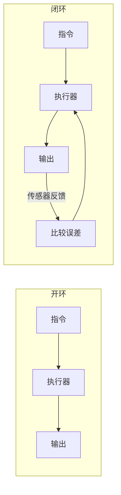

# 第十七讲 · 控制论：开环系统与闭环系统（Open-loop vs Closed-loop）

> **本讲信息**
> - 日期：2026-08-30（周六）
> - 第几讲：第十七讲（学习计划 Day 17，P6 控制论与 PID）
> - 对应计划：`study-plan-60d.md` → **P6 控制论与 PID**，课程集号 **068–069**
> - 今日目标：搞懂「开环」和「闭环」的区别——核心就是**有没有反馈**。舵机本身就是闭环。接 Day 16 的「臂动起来」，今天讲它为什么能稳。

---

## 0. 一句话总结

> **开环 = 发指令不回看结果（便宜但不准）；闭环 = 用反馈（传感器）不断纠正误差（舵机就是闭环）**。别把「闭环」和「AI 控制」混为一谈——PID 闭环是经典控制，不需要神经网络。

---

## 1. 核心知识点（对照 068–069）

### 1.1 068 控制论-开环系统
- 给定输入 → 直接执行 → 输出，**不看结果**。
- 便宜、简单，但误差会累积（比如电机负载变了，转到的位置就偏了）。

### 1.2 069 控制论-闭环系统
- 输出经**传感器**反馈回输入端，和「目标」比较得误差，再纠正。
- **舵机就是闭环**：编码器实时回报角度，控制器据此修正。
- 闭环让系统抗干扰、精度高。

---

## 2. 原理（先抓这几条）

1. **开环无反馈**：给定就执行，结果不管。
2. **闭环有反馈**：比目标、纠误差，形成回路。
3. **舵机 = 闭环执行器**：靠编码器反馈角度。

---

## 3. 一张图：开环 vs 闭环

---

## 4. 今天的操作步骤

1. **画开环 vs 闭环框图**，标出「反馈」在哪。
2. **口头讲清**：开环/闭环区别、舵机为什么是闭环、闭环≠AI。
3. **（以后）** 看一个开环风扇 vs 闭环温控（空调）的例子。
4. **镜子测试（3 分钟）：** *「开环___；闭环___；舵机为什么是闭环___；闭环≠AI 因为___。」*

> ✅ **今天「做完」的标准：** 画框图 + 讲清开环/闭环 + 过镜子测试。

---

## 5. 常见误区 & 容易踩的坑

| # | 误区 | 真相 |
|---|---|---|
| 1 | 闭环 = AI 控制 | PID 闭环是经典控制，不需神经网络 |
| 2 | 开环也能精准 | 无反馈，负载一变就偏 |
| 3 | 反馈越多越好 | 反馈有噪声/延迟，要设计 |

---

## 6. DEA 交叉链接（轻量，非主线）

- 刚性臂反馈靠编码器（干净角度）；**软体 / DEA 臂反馈靠柔性传感做本体感知**（接 Day 17 软体建模铺垫）——信号更噪声、更间接。而且 DEA 迟滞大，**开环几乎不可用**，必须闭环；但闭环建模更难，因为「输入电压 → 形变」不是线性即时映射。

---

## 7. 下一步 / 检查点

- **过了检查点 =** 画框图 + 讲清开环/闭环 + 过镜子测试。
- **下一讲（Day 18）：** PID 算法——比例 P / 积分 I / 微分 D，课程集号 070–073。

---

### 参考资料（先放着，今天不要求）
- 课程集号 068–069（B 站《黑马程序员 · 具身智能》）。
- （后续）Day 18 PID、Day 20 遥操作都建立在闭环之上。