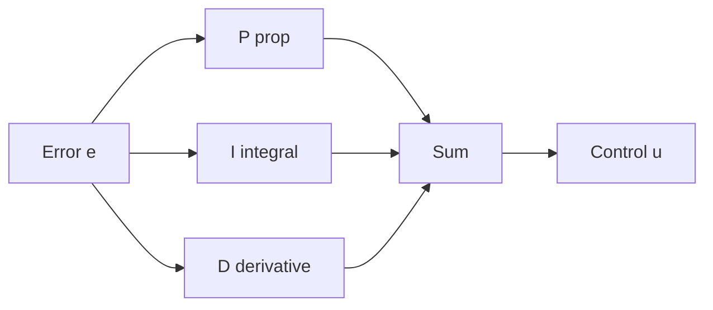

# Lecture 18 — PID Algorithm (Proportional / Integral / Derivative)

> **Meta**
> - Date: 2026-08-31 (Sunday)
> - Lecture / Day: Lecture 18 — Day 18 of the study plan
> - Plan anchor: `study-plan-60d.md` → **P6 Control theory & PID**, course episodes **070–073**
> - Goal of today: what each PID letter does, how to tune, why systems oscillate / overshoot. The "mixing console" of closed-loop control. Builds on Day 17 closed-loop.

---

## 0. One-line summary

> **PID = Proportional P (how far off now) + Integral I (accumulated past error) + Derivative D (trend of change)**; tune P first, then I, then D. Too much P oscillates, too much I overshoots and won't settle, D suppresses overshoot but fears noise.

---

## 1. Core knowledge (against 070–073)

### 1.1 070 PID overview
- **P (Proportional)**: correction force proportional to current error — big error, hard correct; small, light.
- **I (Integral)**: accumulates historical error, cures "steady-state error" (stuck a bit off).
- **D (Derivative)**: reads error change rate (trend), slows down early, suppresses overshoot.

### 1.2 071 PID simulator
- Tune P/I/D in a simulator, watch the response curve (step response).

### 1.3 072 PID parameter guide
- Tuning order: **P first, then I, then D**.
- P↑ → fast but oscillatory; I↑ → kills steady error but overshoots / integral saturation; D↑ → suppresses overshoot but amplifies noise.

### 1.4 073 PID summary
- PID is the industry-standard closed-loop controller: simple, effective; tuning is a craft.

---

## 2. Principles to internalize

1. **P = how far off now** (instant correction).
2. **I = accumulated past error** (kills steady-state error).
3. **D = trend of change** (damping, suppresses overshoot).

---

## 3. One diagram: PID block

---

## 4. Today's operation steps

1. **Stabilize an oscillating system in the PID simulator**, watch the P/I/D curves.
2. **Understand**: P-too-big oscillates, I-too-big overshoots, D suppresses overshoot.
3. **Explain out loud**: PID three letters, tuning order, each param's excess consequence.
4. **(Later)** control a real/sim servo to a target angle with PID.
5. **Mirror test (3 min):** *"What do PID letters do ___; tuning order ___; P-too-big / I-too-big / D-too-big ___".*

> ✅ **Definition of "done today":** stabilize in simulator + explain PID three letters & tuning + pass mirror test.

---

## 5. Common misconceptions & easy mistakes

| # | Misconception | Reality |
|---|---|---|
| 1 | Bigger P is better | Too big → oscillation |
| 2 | Bigger I is better | Too big → overshoot won't settle, integral saturation |
| 3 | Add D freely | D is noise-sensitive → high-freq jitter |

---

## 6. DEA cross-link (light, not the main line)

- Rigid arms use PID for angle control, mature; **DEA soft arms have large hysteresis and strong nonlinearity, pure PID is hard to stabilize** — often need "feed-forward / model compensation" (ties to Day 17 soft modeling's differentiable sim as the model). So your direction studies "PID + deformation model" hybrid control, not bare PID.

---

## 7. Next steps / checkpoint

- **Checkpoint passed if:** stabilize in simulator + explain PID three letters & tuning + pass mirror test.
- **Next lecture (Day 19):** motor ID/voltage setting + student-side mid calibration (important), episodes 074–076.

---

### References (for later, not required today)
- Course episodes 070–073 (B 站《黑马程序员 · 具身智能》).
- (Later) Day 19 calibration, Day 20 teleoperation all use PID/closed-loop.