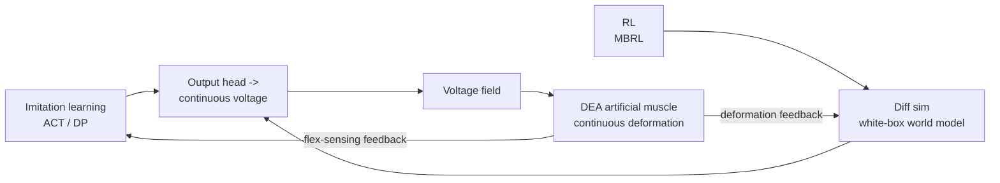
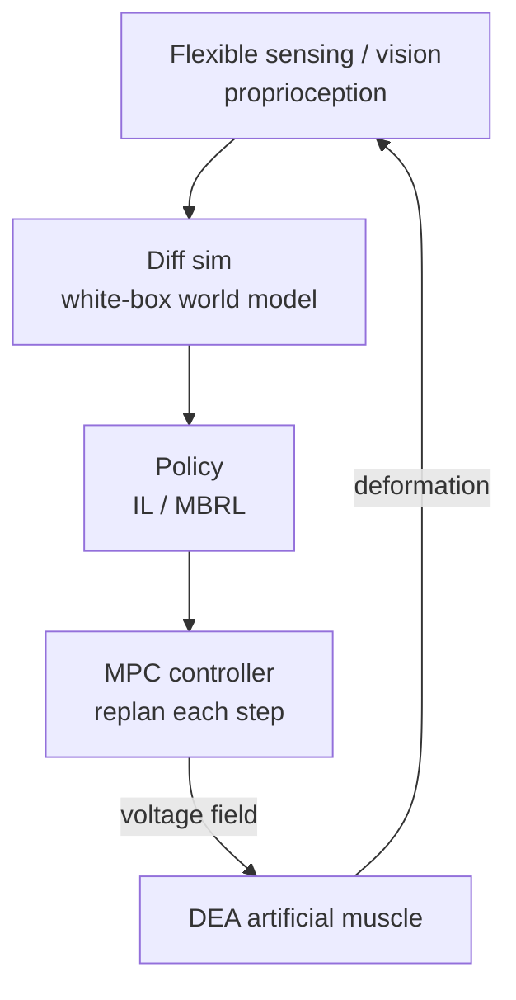

# Lecture 18 — DEA Artificial Muscle as the Embodied Action Space

> **Meta**
> - Date: 2026-08-31 (Sunday)
> - Lecture / Day: Lecture 18 — Day 18 of the study plan (Body-station deep-dive, day 2)
> - Plan anchor: `study-plan-60d.md` → **P7 前沿与方向 · 身体站深化 (Body-station deep-dive)**
> - Goal of today: connect the "brain tools" learned in Day 11 / 13 / 14 (imitation learning, RL, world model) onto the DEA "body". Core thesis — DEA's action space is a "voltage field", not "joint angles", which forces rewriting the I/O of every algorithm you've seen.

---

## 0. One-line summary

> A rigid arm moves "6 joint angles" (low-dim, discrete, reversible); a DEA moves "a voltage field" (continuous, strongly nonlinear, hysteretic, no clean inverse). Today: the ACT / DP / PPO you trained on SO-101 must have its **output layer changed from "joint angles" to "voltage trajectories"** to drive a DEA — and **model-based (Day 14) + MPC** is the right answer for soft bodies.

---

## 1. Core knowledge

### 1.1 Rewriting the action space: from "joints" to "voltage field"

| Dimension | Rigid arm (Day 2 / SO-101) | DEA artificial muscle |
|---|---|---|
| Action | 6-dim joint angles | voltage field (one voltage per film, continuous) |
| Differentiable | clean IK/FK | strongly nonlinear + hysteresis, no closed-form inverse |
| Sample cost | cheap (won't break when dropped) | expensive (breakdown / aging) |
| Control paradigm | PID / WBC / RL all OK | prefer model-based + MPC |

### 1.2 DEA + imitation learning (ties to Day 11's BC / ACT / DP)

- Demonstration data becomes "visual observation → voltage trajectory"; ACT / DP's **output head changes from discrete/low-dim joints to continuous voltage**.
- Difficulty: hysteresis makes "same voltage" map to different deformation, so you must concatenate **voltage/deformation history** into the policy input for compensation (ties to Day 17's Preisach / Bouc-Wen).
- Sample-efficient: DEA samples are expensive, so Day 11's "few-shot imitation" fits perfectly — a few demos to start.

### 1.3 DEA + reinforcement learning (ties to Day 13's RL + Sim2Real)

- Pure MFRL (PPO / SAC) is **usually impractical on DEA**: expensive samples + one drop/breakdown scraps it + dangerous exploration.
- Right answer: **model-based RL (Day 14)** — "imagine" trial-and-error in differentiable sim, real robot only does a little correction.
- The Sim2Real gap on DEA = **material-parameter drift** (VHB film stiffness/hysteresis shifts with temperature & humidity) + stochastic breakdown; domain randomization must cover these.

### 1.4 DEA + world model (ties to Day 14's MBRL)

- Differentiable simulation (DiffTaichi / PyElastica / ChainQueen) IS the DEA's **white-box world model**: it computes the "voltage → deformation" gradient and backprops straight into "material params + controller".
- This beats Day 14's "black-box neural world model": DEA has physical priors; embed them and sample efficiency jumps another order of magnitude.

### 1.5 One diagram: DEA embodied-AI "brain → body" interface

> Contrast with Day 2's rigid stack: there "policy → joint angle → motor (encoder)"; here "policy → voltage field → DEA (no encoder)", sensing filled by flexible sensors — the whole chain rewritten for soft.

---

## 2. Principles to internalize

1. **The action space dictates the algorithm shape**: a voltage field is continuous; IL/RL output layers must change, discrete low-dim actions are out.
2. **Hysteresis must use history compensation**: concatenate voltage/deformation history into observation, or the policy learns a "drifting map".
3. **Model-based is the soft-body answer**: differentiable sim as world model saves samples and avoids breakdown risk.
4. **Physical priors are DEA's moat**: don't go pure black-box; embed Maxwell stress / hysteresis models — both sample-efficient and trustworthy.

---

## 3. One diagram: the DEA loop (sense–world-model–policy–control)

---

## 4. Today's operation steps

1. **Read this file once**, flipping back to Day 11 (IL), Day 13 (RL), Day 14 (world model), Day 17 (modeling).
2. **Hand-draw the §1.5 / §3 diagrams**: brain tools → voltage field → DEA → feedback.
3. **Explain out loud**: what a voltage-field action space is, why PPO is impractical, why differentiable sim is a DEA dividend, how hysteresis enters the policy.
4. **(Later)** build a 1-DOF DEA bending actuator as a differentiable model in PyElastica and train a "trajectory tracking" task with MBRL.
5. **Mirror test (3 min):** *"How does DEA's action space differ from a rigid arm ___; why is pure PPO impractical ___; why is diff-sim as world model great ___; how does hysteresis enter the policy ___; how does it tie to Day 11/13/14 ___"*

> ✅ **Definition of "done today":** explain the voltage-field action space + DEA's interface with IL/RL/WM + pass the mirror test.

---

## 5. Common misconceptions & easy mistakes

| # | Misconception | Reality |
|---|---|---|
| 1 | "Just drop ACT onto DEA." | Output head must change from joint angles to continuous voltage, plus hysteresis history. |
| 2 | "Train PPO on DEA freely." | Expensive samples + breakdown risk; pure MFRL usually impractical, go model-based. |
| 3 | "World models are useless for DEA." | Diff sim IS the white-box world model; gradients backprop into material params — the best. |
| 4 | "Hysteresis can be ignored." | Ignoring it, the policy learns a drifting map; history compensation is mandatory. |
| 5 | "Only materials people can do soft bodies." | Action-space rewrite + world-model interface is exactly the mechanical + AI cross-over. |

---

## 6. Next steps / checkpoint

- **Checkpoint passed if:** you can explain the voltage-field action space + DEA's interface with IL/RL/WM + pass the mirror test.
- **Next lecture (Day 19):** soft-body embodied-AI **engineering deployment (Sim2Real + system integration)** and **military special-ops application deep-dive**, then package this learning into a resume project.

---

## 7. First-person reflection (SO-101 contrast)

1. **SO-101 taught you "how to train a rigid action space"**: ACT / DP output 6 joint angles, encoder as state. You know this well.
2. **DEA swaps the output layer from "6 angles" to "voltage field" and the encoder for flexible sensing** — same framework, rewritten interface. This is your lowest-effort research entry: don't build algorithms from scratch, rewrite the interface.

> If I were to redo it: **get the rigid side trained smoothly (done), then rewrite the output & sensing layers for DEA (doing now)** — same framework, different body, best ROI.

---

### References (for later, not required today)
- Katzschmann et al. (2019). *Dynamically closing a soft robotic gripper with a learned latent*. Science Robotics.
- Differentiable sim: DiffTaichi (SIGGRAPH 2021), PyElastica, ChainQueen (RSS 2019), DiSECt.
- Bruder et al. (2021). *Koopman-based modeling for soft robotics*. IEEE T-RO.
- Hysteresis compensation: Preisach model, Bouc-Wen model.
- (Later) Day 19 engineering deployment + military special-ops.