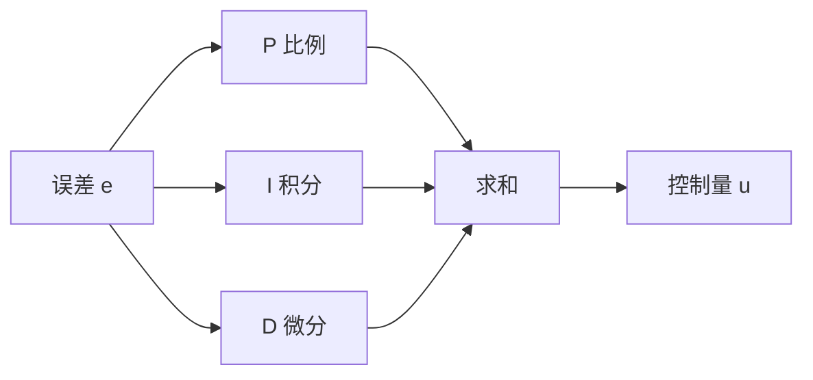

# 第十八讲 · PID 算法（比例 P / 积分 I / 微分 D）

> **本讲信息**
> - 日期：2026-08-31（周日）
> - 第几讲：第十八讲（学习计划 Day 18，P6 控制论与 PID）
> - 对应计划：`study-plan-60d.md` → **P6 控制论与 PID**，课程集号 **070–073**
> - 今日目标：搞懂 PID 三字母各管什么、怎么调参、为什么震荡/超调。这是闭环控制的「调音台」。接 Day 17 的闭环。

---

## 0. 一句话总结

> **PID = 比例 P（现在差多少）+ 积分 I（历史累计差）+ 微分 D（变化趋势）**；调参先 P 后 I 再 D。P 太大震荡、I 太大超调回不来、D 抑制过冲但怕噪声。

---

## 1. 核心知识点（对照 070–073）

### 1.1 070 PID 算法概述
- **P（比例）**：按当前误差大小给纠正力——误差大就猛纠，小就轻纠。
- **I（积分）**：把历史误差累加起来，专治「稳态误差」（一直差一点点纠不回来）。
- **D（微分）**：看误差变化速度（趋势），提前减速，抑制过冲。

### 1.2 071 PID 算法模拟器
- 在模拟器里调 P/I/D，看系统响应曲线（阶跃响应）。

### 1.3 072 PID 参数讲解
- 调参顺序：**先 P，再 I，最后 D**。
- P↑ → 响应快但易震荡；I↑ → 消稳态误差但易超调/积分饱和；D↑ → 抑制过冲但放大噪声。

### 1.4 073 PID 算法总结
- PID 是工业标准闭环控制器，简单有效；调参是手艺活。

---

## 2. 原理（先抓这几条）

1. **P = 现在差多少**（即时纠正）。
2. **I = 历史累计差**（消稳态误差）。
3. **D = 变化趋势**（阻尼，抑制过冲）。

---

## 3. 一张图：PID 框图

---

## 4. 今天的操作步骤

1. **在 PID 模拟器里把震荡系统调稳**，观察 P/I/D 三条曲线。
2. **理解**：P 太大震荡、I 太大超调、D 抑制过冲。
3. **口头讲清**：PID 三字母、调参顺序、各参数过大后果。
4. **（以后）** 把一个真实/仿真舵机用 PID 控到目标角度。
5. **镜子测试（3 分钟）：** *「PID 三字母各管什么___；调参顺序___；P 太大/I 太大/D 太大分别怎样___。」*

> ✅ **今天「做完」的标准：** 模拟器调稳 + 讲清 PID 三字母与调参 + 过镜子测试。

---

## 5. 常见误区 & 容易踩的坑

| # | 误区 | 真相 |
|---|---|---|
| 1 | P 越大越好 | 太大 → 震荡 |
| 2 | I 越大越好 | 太大 → 超调回不来、积分饱和 |
| 3 | D 随便加 | D 对噪声敏感 → 引入高频抖动 |

---

## 6. DEA 交叉链接（轻量，非主线）

- 刚性臂用 PID 控角度很成熟；**DEA 软体臂迟滞大、非线性强，纯 PID 难调稳**——常需加「前馈 / 模型补偿」（接 Day 17 软体建模的可微仿真当模型）。所以你的方向是研究「PID + 形变模型」的混合控制，而不是裸 PID。

---

## 7. 下一步 / 检查点

- **过了检查点 =** 模拟器调稳 + 讲清 PID 三字母与调参 + 过镜子测试。
- **下一讲（Day 19）：** 电机 ID/电压设置 + 学生端中位校准（重要），课程集号 074–076。

---

### 参考资料（先放着，今天不要求）
- 课程集号 070–073（B 站《黑马程序员 · 具身智能》）。
- （后续）Day 19 校准、Day 20 遥操作都用到 PID/闭环。