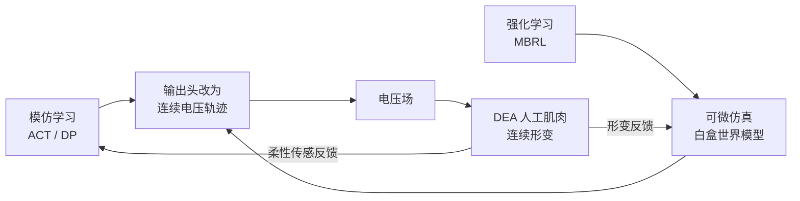
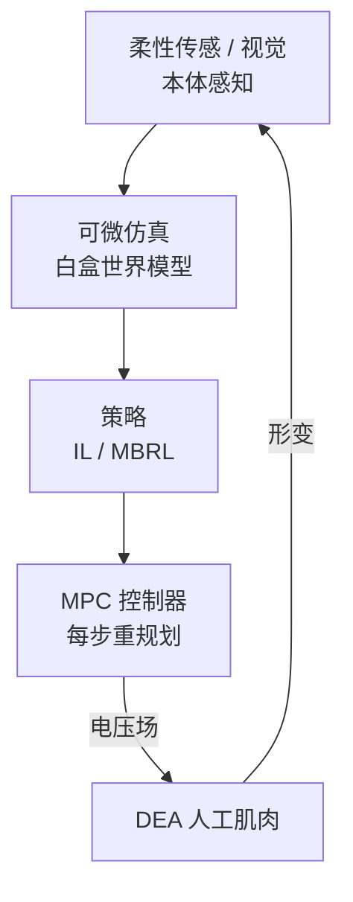

# 第十八讲 · DEA 人工肌肉的具身智能接口（DEA as the Embodied Action Space）

> **本讲信息**
> - 日期：2026-08-31（周日）
> - 第几讲：第十八讲（学习计划 Day 18，身体站深化第 2 天）
> - 对应计划：`study-plan-60d.md` 里 **P7 前沿与方向 · 身体站深化** 阶段
> - 今日目标：把 Day 11 / 13 / 14 学的「大脑工具」（模仿学习、强化学习、世界模型）接到 DEA 这个「身体」上。核心命题——DEA 的动作空间是「电压场」而不是「关节角度」，这逼着改写前面所有算法的输入/输出。

---

## 0. 一句话总结

> 刚性臂动「6 个关节角度」（低维、离散、可逆）；DEA 动「一张电压场」（连续、强非线性、带迟滞、无干净逆解）。今天讲清：你前面在 SO-101 上学的 ACT / DP / PPO，要把「输出层」从「关节角」改成「电压轨迹」才能驱动 DEA——而 **model-based（Day 14）+ MPC** 才是软体的正解。

---

## 1. 核心知识点

### 1.1 动作空间重写：从「关节」到「电压场」

| 维度 | 刚性臂（Day 2 / SO-101） | DEA 人工肌肉 |
|---|---|---|
| 动作 | 6 维关节角度 | 电压场（每张膜一个电压，连续分布） |
| 可微性 | 正逆解干净 | 强非线性 + 迟滞，无闭式逆 |
| 样本成本 | 便宜（摔了不坏） | 贵（会击穿 / 老化） |
| 控制范式 | PID / WBC / RL 都行 | 偏好 model-based + MPC |

### 1.2 DEA + 模仿学习（接 Day 11 的 BC / ACT / DP）

- 示教数据变成「视觉观测 → 电压轨迹」；ACT / DP 的**输出头从离散/低维关节改为连续电压**。
- 难点：迟滞让「同一电压」对应不同形变，要在策略输入里拼**历史电压/形变**做补偿（接 Day 17 的 Preisach / Bouc-Wen）。
- 数据高效：DEA 样本贵，正好用 Day 11 的「少样本模仿」思路——几条示教就能起步。

### 1.3 DEA + 强化学习（接 Day 13 的 RL + Sim2Real）

- 纯 MFRL（PPO / SAC）在 DEA 上**通常不现实**：样本贵 + 一摔/一击穿就报废 + 探索危险。
- 正解：**model-based RL（Day 14）**——在可微仿真里「想象」试错，真机只做少量校正。
- Sim2Real 差距在 DEA 上 = **材料参数漂移**（VHB 膜的刚度/迟滞随温湿度变）+ 击穿随机性；域随机化要覆盖这些。

### 1.4 DEA + 世界模型（接 Day 14 的 MBRL）

- 可微仿真（DiffTaichi / PyElastica / ChainQueen）就是 DEA 的**白盒世界模型**：能算出「电压 → 形变」的梯度，直接反传优化「材料参数 + 控制器」。
- 这比 Day 14 说的「黑盒神经网络世界模型」更香：DEA 有物理先验，把先验塞进模型，样本效率再上一个量级。

### 1.5 一张图：DEA 具身智能的「大脑 → 身体」接口

> 对比 Day 2 刚性栈：那里「策略 → 关节角 → 电机(编码器)」；这里「策略 → 电压场 → DEA(无编码器)」，感知靠柔性传感补——整条链为软体重写。

---

## 2. 原理（先抓这几条）

1. **动作空间决定算法形态**：电压场是连续场，IL/RL 的输出层必须改，离散低维动作直接淘汰。
2. **迟滞必须用历史补偿**：把电压/形变历史拼进观测，否则策略学的是「漂移的地图」。
3. **model-based 是软体正解**：可微仿真当世界模型，省样本又防击穿风险。
4. **物理先验是 DEA 的护城河**：别纯数据黑盒，把 Maxwell 应力 / 迟滞模型嵌进去，既省样本又可信。

---

## 3. 一张图：DEA 闭环（感知–世界模型–策略–控制）

---

## 4. 今天的操作步骤

1. **读一遍本文件**，回看 Day 11（IL）、Day 13（RL）、Day 14（世界模型）、Day 17（建模）。
2. **徒手画 §1.5 / §3 的图**：大脑工具 → 电压场 → DEA → 反馈。
3. **口头讲清**：电压场动作空间是什么、为什么 PPO 不现实、可微仿真为什么是 DEA 红利、迟滞怎么补偿。
4. **（以后）** 把一个 1-自由度 DEA 弯曲致动器在 PyElastica 里建可微模型，用 MBRL 训一个「跟轨迹」任务。
5. **镜子测试（3 分钟）：** *「DEA 动作空间和刚性臂差在哪___；为什么纯 PPO 不现实___；可微仿真当世界模型好在哪___；迟滞怎么进策略___；和 Day 11/13/14 各怎么接___。」*

> ✅ **今天「做完」的标准：** 讲清电压场动作空间 + DEA 与 IL/RL/WM 的接口 + 过镜子测试。

---

## 5. 常见误区 & 容易踩的坑

| # | 误区 | 真相 |
|---|---|---|
| 1 | "把 ACT 直接套 DEA 就行。" | 输出层要从关节角改成连续电压，还要补迟滞历史。 |
| 2 | "DEA 上 PPO 随便训。" | 样本贵 + 击穿风险，纯 MFRL 通常不现实，走 model-based。 |
| 3 | "世界模型对 DEA 没用。" | 可微仿真就是白盒世界模型，梯度能反传材料参数，最香。 |
| 4 | "迟滞可以忽略。" | 忽略迟滞策略学的是漂移地图，必须历史补偿。 |
| 5 | "软体只能材料人做。" | 动作空间改写 + world model 接口正是机械 + AI 的交叉切口。 |

---

## 6. 下一步 / 检查点

- **过了检查点 =** 讲清电压场动作空间 + DEA 与 IL/RL/WM 接口 + 过镜子测试。
- **下一讲（Day 19）：** 软体具身智能的**工程化落地（Sim2Real + 系统集成）**与**军事特种作业应用深化**，并把这趟学习打包成简历项目。

---

## 7. 训练营实操回顾（SO-101 的反差）

1. **SO-101 让你学会了「刚性动作空间怎么训」**：ACT / DP 输出 6 维关节角，编码器当状态。这套你已熟。
2. **DEA 把输出层从「6 维角」换成「电压场」、把编码器换成柔性传感**——框架不变，接口重写。这就是你研究切口最省力的起点：别从零造算法，改接口。

> 让我重来一次：**先把刚性那套训顺（已做），再把输出层和感知层改给 DEA（现在做）**——同框架、不同身体，性价比最高。

---

### 参考资料（先放着，今天不要求）
- Katzschmann et al. (2019). *Dynamically closing a soft robotic gripper with a learned latent*. Science Robotics.
- 可微仿真：DiffTaichi (SIGGRAPH 2021)、PyElastica、ChainQueen (RSS 2019)、DiSECt.
- Bruder et al. (2021). *Koopman-based modeling for soft robotics*. IEEE T-RO.
- 迟滞补偿：Preisach 模型、Bouc-Wen 模型.
- （后续）Day 19 工程化落地 + 军事特种作业.