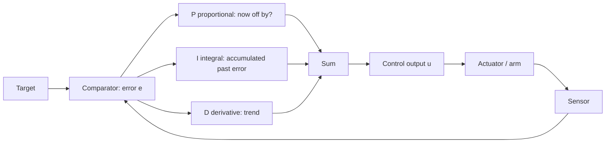

# Lecture 18 — PID Algorithm: Proportional / Integral / Derivative

> **Plan slot**: Day 18 (P6) | Episodes 070 PID overview / 071 PID simulator / 072 PID parameters / 073 PID summary
> **Series**: Heima《Embodied Intelligence》223-lecture study notes · Day 18

## 1. Where this sits
The most common controller inside a closed loop is PID. Today, using a simulator, we understand the three letters P, I, D separately.

## 2. Core knowledge

### 2.1 The PID trio
- **P — Proportional**: output ∝ current error e(t). Big error → big output; small error → small output. "Correct as much as you're off right now."
- **I — Integral**: output ∝ the **historical accumulation** ∫e dt of the error. Cures "steady-state error" — with P alone the arm often stops a bit short (target 30° but rests at 28°, a 2° offset); I slowly pays off that accumulated debt.
- **D — Derivative**: output ∝ the **rate of change** de/dt of the error. Watches the "trend" — brakes early when rushing past, suppressing overshoot and oscillation.

Formula: u(t) = Kp·e(t) + Ki·∫e dt + Kd·de/dt

### 2.2 Tuning order
P first, then I, then D. Get P to "a bit oscillatory but tracks", add I to kill the offset, then add a little D to suppress overshoot.

### 2.3 Three curves in the simulator
X-axis = time; Y-axis = target (straight line), actual (curve), error. A good PID: actual quickly, smoothly, offset-free sticks to the target.

## 3. Hands-on
Stabilize an "oscillating system" in the PID simulator: P only → watch oscillation → add D to damp it → add I to kill the offset. Record the curves for each parameter set.

## 4. Common pitfalls
- **P too large → sustained oscillation** (output always overshoots then pulls back).
- **I too large → overshoot that won't return + integral windup**: when error stays non-zero for long, the I term accumulates hugely and lurches on switching.
- **D is very noise-sensitive**: sensor noise is amplified by differentiation → high-frequency jitter; in practice filter the measurement before differentiating.
- Treating PID as omnipotent: pure PID is limited on strongly nonlinear / highly hysteretic systems (e.g. soft DEA); add feed-forward.

## 5. Checkpoint (end of Day 20)
State orally what each PID letter governs; independently stabilize a 2nd-order system in the simulator.

## 6. DEA cross-link (light, not the main thread)
- A DEA is driven voltage→deformation and shows **hysteresis + creep** — a classic "strongly nonlinear + highly hysteretic" plant where pure PID struggles: usually add **feed-forward (model-based voltage estimate) + look-up-table hysteresis compensation**, or use data-driven control.
- Feedback: estimate deformation via flexible strain/capacitance sensing for the loop — harder and noisier than a rigid encoder → be extra careful with the D term.
- Link: the servo PID tuning experience of Day 19–20 transfers directly to soft-actuator force/deformation control; only the feedback and model are harder.

---
*Strictly follows the 60-day plan Day 18 (P6): episodes 070–073. Zero military content.*
