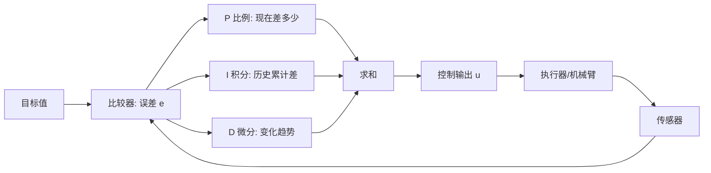

# 第十八讲 · PID 算法：比例 P / 积分 I / 微分 D（PID Algorithm）

> **计划定位**：Day 18（P6）｜070 PID算法概述 / 071 PID算法模拟器 / 072 PID参数讲解 / 073 PID算法总结
> **系列**：黑马程序员《具身智能》223 节学习笔记 · 第 18 天

## 1. 本讲位置
闭环控制里最常用的控制器就是 PID。今天用模拟器把 P、I、D 三个字母分别搞懂。

## 2. 核心知识点

### 2.1 PID 三件套
- **P 比例（Proportional）**：输出 ∝ 当前误差 e(t)。误差大出力大，误差小出力小。“现在差多少就补多少”。
- **I 积分（Integral）**：输出 ∝ 误差的**历史累计** ∫e dt。专治“稳态误差”——只用 P 往往停在差一点的位置（目标 30° 却停在 28°，差 2° 的静差），I 把历史欠账慢慢补上。
- **D 微分（Derivative）**：输出 ∝ 误差的**变化率** de/dt。看“趋势”——快冲过头时提前刹一脚，抑制过冲和振荡。

公式：u(t) = Kp·e(t) + Ki·∫e dt + Kd·de/dt

### 2.2 调参顺序
先 P 后 I 再 D。先把 P 调到“有点抖但跟得上”，再加 I 消静差，最后加少量 D 抑制过冲。

### 2.3 模拟器里看三条曲线
横轴时间，纵轴：目标值（直线）、实际值（曲线）、误差。好的 PID：实际值快速、平稳、无静差地贴住目标。

## 3. 动手操作
在 PID 模拟器里把“震荡系统”调稳：先只开 P 看震荡 → 加 D 压震荡 → 加 I 消静差。记录每组参数下的曲线。

## 4. 易错点
- **P 太大 → 持续震荡**（输出永远过冲又拉回）。
- **I 太大 → 超调回不来 + 积分饱和（windup）**：误差长期不为零时 I 项累积到极大，切换时猛冲。
- **D 对噪声极敏感**：传感器噪声被微分放大 → 高频抖动；实际常对测量做滤波再微分。
- 把 PID 当万能：纯 PID 对强非线性/大迟滞系统（如软体 DEA）效果有限，需加前馈。

## 5. 阶段检查点（Day 20 末）
能口述 PID 三字母各自管什么；在模拟器里独立调稳一个二阶系统。

## 6. DEA 交叉链接（轻量，非主线）
- DEA 驱动是电压→形变，且有**迟滞+蠕变**，是“强非线性+大迟滞”典型，纯 PID 难压：常加**前馈（按模型预估电压）+ 查表补偿迟滞**，或用数据驱动控制。
- 反馈信号：用柔性应变/电容传感估计形变做闭环，比刚性编码器难、噪声更大 → D 项要特别小心。
- 衔接：Day 19–20 的舵机 PID 调参经验，可直接类比到软体执行器的力/形变控制，只是反馈与模型更难。

---
*本讲严格对应《60 天计划》Day 18（P6）：070–073 PID。全程零军事内容。*
