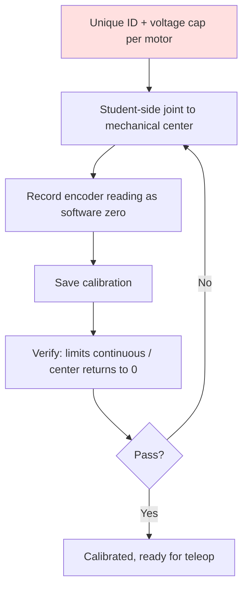

# Lecture 19 — Motor ID Setup & Student-side Mid Calibration

> **Plan slot**: Day 19 (P6) | Episodes 074 Set each motor's id and max voltage / 075 Student-side mid calibration (important) / 076 Student-side calibration verification
> **Series**: Heima《Embodied Intelligence》223-lecture study notes · Day 19

## 1. Where this sits
Continuing P6 control on real hardware: first give each motor an ID and a voltage cap, then do the student-side (follower arm) mid calibration — the prerequisite for teleoperation / BC later.

## 2. Core knowledge

### 2.1 Set motor ID and max voltage (074)
- **ID**: every motor on the bus needs a unique number so the controller can "call it by name" to read/write angles. Duplicate ID → bus conflict, angles cross-talk.
- **Max voltage (voltage cap)**: set an output ceiling to **protect hardware** — prevent a code bug or mis-tune from burning the motor or flinging the arm.

### 2.2 Student-side mid calibration (075, important)
- "Mid" = the mechanical center the software's 0° maps to on the real servo.
- Calibration = align software 0° with the real servo's center, removing the zero-offset.
- Method: drive each joint to its mechanical center, record the encoder reading as the software zero (linear mapping).

### 2.3 Calibration verification (076)
- Rotate to the joint limit; check the angle reading is **continuous, monotonic, no jumps**; release to center, check it returns near 0°.
- No verification = every later motion is globally shifted.

## 3. Hands-on
1. Assign unique IDs (e.g. 1–6) and a sensible voltage cap to all 6 motors.
2. Mid-calibrate each student-side joint, save the calibration.
3. Verify: rotate to limits (check continuity), return to center (check zeroing).

## 4. Common pitfalls (IMPORTANT!)
- **Forcing the arm while enabled → burns the servo** (course warning)! If you must move the arm by hand during calibration, **disable / power off first**, then move gently.
- Mis-calibrated mid → global "zero drift", every motion offset.
- Unsaved calibration → re-calibrate on every reboot.
- ID conflict → bus communication chaos.

## 5. Checkpoint
Student-side 6 joints have trustworthy zeros and continuous angles; remember "never twist the arm while enabled".

## 6. DEA cross-link (light, not the main thread)
- A rigid servo reports angle via encoder directly — mid calibration is easy; a soft DEA has no hard zero/limit, its "mid" and "range" are defined by the deformation-voltage curve, fuzzier and needing online calibration.
- Same safety: over-voltage punches through the dielectric layer, so the **voltage cap matters even more**, plus current/temperature protection.
- Link: the mindset of hardware calibration (align software zero with the real center) is universal across actuators; soft ones are just harder to measure and more delicate.

---
*Strictly follows the 60-day plan Day 19 (P6): episodes 074–076. Zero military content. Red line: never twist the arm while enabled.*
