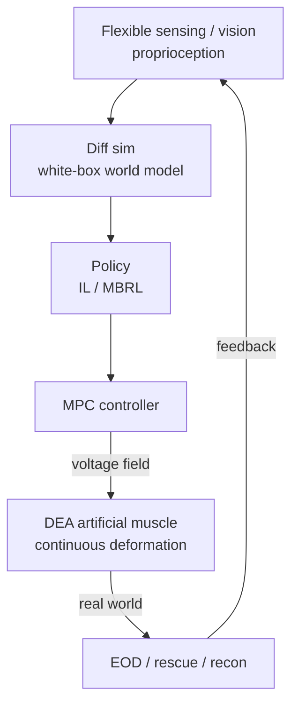

# Lecture 19 — Soft Embodied AI: Deployment & Military Special-Ops Deep-Dive

> **Meta**
> - Date: 2026-09-01 (Monday)
> - Lecture / Day: Lecture 19 — Day 19 of the study plan (Body-station deep-dive, day 3 / capstone)
> - Plan anchor: `study-plan-60d.md` → **P7 前沿与方向 · 身体站深化 (Body-station deep-dive)**
> - Goal of today: assemble Day 2/5/11/13/14/15/16/17/18's "brain + body" into **one runnable system**; use **military special operations** (EOD / rescue / recon) as a high-value demo; and **package this learning into a resume project**. This directly answers your line "combine what you wrote before with my DEA artificial muscle".

---

## 0. One-line summary

> A soft embodied system = **flexible sensing → differentiable-sim world model → IL/RL policy → MPC → DEA voltage field → real robot**, with a feedback loop. Military special ops (EOD / rescue / recon) are its natural high-value landing scenario; the whole thing condenses into a resume project story of "background / innovation / work / result".

---

## 1. Core knowledge

### 1.1 Soft-body Sim2Real (ties to Day 13's Sim2Real)

- **Domain randomization must cover soft-body-specific uncertainty**: material stiffness, hysteresis curve, friction, breakdown threshold, temperature & humidity — a rigid arm doesn't have these.
- **Differentiable sim as a "real-gradient source"**: Day 17/18's differentiable sim is a white box giving trustworthy gradients, more stable than black-box Sim2Real.
- **Online adaptation**: on the real robot, recursively estimate material params (e.g., current VHB film stiffness) from flexible sensing to cancel drift.

### 1.2 End-to-end system integration stack

> This is the **soft-body version** of Day 15's deployment chain: swap "quantized policy → motor" for "diff-sim world model → MPC → DEA voltage field", and "rigid benchmark" for "soft-body custom metrics".

### 1.3 Military special-ops demo mapping (ties to Day 16's scenario table)

| Scenario | How DEA / soft body helps | Technical mapping (back-links) |
|---|---|---|
| **EOD** | soft gripper compliantly wraps suspicious objects, no hard contact | compliant grasp + MPC force compliance (Day 2/18) |
| **Disaster rescue** | continuous deformation squeezes through rubble, shock-resistant | infinite-dim deformation + shock-proof body (Day 17) |
| **Recon** | light, shape-morphing body enters confined space | low-inertia inherently-safe body (Day 16/17) |

> This is exactly Day 1's "application layer" **special operations** — embodied AI doesn't only serve factories and homes, it serves the hard-core national-security scenarios. Your soft / DEA stands at the "body" station to tackle jobs rigid robots can't.

### 1.4 Soft-body evaluation metrics (ties to Day 15's benchmark, customized)

| General metric (Day 15) | Soft-body custom metric |
|---|---|---|
| task success rate | shape tracking error |
| latency | contact-force compliance |
| robustness | safety margin (breakdown / over-voltage headroom) |
| — | impact recovery (rebound after shock) |

### 1.5 Resume project-izing (ties to Day 16's three landing points)

Package "DEA + MPC + differentiable-sim world model" into a project story:
- **Background**: rigid actuators are afraid of hard contact and not compliant in EOD / rescue.
- **Innovation**: DEA artificial muscle as compliant action space + differentiable sim as white-box world model + MPC real-time compliance.
- **Work**: modeling (Koopman / diff sim) + control (MPC) + integration (flexible-sensing loop).
- **Result**: demo success rate / shape error / safety margin (speak with §1.4 soft custom metrics).

### 1.6 One diagram: body-station full stack loop (capstone)

### 1.7 One-to-one mapping to the first 16 lectures (DEA capstone map) 🔗

| Lecture | Original topic | Tie-in with DEA / soft body |
|---|---|---|
| Day 1 | 5-station map / proprioception | "Body" station = DEA; proprioception via flexible sensing |
| Day 2 | rigid actuator | DEA is "the other path" — no gears, no encoder |
| Day 3–5 | sim URDF | soft body uses SOFA / PyElastica, not rigid URDF |
| Day 6–10 | comm / calibration | DEA high-voltage drive + flexible-sensing calibration |
| Day 11 | imitation learning | demo → voltage trajectory |
| Day 12 | generative policy | DP outputs continuous voltage |
| Day 13 | RL + Sim2Real | MBRL + material domain randomization |
| Day 14 | world model | diff sim = white-box world model |
| Day 15 | deploy / benchmark | soft-body custom metrics |
| Day 16 | military / resume | DEA special-ops + direction line |

> This table is exactly the "combine prior writing with DEA" you asked for — **every lecture lands on your DEA artificial muscle**; it's not a separate track.

---

## 2. Principles to internalize

1. **System > single point**: the six-piece sense/model/policy/control/actuate/feedback is not embodied without any one.
2. **Soft Sim2Real leans on physical priors**: diff sim gives real gradients, domain randomization covers material uncertainty.
3. **Military scenarios are high-value demos for soft bodies**: compliance / safety / adaptivity are exactly special-ops' hard needs.
4. **Learning must become a project story**: package with "background / innovation / work / result" to enter the resume.

---

## 3. Today's operation steps

1. **Read this file once**, flipping back to Day 15 (deploy), Day 16 (military / resume), Day 18 (action space).
2. **Hand-draw the §1.2 / §1.6 / §1.7 diagrams & table**: system stack + body-station loop + DEA capstone map.
3. **Write a project statement** (3–5 sentences): my DEA+MPC+world-model system, how it serves EOD / rescue.
4. **Mirror test (5 min):** *"What extra randomization does soft Sim2Real need vs rigid ___; the six-piece system stack ___; how each military scenario uses DEA ___; soft custom metrics ___; how my resume project story reads ___"*
5. **(Optional)** using the §1.7 table, add a "DEA version" line to each lecture as your own cheat-card.

> ✅ **Definition of "done today":** explain the system stack + military mapping + soft metrics + project story + pass the mirror test.

---

## 5. Common misconceptions & easy mistakes

| # | Misconception | Reality |
|---|---|---|
| 1 | "With DEA we can go to the battlefield." | First pass the six-piece stack + soft custom metrics; engineering is far. |
| 2 | "Soft Sim2Real is like rigid." | Must randomize material/hysteresis/breakdown more; rely on diff sim for gradients. |
| 3 | "The military direction is just hype." | EOD / rescue / recon's need for compliance & safety is a real industry gap. |
| 4 | "Study notes can't go on a resume." | Packaged as "background/innovation/work/result", they're project evidence. |
| 5 | "DEA has nothing to do with earlier lectures." | §1.7 proves: every lecture lands on DEA; it's one system. |

---

## 6. Next steps / checkpoint

- **Checkpoint passed if:** you can explain the system stack + military mapping + soft metrics + project story + pass the mirror test.
- **Next (Day 22–23 planned):** enter the **military-intelligence专题** — survey of embodied AI in unmanned systems / EOD + how your DEA direction maps to military-intelligence jobs and central/state employers (with KB 04/05).

---

## 7. First-person reflection (from SO-101 to a DEA system)

1. **SO-101 is a micro-template of the "rigid system full stack"**: sim → ACT → deploy → WebSocket monitoring — you saw all six pieces.
2. **Replace each SO-101 link with its soft version**: URDF → PyElastica, joint angle → voltage field, encoder → flexible sensing, rigid benchmark → soft metrics — and you get Day 19's system stack.
3. **The bootcamp gave you system thinking, not algorithms**: what DEA research lacks most is people who can string the six pieces together.

> If I were to redo it: **take the bootcamp's system thinking and fit it onto the DEA body** — that's your "mechanical + materials + AI" trinity moat.

---

### References (for later, not required today)
- Soft Sim2Real: Hu et al. (2021). *Soft robot learning with differentiable simulation*. RSS.
- Differentiable sim: DiffTaichi, PyElastica, ChainQueen, DiSECt.
- Military / special-ops public directions: lab field-robotics / EOD lines (verify officially).
- Resume packaging: KB 04 job families A/B/C/J/K/I, KB 05 regional & central/state employers (verify officially).
- (Later) Day 22–23 military-intelligence专题.