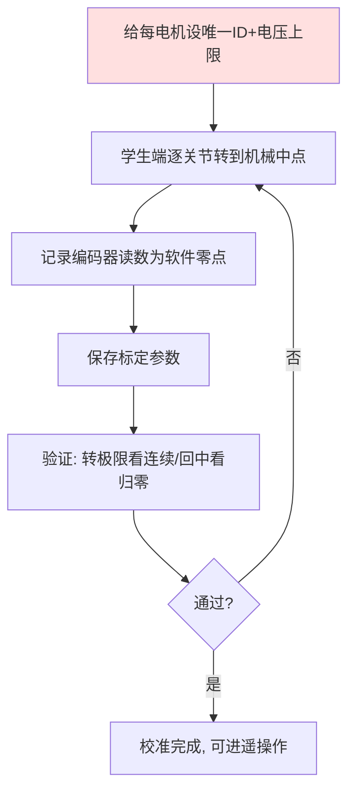

# 第十九讲 · 电机 ID 设置与学生端中位校准（Motor ID & Student-side Mid Calibration）

> **计划定位**：Day 19（P6）｜074 设置每个电机的id和最高电压 / 075 学生端的中位校准标定（重要） / 076 学生端标定的验证
> **系列**：黑马程序员《具身智能》223 节学习笔记 · 第 19 天

## 1. 本讲位置
继续 P6 控制落地：把“理论控制”接到真实硬件。先给每个电机上 ID 和电压上限，再做学生端（从臂）的中位校准——这是后面遥操作/BC 能跑通的前提。

## 2. 核心知识点

### 2.1 设电机 ID 与最高电压（074）
- **ID**：总线上每个电机要有唯一编号，控制器才能“按号点名”读/写角度。重复 ID → 总线冲突、角度串台。
- **最高电压（电压上限）**：给电机设输出上限，**保护硬件**——防止代码 bug 或误调把电机烧了/把臂甩飞。

### 2.2 学生端中位校准（075，重要）
- “中位” = 软件定义的 0° 对应真实舵机的**机械中点**。
- 校准 = 让软件 0° 与真实舵机中点对齐，消除零位偏差。
- 做法：通常让每个关节转到机械中点，记录此时编码器读数作为软件零点（线性映射）。

### 2.3 标定验证（076）
- 转到关节极限，看角度读数是否**连续、单调、不跳变**；松手回中，看是否回到 0° 附近。
- 不验证 = 后面所有动作整体偏移。

## 3. 动手操作
1. 给 6 个电机依次设唯一 ID（如 1–6）和合理电压上限。
2. 学生端逐关节做中位校准，保存标定参数。
3. 验证：转极限看连续、回中看归零。

## 4. 易错点（重点！）
- **使能状态下强行扭机械臂 → 烧舵机**（课程专门警告）！校准时若需手动摆臂，务必先**解除使能/断电**再轻摆。
- 中位没标定准 → 全局“零位飘”，所有动作偏移。
- 标定参数没保存 → 每次重启要重标。
- ID 冲突 → 总线通讯混乱。

## 5. 阶段检查点
学生端 6 关节零位可信、角度连续；牢记“使能不扭臂”。

## 6. DEA 交叉链接（轻量，非主线）
- 刚性舵机用编码器直接报角度，中位校准简单；软体 DEA 没有硬零位/限位，**“中位”和“量程”靠形变-电压曲线定义**，更模糊、需在线标定。
- 安全同理：DEA 过压会击穿介电层，**电压上限更关键**，且要加电流/温度保护。
- 衔接：硬件校准思维（对齐软件零位与真实中点）对任何执行器都通用，软体只是更难测、更娇贵。

---
*本讲严格对应《60 天计划》Day 19（P6）：074–076。全程零军事内容。注：使能状态严禁硬扭臂。*
