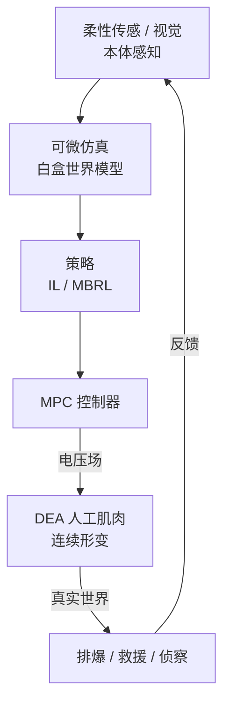

# 第十九讲 · 软体具身智能工程化落地与军事特种作业应用深化（Soft Embodied AI: Deployment & Military Special-Ops）

> **本讲信息**
> - 日期：2026-09-01（周一）
> - 第几讲：第十九讲（学习计划 Day 19，身体站深化第 3 天 / 收口）
> - 对应计划：`study-plan-60d.md` 里 **P7 前沿与方向 · 身体站深化** 阶段
> - 今日目标：把前面 Day 2/5/11/13/14/15/16/17/18 的「大脑 + 身体」拼成**一个能跑的系统**；用**军事特种作业**（排爆/救援/侦察）当高价值 demo；并把这趟学习**打包成简历项目**。直接回应你那句「把之前写的跟我的 DEA 人工肌肉结合一下」。

---

## 0. 一句话总结

> 软体具身系统 = **柔性感知 → 可微仿真世界模型 → IL/RL 策略 → MPC → DEA 电压场 → 真机**，再闭环反馈。军事特种作业（排爆/救援/侦察）正是它天然的高价值落地场景；整套东西能整理成「背景/创新/工作/成果」的简历项目故事。

---

## 1. 核心知识点

### 1.1 软体 Sim2Real（接 Day 13 的 Sim2Real）

- **域随机化要覆盖软体专属不确定性**：材料刚度、迟滞曲线、摩擦、击穿阈值、温湿度——刚性臂没有这些。
- **可微仿真当「真实梯度源」**：Day 17/18 的可微仿真是白盒，能给出可信的梯度，比黑盒 Sim2Real 更稳。
- **在线自适应**：真机上用柔性传感递归估计材料参数（如当前 VHB 膜刚度），抵消漂移。

### 1.2 端到端系统集成栈

> 这是 Day 15「部署链」的**软体版**：把「量化策略→电机」换成「可微仿真世界模型→MPC→DEA 电压场」，把「刚性 benchmark」换成「软体定制指标」。

### 1.3 军事特种作业 demo 映射（接 Day 16 场景表）

| 场景 | DEA/软体怎么用 | 技术映射（回链讲次） |
|---|---|---|
| **排爆 EOD** | 软体夹爪柔顺包裹可疑物，不硬碰 | 柔性抓取 + MPC 合规力控（Day 2/18） |
| **灾害救援** | 连续形变钻瓦砾缝、抗冲击 | 无穷维形变 + 抗冲击本体（Day 17） |
| **侦察探测** | 轻量可变形机体进狭小空间 | 低惯量本质安全本体（Day 16/17） |

> 这正是 Day 1「应用层」说的**特种作业**——具身智能不只服务工厂家庭，也服务国家安全硬核场景。你的软体/DEA 站在「身体」站啃刚性机器人啃不动的活。

### 1.4 软体评测指标（接 Day 15 的 benchmark，但定制）

| 通用指标（Day 15） | 软体定制指标 |
|---|---|---|
| 任务成功率 | 形变跟踪误差（shape tracking error） |
| 实时性 | 接触力合规度（contact-force compliance） |
| 鲁棒性 | 安全裕度（击穿/过压余量） |
| — | 抗冲击恢复（冲击后形变回弹） |

### 1.5 简历项目化（接 Day 16 的三条落点）

把「DEA + MPC + 可微仿真世界模型」整理成一个项目故事：
- **背景**：刚性执行器在排爆/救援中怕硬碰、不柔顺。
- **创新**：用 DEA 人工肌肉做柔顺动作空间 + 可微仿真当白盒世界模型 + MPC 实时合规。
- **工作**：建模（Koopman/可微仿真）+ 控制（MPC）+ 集成（柔性传感闭环）。
- **成果**：demo 成功率 / 形变误差 / 安全裕度指标（用 §1.4 软体定制指标说话）。

### 1.6 一张图：身体站全栈闭环（收口）

### 1.7 与前 16 讲的一一对应（DEA 收口地图）🔗

| 讲次 | 原主题 | 与 DEA / 软体的结合 |
|---|---|---|
| Day 1 | 五站地图 / 本体感知 | 「身体」站 = DEA；本体感知靠柔性传感 |
| Day 2 | 刚性执行器 | DEA 是「另一条路」——无齿轮、无编码器 |
| Day 3–5 | 仿真 URDF | 软体用 SOFA / PyElastica，而非刚体 URDF |
| Day 6–10 | 通讯 / 标定 | DEA 高压驱动 + 柔性传感标定 |
| Day 11 | 模仿学习 | 示教 → 电压轨迹 |
| Day 12 | 生成式策略 | DP 输出连续电压 |
| Day 13 | RL + Sim2Real | MBRL + 材料域随机化 |
| Day 14 | 世界模型 | 可微仿真 = 白盒世界模型 |
| Day 15 | 部署 / benchmark | 软体定制指标 |
| Day 16 | 军事 / 简历 | DEA 特种作业 + 方向句 |

> 这张表就是你要的「之前写的跟 DEA 结合」——**每一讲都能落到你的 DEA 人工肌肉上**，不是另起炉灶。

---

## 2. 原理（先抓这几条）

1. **系统 > 单点**：感知/模型/策略/控制/执行/反馈六件套缺一不叫具身系统。
2. **软体 Sim2Real 靠物理先验**：可微仿真给真实梯度，域随机化覆盖材料不确定性。
3. **军事场景是软体的高价值 demo**：柔顺/安全/自适应正是特种作业的刚需。
4. **学习要变成项目故事**：用「背景/创新/工作/成果」封装，才进得了简历。

---

## 3. 今天的操作步骤

1. **读一遍本文件**，回看 Day 15（部署）、Day 16（军事/简历）、Day 18（动作空间）。
2. **徒手画 §1.2 / §1.6 / §1.7 的图与表**：系统栈 + 身体站闭环 + DEA 收口地图。
3. **写一段项目陈述**（3–5 句）：我的 DEA+MPC+世界模型系统，怎么服务排爆/救援。
4. **镜子测试（5 分钟）：** *「软体 Sim2Real 比刚性多随机化什么___；系统栈六件套___；军事三场景各怎么用 DEA___；软体定制指标___；我的简历项目故事怎么写___。」*
5. **（可选）** 用 §1.7 的表，给每讲补一句「DEA 版」，做成你自己的速查卡。

> ✅ **今天「做完」的标准：** 讲清系统栈 + 军事映射 + 软体指标 + 写出项目故事 + 过镜子测试。

---

## 5. 常见误区 & 容易踩的坑

| # | 误区 | 真相 |
|---|---|---|
| 1 | "有了 DEA 就能上战场。" | 先过系统栈六件套 + 软体定制指标，工程很远。 |
| 2 | "软体 Sim2Real 和刚性一样。" | 要多随机化材料/迟滞/击穿，靠可微仿真给梯度。 |
| 3 | "军事方向只是噱头。" | 排爆/救援/侦察对柔顺安全的刚需是真实的产业缺口。 |
| 4 | "学习笔记不能写进简历。" | 用「背景/创新/工作/成果」封装，就是项目证据。 |
| 5 | "DEA 和前面讲次无关。" | §1.7 证明：每一讲都能落到 DEA，是同一套体系。 |

---

## 6. 下一步 / 检查点

- **过了检查点 =** 讲清系统栈 + 军事映射 + 软体指标 + 项目故事 + 过镜子测试。
- **后续（Day 22–23 计划）：** 进入**军事智能专题**——无人系统/排爆中的具身智能综述 + 你的 DEA 方向如何对接军事智能岗位与央国企雇主（结合 KB 04/05）。

---

## 7. 训练营实操回顾（从 SO-101 到 DEA 系统）

1. **SO-101 是「刚性系统全栈」的微型样板**：仿真→ACT→部署→WebSocket 监控，六件套都见了。
2. **把 SO-101 的每个环节替换成软体版**：URDF→PyElastica、关节角→电压场、编码器→柔性传感、刚性 benchmark→软体指标——你就得到 Day 19 的系统栈。
3. **训练营给你的不是算法，是「系统思维」**：DEA 研究最缺的就是能把六件套串起来的人。

> 让我重来一次：**用训练营的系统思维，套到 DEA 身体上**——这才是你「机械+材料+AI」三位一体的护城河。

---

### 参考资料（先放着，今天不要求）
- 软体 Sim2Real：Hu et al. (2021). *Soft robot learning with differentiable simulation*. RSS.
- 可微仿真：DiffTaichi、PyElastica、ChainQueen、DiSECt.
- 军事/特种作业公开方向：各实验室 field robotics / EOD 路线（官方复核）。
- 简历封装：KB 04 岗位家族 A/B/C/J/K/I、KB 05 区域与央国企雇主（务必官方复核）。
- （后续）Day 22–23 军事智能专题.