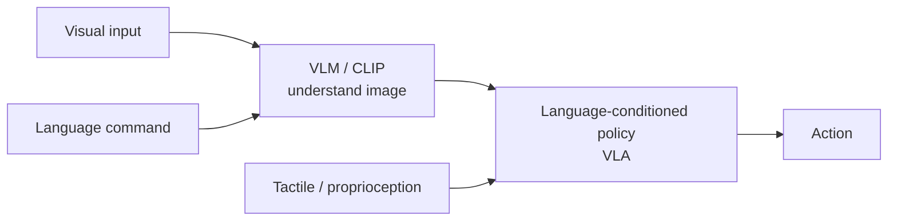
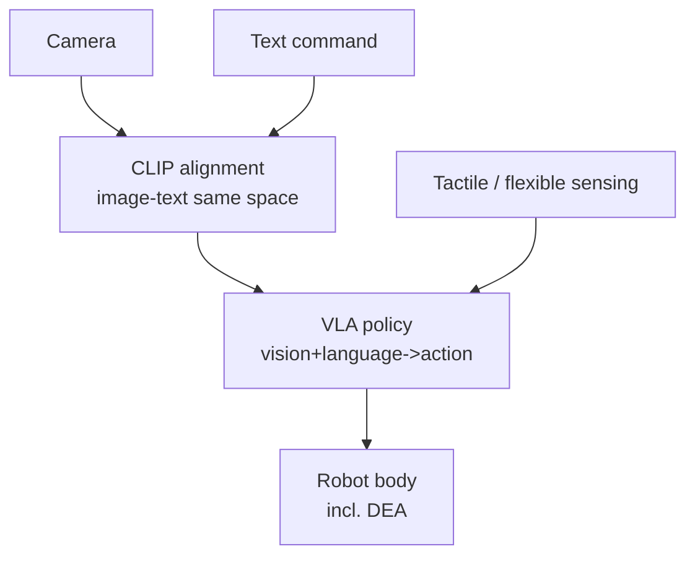

# Lecture 20 — Multimodal Perception & VLMs: the "Eyes and Brain" of Embodied AI

> **Meta**
> - Date: 2026-09-02 (Tuesday)
> - Lecture / Day: Lecture 20 — Day 20 of the study plan
> - Plan anchor: `study-plan-60d.md` → **P8 前沿 / 感知-认知进阶 (Perception-Cognition advanced)**
> - Goal of today: deepen Day 1's "perception station" and Day 12's "VLA" — how VLM / CLIP become the "perception-cognition core" of embodied AI; how language-conditioned policies let natural language command a robot. **Note: today is general embodied-AI content (not a military专题).**

---

## 0. One-line summary

> Embodied AI's "perception" is no longer just "recognizing objects" — it's **VLM (vision-language model) turning "what it sees" into "understanding + actionable, talkable intent"**; CLIP aligns images and language into one space so "pick up the red cup" can be understood as a visual goal. This is the "perception base" of Day 12's VLA.

---

## 1. Core knowledge

### 1.1 From perception to cognition (three leaps)

| Level | Does what | Example |
|---|---|---|
| Classic CV | detect / segment / classify | YOLO detects a cup |
| VLM | visual QA / referring / describing | "is the red one on the left a cup?" |
| Language-conditioned policy | command action via language | "put the red cup on the table" → action |

### 1.2 CLIP / vision-language alignment

- An image encoder and a text encoder project **images and text into the same embedding space**; semantically close image-text pairs sit near each other.
- This lets a language description like "red cup" directly correspond to visual features — becoming the **base of language-conditioned policies**.

### 1.3 VLA deep-dive (ties to Day 12)

- **RT-1 / RT-2** (Google DeepMind): VLM as backbone, outputs discrete action tokens; RT-2 transfers web commonsense to new objects / new instructions.
- **OpenVLA / Octo**: open-source VLAs, easy to reproduce and rewire interfaces (the SO-101 bootcamp can connect).
- Key point: **VLA = vision + language → action, is the "brain"; your DEA is the "body"** — decoupled, each can advance independently.

### 1.4 Multimodal fusion (ties to Day 1 / KB 03)

- Vision + language + tactile + proprioception fused → more robust policy.
- Soft bodies need this especially: deformation is hard to measure, VLM "looking at the image" can help estimate deformation / contact.

### 1.5 One diagram: the perception-cognition stack

### 1.6 DEA cross-over (your direction)

- A soft body has no clean proprioception → **VLM "sees deformation" + flexible sensing fills state** is a practical combo for soft embodied AI.
- Doing DEA, you can use "visual deformation estimation" as the perception entry, tying into Day 17's flexible-sensing loop.

---

## 2. Principles to internalize

1. **The end of perception is "executable, language-grounded understanding", not a detection box.**
2. **CLIP alignment is the base of language-conditioned policies.**
3. **VLA = brain, body / DEA = body**; decoupled, each advances independently.
4. **Soft bodies rely on "vision + flexible sensing" to fill state**; VLM is a cheap perception gain.

---

## 3. One diagram: perception stack to action

---

## 4. Today's operation steps

1. **Read this file once**, flipping back to Day 1 (perception station), Day 12 (VLA).
2. **Hand-draw the §1.5 / §3 diagrams**: vision+language → VLM → VLA → action.
3. **Explain out loud**: CLIP alignment, VLM vs VLA, language-conditioned policy.
4. **(Later)** run a CLIP "find object by language" demo, or an OpenVLA inference sample.
5. **Mirror test (3 min):** *"Three leaps of perception ___; what is CLIP alignment ___; VLA vs VLM ___; what multimodal fusion helps ___; how DEA uses VLM for perception ___"*

> ✅ **Definition of "done today":** explain CLIP alignment + VLA structure + multimodal fusion + pass the mirror test.

---

## 5. Common misconceptions & easy mistakes

| # | Misconception | Reality |
|---|---|---|
| 1 | "Perception is just object detection." | Embodied perception needs language-grounded understanding + talkable intent. |
| 2 | "VLA equals VLM." | VLM is perception/cognition; VLA outputs action on top of it. |
| 3 | "CLIP only does classification." | It aligns image-text; base of language-conditioned policies. |
| 4 | "Soft bodies don't need vision." | Soft state is hard to measure; vision is a cheap perception gain. |
| 5 | "Big models are too heavy to run." | Can be distilled / quantized to the edge (ties to Day 15 quantization). |

---

## 6. Next steps / checkpoint

- **Checkpoint passed if:** you can explain CLIP alignment + VLA structure + multimodal fusion + pass the mirror test.
- **Next lecture (Day 21):** **Dexterous manipulation & tactile sensing** — the "hands" of embodied AI: dexterous hands, grasping, tactile loop (ties to KB 02 humanoid stack, KB 03 flexible sensing).

---

## 7. First-person reflection (SO-101 contrast)

1. **SO-101 uses a camera as observation; ACT / DP learn straight from pixels** — you've seen the simplest "perception → action" loop.
2. **VLM adds a "language brain" to that loop**: turns pixels into "semantics + command" so the robot understands human speech. The bootcamp gave you the地基, VLM is the upper floor.

> If I were to redo it: **first the SO-101 "pixel → action" base, then stack VLM's "language → intent" brain** — master both layers and you're a real perception expert of embodied AI.

---

### References (for later, not required today)
- Radford et al. (2021). *CLIP*. ICML.
- Brohan et al. (2022/2023). *RT-1 / RT-2: Vision-Language-Action models*.
- OpenVLA (2024). arXiv:2406.09246.
- Octo (2024). RSS.
- (Later) Day 21 dexterous manipulation & tactile.