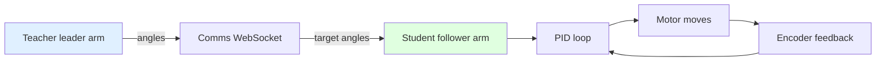

# Lecture 20 — Student-side Angle Control, Never-twist-while-enabled & Teleoperation

> **Plan slot**: Day 20 (P6) | Episodes 077 Student-side angle control code / 078 Never twist the arm while enabled / 079 Robot teleoperation / 080 Robot-arm PID tuning
> **Series**: Heima《Embodied Intelligence》223-lecture study notes · Day 20 (P6 finale)

## 1. Where this sits
P6 finale: drive the calibrated student-side (follower) arm with code, do kinesthetic teleoperation, and use PID to make tracking tighter. End of Day 20 is the P6 checkpoint.

## 2. Core knowledge

### 2.1 Student-side angle control code (077)
- Write code to move each follower joint to a target angle: send target → PID loop (yesterday) → motor moves → encoder feedback.

### 2.2 Never twist the arm while enabled (078, IMPORTANT)
- **Enabled = motor powered, closed loop locks current position**. If you force the arm then, the motor "fights back", current spikes → **burns the driver / servo**.
- Rule: to move the arm by hand, disable / power off first.

### 2.3 Teleoperation (079)
- Kinesthetic teaching: a human drives the **teacher (leader) arm**, the student (follower) arm **follows 1:1**.
- Data flow: teacher angles → comms → student target angles → PID → student moves.
- This is the physical basis for behavior cloning (BC, Day 51–56) "demonstration collection".

### 2.4 Robot-arm PID tuning (080)
- Make the follower track the leader tighter: tune Kp/Ki/Kd to cut tracking delay and overshoot.
- Big delay → bad feel; overshoot → jitter / collision.

## 3. Hands-on
1. Write "go to target angle" code for the student side and verify.
2. Run "you move teacher, student follows in real time".
3. Tune PID in the simulator; log delay/overshoot changes.

## 4. Common pitfalls (IMPORTANT!)
- **Repeated: twisting the arm while enabled = burns the servo** (same red line as Day 19).
- Large leader-follower delay → bad feel; tune sync / comms rate.
- Bad PID → jittery tracking, overshoot collision.
- Teacher/student calibration not aligned (Day 53 stresses again) → globally offset following.

## 5. Checkpoint (must explain by end of Day 20)
- State the PID letters; run kinesthetic teleoperation; **memorize "never twist the arm while enabled"**.

## 6. DEA cross-link (light, not the main thread)
- Teleop/teaching works for soft actuators too, but "1:1 following" is hard: a DEA outputs via voltage with hysteresis, the leader-follower map isn't simple angle→angle but angle→voltage/field, needing hysteresis compensation to follow tightly.
- Safety: a DEA has no hard limit; manual movement must watch over-travel punch-through.
- Link: today's teleop data is exactly the training-sample source for behavior cloning (BC) after Day 54 — rigid or soft arm alike.

---
*Strictly follows the 60-day plan Day 20 (P6): episodes 077–080. Zero military content. Red line: never twist the arm while enabled.*
