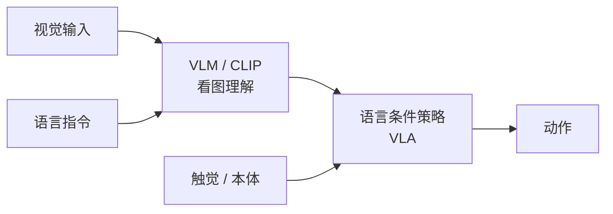
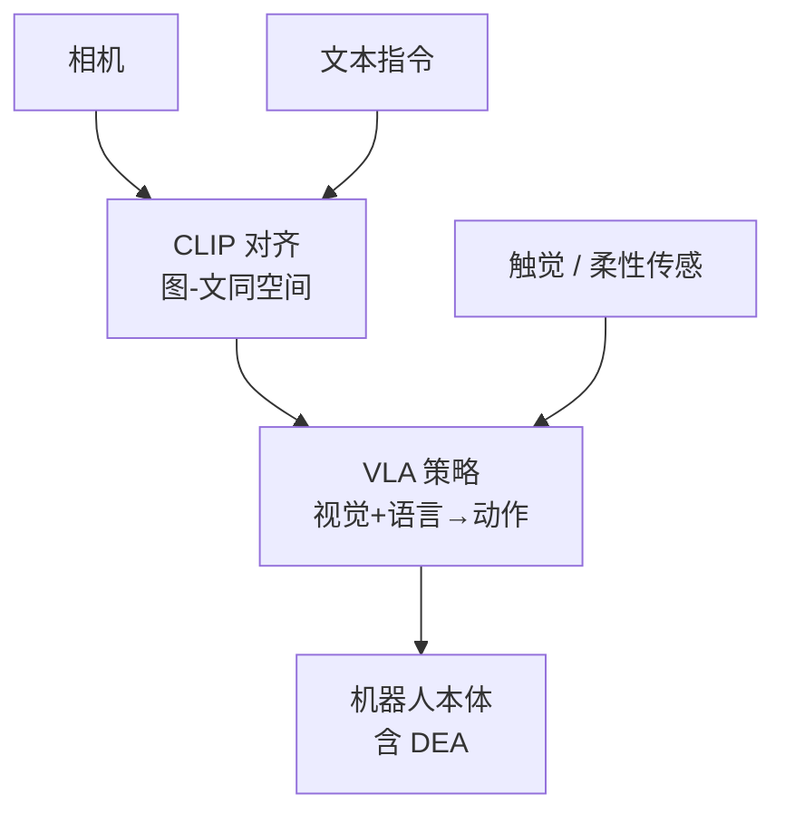

# 第二十讲 · 多模态感知与大模型：具身智能的「眼睛与大脑」（Multimodal Perception & VLMs）

> **本讲信息**
> - 日期：2026-09-02（周二）
> - 第几讲：第二十讲（学习计划 Day 20）
> - 对应计划：`study-plan-60d.md` 里 **P8 前沿 / 感知-认知进阶** 阶段
> - 今日目标：把 Day 1 的「感知站」和 Day 12 的「VLA」深化——VLM / CLIP 如何成为具身智能的「感知-认知内核」；语言条件策略是怎么用自然语言指挥机器人的。**注意：今天是具身智能通用内容（不是军事专题）。**

---

## 0. 一句话总结

> 具身智能的「感知」早已不只是「认出物体」，而是 **VLM（视觉语言模型）把「看到」变成「理解 + 可对话的动作意图」**；CLIP 把图像和语言对齐到同一空间，让「拿起红色的杯子」能被理解成视觉目标。这是 Day 12 VLA 的「感知底座」。

---

## 1. 核心知识点

### 1.1 从感知到认知（三级跳）

| 层级 | 做什么 | 例子 |
|---|---|---|
| 传统 CV | 检测 / 分割 / 分类 | YOLO 检到杯子 |
| VLM | 看图问答 / 指代 / 描述 | 「左边红色那个是杯子吗」 |
| 语言条件策略 | 用自然语言指挥动作 | 「把红杯放桌上」 → 动作 |

### 1.2 CLIP / 视觉语言对齐

- 图像编码器和文本编码器把**图、文投影到同一嵌入空间**；语义相近的图文在向量里靠得近。
- 这让「红杯」这种语言描述能直接对应视觉特征 —— 成为**语言条件策略的基座**。

### 1.3 VLA 深化（接 Day 12）

- **RT-1 / RT-2**（Google DeepMind）：VLM 当骨干，输出离散动作 token；RT-2 把网络世界的常识迁移到新物体 / 新指令。
- **OpenVLA / Octo**：开源 VLA，便于复现与改接口（训练营的 SO-101 可接）。
- 关键点：**VLA = 视觉 + 语言 → 动作，是「大脑」；你的 DEA 是「身体」**——两者解耦、可独立进步。

### 1.4 多模态融合（接 Day 1 / KB 03）

- 视觉 + 语言 + 触觉 + 本体感知融合 → 策略更稳。
- 软体尤其需要：形变难测，VLM「看图像」可辅助估计形变 / 接触。

### 1.5 一张图：感知-认知栈

### 1.6 DEA 交叉（你的方向）

- 软体没有干净本体感知 → **VLM「看形变」+ 柔性传感补状态**，是软体具身智能的实用组合。
- 你做 DEA，可以把「视觉估计形变」作为感知入口，接 Day 17 的柔性传感闭环。

---

## 2. 原理（先抓这几条）

1. **感知的终点是「可被执行的语言化理解」，不是识别框。**
2. **CLIP 对齐是语言条件策略的基石。**
3. **VLA = 大脑，本体 / DEA = 身体**，两者解耦可独立进步。
4. **软体靠「视觉 + 柔性传感」补状态**，VLM 是便宜的感知增益。

---

## 3. 一张图：感知栈到动作

---

## 4. 今天的操作步骤

1. **读一遍本文件**，回看 Day 1（感知站）、Day 12（VLA）。
2. **徒手画 §1.5 / §3 的图**：视觉+语言 → VLM → VLA → 动作。
3. **口头讲清**：CLIP 对齐、VLM 与 VLA 的关系、语言条件策略。
4. **（以后）** 跑一个 CLIP「用语言找物体」的 demo，或 OpenVLA 推理样例。
5. **镜子测试（3 分钟）：** *「感知三级跳___；CLIP 对齐是什么___；VLA 与 VLM 关系___；多模态融合有什么用___；DEA 怎么用 VLM 补感知___。」*

> ✅ **今天「做完」的标准：** 讲清 CLIP 对齐 + VLA 结构 + 多模态融合 + 过镜子测试。

---

## 5. 常见误区 & 容易踩的坑

| # | 误区 | 真相 |
|---|---|---|
| 1 | "感知就是目标检测。" | 具身感知要语言化理解 + 可对话意图。 |
| 2 | "VLA 等于 VLM。" | VLM 是感知/认知，VLA 在前者基础上输出动作。 |
| 3 | "CLIP 只能做分类。" | 它把图文对齐，是语言条件策略的基座。 |
| 4 | "软体不需要视觉。" | 软体状态难测，视觉是便宜的感知增益。 |
| 5 | "大模型太重跑不动。" | 可蒸馏 / 量化到边缘（接 Day 15 量化）。 |

---

## 6. 下一步 / 检查点

- **过了检查点 =** 讲清 CLIP 对齐 + VLA 结构 + 多模态融合 + 过镜子测试。
- **下一讲（Day 21）：** **灵巧操作与触觉感知**——具身智能的「手」：灵巧手、抓取、触觉闭环（接 KB 02 人形栈、KB 03 柔性传感）。

---

## 7. 训练营实操回顾（SO-101 的对照）

1. **SO-101 用相机做观测，ACT / DP 直接从像素学**——你已经见过「感知 → 动作」的最简闭环。
2. **VLM 给这条闭环加「语言大脑」**：把像素变成「语义 + 指令」，机器人才能听懂人话。训练营让你懂了地基，VLM 是上层建筑。

> 让我重来一次：**先有 SO-101 的「像素→动作」地基，再叠 VLM 的「语言→意图」大脑**——两层都懂，才算具身智能的感知专家。

---

### 参考资料（先放着，今天不要求）
- Radford et al. (2021). *CLIP: Learning transferable visual models from natural language supervision*. ICML.
- Brohan et al. (2022/2023). *RT-1 / RT-2: Vision-Language-Action models*.
- OpenVLA (2024). *OpenVLA: An open vision-language-action model*. arXiv:2406.09246.
- Octo (2024). *Octo: An open-source generalist robot policy*. RSS.
- （后续）Day 21 灵巧操作与触觉.