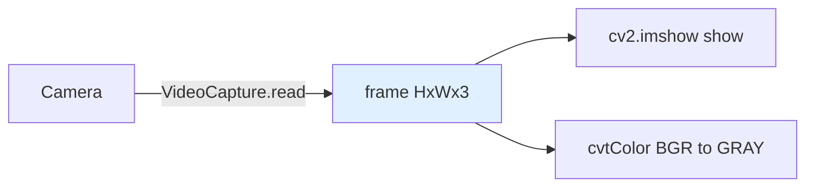

# Lecture 21 — Computer Vision Intro & OpenCV

> **Plan slot**: Day 21 (P7) | Episodes 081 Task intro / 082 CV overview / 083 How color images are stored / 084 OpenCV concept / 085 OpenCV helloworld / 086 OpenCV open camera
> **Series**: Heima《Embodied Intelligence》223-lecture study notes · Day 21 (entering P7 vision)

## 1. Where this sits
Entering P7 (Day 21–28, computer vision OpenCV, 35 lectures). Today's foundation: what an image actually is in a computer, how to use OpenCV, how to open a camera.

## 2. Core knowledge

### 2.1 What CV does (081–082)
Make machines "understand" images: detection (is it there / where), recognition (what is it), segmentation (which class each pixel belongs to). The arm needs vision to "see" objects before it can grasp them.

### 2.2 How color images are stored (083)
- An image = a pixel matrix of size H×W, each pixel 3 numbers (RGB 3 channels), i.e. an **H×W×3 tensor**.
- Values 0–255 encode brightness. R/G/B channels叠加 into color.

### 2.3 OpenCV (084)
- OpenCV = the standard image-processing library (C++/Python): read, show, transform, filter, detect.
- `cv2.imread / cv2.imshow / cv2.VideoCapture`.

### 2.4 Hello World + open camera (085–086)
- Hello: read an image, `imshow`, `waitKey` for a key, `destroyAllWindows` to close.
- Camera: `cap = cv2.VideoCapture(0)`, `ret, frame = cap.read()` grabs frame by frame.

## 3. Hands-on
Open the camera with OpenCV and show the live feed; try `cv2.cvtColor` to grayscale to see the effect.

## 4. Common pitfalls (IMPORTANT!)
- **OpenCV defaults to BGR, not RGB** (very easy to miss): `imread` returns B→G→R; `imshow` is fine, but the moment you use matplotlib or another lib (RGB) the **colors invert** (red becomes blue).
- Thinking "a color image is 3 separate images" — it's actually one H×W×3 tensor.
- `waitKey(0)` blocks for a key; `waitKey(1)` for video loops; forgetting it freezes the window.
- Wrong camera index (0/1) → won't open.

## 5. Checkpoint (by end of Day 38)
Process images with OpenCV + hand-eye calibration; run YOLO annotation-to-training (later).

## 6. DEA cross-link (light, not the main thread)
- Vision matters just as much for soft robots: compliant grasping, soft-body deformation observation, and e-skin imaging all rely on CV.
- A soft body has "no fixed shape" → traditional fixed-contour detection is harder; often needs soft-body models or vision/tactile fusion.
- Link: after Day 23 hand-eye calibration, camera pixels → physical coords, so a soft arm can also "look and grasp".

---
*Strictly follows the 60-day plan Day 21 (P7): episodes 081–086. Zero military content. Note: OpenCV defaults to BGR.*
