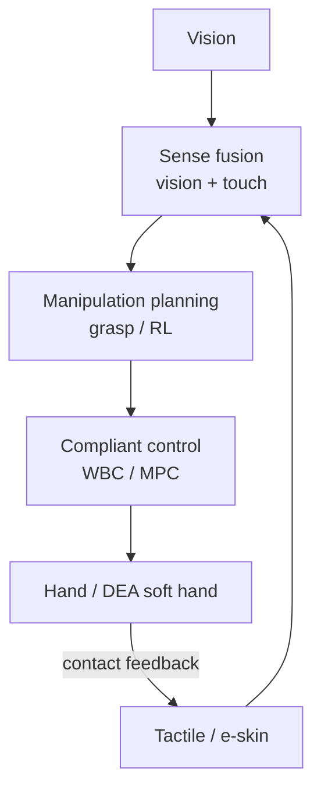
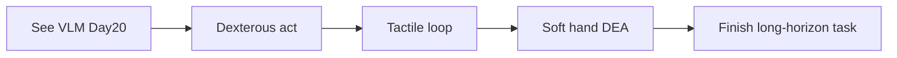

# Lecture 21 — Dexterous Manipulation & Tactile Sensing

> **Meta**
> - Date: 2026-09-03 (Wednesday)
> - Lecture / Day: Lecture 21 — Day 21 of the study plan
> - Plan anchor: `study-plan-60d.md` → **P8 前沿 / 操作进阶 (Manipulation advanced)**
> - Goal of today: the "hands" of embodied AI — dexterous hands, grasping, tactile loop. Ties to KB 02 (humanoid stack) "hands", KB 03 (flexible sensing / e-skin). **General embodied-AI content (not a military专题).**

---

## 0. One-line summary

> Seeing is not enough; you must *do* — **dexterous manipulation (multi-finger hands) and tactile sensing (e-skin) are the leap from "can recognize" to "can act"** in embodied AI; and soft / DEA dexterous hands are exactly your differentiation: compliant, inherently safe, shock-resistant — filling the rigid dexterous hand's "afraid of collision, too hard" gap.

---

## 1. Core knowledge

### 1.1 Why dexterous manipulation is hard

| Difficulty | Note |
|---|---|
| High-dim contact | many fingers, varying contact points |
| Friction / slip | slips if not compensated in real time |
| Partial observability | object often occluded, back not visible |
| Long-horizon | "fold laundry" needs dozens of steps |
| Object diversity | shape / material vary wildly |

### 1.2 Grasping & manipulation paradigms

- **Analytic grasp**: form/force closure geometry — classic, only guarantees "can pick up".
- **Data-driven grasp**: DexNet / FC-GQ-CN train general grasping on massive sim grasp data.
- **RL manipulation**: ties to Day 13's RL — learns "how to turn / insert".

### 1.3 Tactile sensing (ties to KB 03)

- **Vision-based tactile (GelSight)**: camera + elastic surface → high-info contact geometry / slip.
- **Capacitive array**: high-res pressure distribution → e-skin.
- **Tactile loop fills vision blind spots**: transparent objects, occlusion, slip — vision can't see, touch can feel.
- This directly completes Day 1's "perception station" loop.

### 1.4 Soft / DEA dexterous hands (your differentiation)

- Rigid dexterous hands are precise but **afraid of collision, too hard**; soft / DEA hands are **compliant, inherently safe, shock-resistant** (ties to Day 17/19).
- Grasping fragile / unknown objects, the soft body adaptively envelops — no clean inverse kinematics needed.
- This is where your "mechanical + materials + AI" trinity hits hardest.

### 1.5 One diagram: the hand-stack loop

### 1.6 DEA cross-over focus

- Your direction: **DEA soft hand = inherently safe + compliant**, filling the rigid hand's gap.
- Tactile (flexible sensing) is both DEA's proprioception (Day 17) and the manipulation-loop feedback — killing two birds with one stone.

---

## 2. Principles to internalize

1. **Manipulation = perception + planning + compliant control + contact feedback**; without touch you lose half the info.
2. **Touch fills vision blind spots**: occlusion / transparent / slip — vision is helpless.
3. **Compliance is the source of safety**: soft hands aren't afraid of collision, a must for human-robot collaboration.
4. **Your entry = DEA soft hand**: rigid hands are a red ocean, soft hands a blue ocean.

---

## 3. One diagram: from "recognize" to "act"

---

## 4. Today's operation steps

1. **Read this file once**, flipping to Day 1 (perception), Day 13 (RL manipulation), Day 17 (soft modeling), KB 02/03.
2. **Hand-draw the §1.5 / §3 diagrams**: vision+touch → fusion → planning → compliant control → hand → feedback.
3. **Explain out loud**: manipulation difficulties, why tactile matters, where soft hands differentiate.
4. **(Later)** watch a GelSight or DexNet demo video to feel tactile sensing first-hand.
5. **Mirror test (3 min):** *"Five difficulties of manipulation ___; what blind spots does touch fill ___; GelSight / capacitive array ___; DEA soft-hand differentiation ___; how tactile is also DEA proprioception ___"*

> ✅ **Definition of "done today":** explain manipulation difficulties + tactile value + DEA soft-hand difference + pass the mirror test.

---

## 5. Common misconceptions & easy mistakes

| # | Misconception | Reality |
|---|---|---|
| 1 | "A camera is enough for manipulation." | Occlusion/slip invisible; touch is mandatory. |
| 2 | "Rigid dexterous hands beat soft." | Rigid is precise but collision-shy; soft is compliant & safe — complementary. |
| 3 | "Picking up is enough." | Long-horizon needs turn/insert/fold — far beyond grasp. |
| 4 | "DEA hands aren't practical." | Adaptive enveloping of fragile/unknown objects is exactly the need. |
| 5 | "Tactile has nothing to do with proprioception." | Flexible sensing is both tactile and DEA proprioception — two birds. |

---

## 6. Next steps / checkpoint

- **Checkpoint passed if:** you can explain manipulation difficulties + tactile value + DEA soft-hand difference + pass the mirror test.
- **Next lecture (Day 22):** **Embodied-AI frontier panorama & research hotspots** — connect the 60 days into one panorama, and locate "your DEA / soft direction" in the map (general embodied-AI view).

---

## 7. First-person reflection (SO-101 contrast)

1. **SO-101 is "single-arm + gripper" simple manipulation** — you've run the simplest pick-place loop.
2. **Dexterous hands + tactile is the advanced tier**: from "can grip" to "can turn / insert / fold". The bootcamp gave the base, this lecture the upper floor.

> If I were to redo it: **first the SO-101 "gripper manipulation" base, then the "dexterous hand + tactile" upper floor** — your DEA soft hand opens a separate game on the safety/compliance dimension.

---

### References (for later, not required today)
- DexNet / FC-GQ-CN (UC Berkeley): data-driven grasping.
- GelSight (MIT): vision-based tactile sensing.
- RL manipulation: OpenAI Rubik's Cube hand (2019).
- KB 02 humanoid stack (hands), KB 03 flexible sensing / e-skin.
- (Later) Day 22 frontier panorama.
