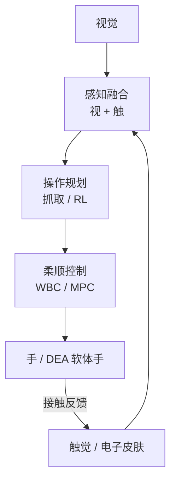

# 第二十一讲 · 灵巧操作与触觉感知（Dexterous Manipulation & Tactile Sensing）

> **本讲信息**
> - 日期：2026-09-03（周三）
> - 第几讲：第二十一讲（学习计划 Day 21）
> - 对应计划：`study-plan-60d.md` 里 **P8 前沿 / 操作进阶** 阶段
> - 今日目标：具身智能的「手」——灵巧手、抓取、触觉闭环。接 KB 02（人形机器人栈）的「手」、KB 03（柔性传感/电子皮肤）。**通用具身智能内容（不是军事专题）。**

---

## 0. 一句话总结

> 会「看」不够，要会「做」——**灵巧操作（多指手）和触觉感知（电子皮肤）是具身智能从「能认」到「能干」的关键一跃**；而软体 / DEA 灵巧手正是你的差异化切口：柔顺、本质安全、抗冲击，正好补刚性灵巧手「怕撞、太硬」的短板。

---

## 1. 核心知识点

### 1.1 灵巧操作为什么难

| 难点 | 说明 |
|---|---|
| 高维接触 | 手指多、接触点多变 |
| 摩擦 / 滑动 | 抓不稳就滑，需实时补偿 |
| 部分可观 | 物体常被遮挡，看不到背面 |
| 长程任务 | 「叠衣服」要几十步 |
| 物体多样 | 形状/材质千差万别 |

### 1.2 抓取与操作范式

- **分析抓取**：力闭合（form/force closure）等几何判据，经典但只管「抓得起」。
- **数据驱动抓取**：DexNet / FC-GQ-CN 用海量仿真抓取数据训通用抓取。
- **RL 操作**：接 Day 13 的强化学习，学「怎么转、怎么插」。

### 1.3 触觉感知（接 KB 03）

- **视触觉 GelSight**：相机 + 弹性表层，给出高信息量的接触几何 / 滑移。
- **电容阵列**：高分辨率压力分布，做电子皮肤。
- **触觉闭环补视觉盲区**：透明物体、遮挡、滑移——视觉看不清，触觉能感到。
- 这直接服务 Day 1「感知站」的闭环补全。

### 1.4 软体 / DEA 灵巧手（你的差异化切口）

- 刚性灵巧手精度高但**怕碰撞、太硬**；软体 / DEA 手**柔顺、本质安全、抗冲击**（接 Day 17/19）。
- 抓易碎 / 未知物体时，软体自适应包络，不靠精确逆解。
- 这是你「机械 + 材料 + AI」三位一体最能打的差异点。

### 1.5 一张图：手栈闭环

### 1.6 DEA 交叉重点

- 你的方向：**DEA 软体手 = 本质安全 + 柔顺**，补刚性灵巧手短板。
- 触觉（柔性传感）既是 DEA 的本体感知（Day 17），也是操作闭环的反馈——一箭双雕。

---

## 2. 原理（先抓这几条）

1. **操作 = 感知 + 规划 + 柔顺控制 + 接触反馈**，缺触觉就缺一半信息。
2. **触觉补视觉盲区**：遮挡 / 透明 / 滑移，视觉无能为力。
3. **柔顺是安全的来源**：软体手不怕撞，是人机协作的刚需。
4. **你的切口 = DEA 软体手**：刚性手红海，软体手蓝海。

---

## 3. 一张图：从「认」到「干」

---

## 4. 今天的操作步骤

1. **读一遍本文件**，回看 Day 1（感知站）、Day 13（RL 操作）、Day 17（软体建模）、KB 02/03。
2. **徒手画 §1.5 / §3 的图**：视+触 → 融合 → 规划 → 柔顺控制 → 手 → 反馈。
3. **口头讲清**：灵巧操作难点、触觉为什么重要、软体手差异化在哪。
4. **（以后）** 看一个 GelSight 或 DexNet 的 demo 视频，直观感受触觉。
5. **镜子测试（3 分钟）：** *「灵巧操作五大难点___；触觉补视觉什么盲区___；GelSight/电容阵列是什么___；DEA 软体手差异化___；触觉怎么又是 DEA 本体感知___。」*

> ✅ **今天「做完」的标准：** 讲清操作难点 + 触觉价值 + DEA 软体手差异 + 过镜子测试。

---

## 5. 常见误区 & 容易踩的坑

| # | 误区 | 真相 |
|---|---|---|
| 1 | "有相机就能操作。" | 遮挡/滑移看不清，触觉不可省。 |
| 2 | "刚性灵巧手比软体好。" | 刚性精度高但怕撞；软体柔顺安全，场景互补。 |
| 3 | "抓得起就行。" | 长程任务要转/插/叠，远超抓取。 |
| 4 | "DEA 手不实用。" | 易碎/未知物体自适应包络，正是刚需。 |
| 5 | "触觉和本体感知无关。" | 柔性传感既是触觉也是 DEA 本体感知，一箭双雕。 |

---

## 6. 下一步 / 检查点

- **过了检查点 =** 讲清操作难点 + 触觉价值 + DEA 软体手差异 + 过镜子测试。
- **下一讲（Day 22）：** **具身智能前沿全景与研究热点**——把 60 天串成全景，并定位「你的 DEA/软体方向」在版图里的位置（通用具身智能视角）。

---

## 7. 训练营实操回顾（SO-101 的对照）

1. **SO-101 是「单臂 + 夹爪」的简易操作**——你已经跑通「抓放」的最简操作闭环。
2. **灵巧手 + 触觉是操作的进阶**：从「夹得起」到「转得动、插得准、叠得好」。训练营给你操作的地基，这一讲是上层。

> 让我重来一次：**先有 SO-101 的「夹爪操作」地基，再上「灵巧手 + 触觉」的高层**——你的 DEA 软体手则在「安全/柔顺」维度另开一局。

---

### 参考资料（先放着，今天不要求）
- DexNet / FC-GQ-CN (UC Berkeley): 数据驱动抓取.
- GelSight (MIT): 视触觉传感.
- 灵巧操作 RL: OpenAI Rubik's Cube hand (2019).
- KB 02 人形机器人栈（手）、KB 03 柔性传感/电子皮肤.
- （后续）Day 22 前沿全景.