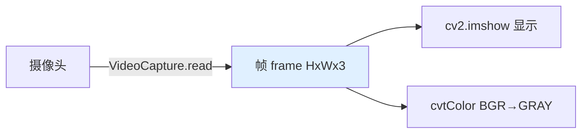

# 第二十一讲 · 计算机视觉入门与 OpenCV（Computer Vision Intro & OpenCV）

> **计划定位**：Day 21（P7）｜081 相关任务介绍 / 082 计算机视觉简介 / 083 计算机保存彩色图片的原理 / 084 opencv概念介绍 / 085 opencv的helloworld代码 / 086 opencv打开摄像头画面
> **系列**：黑马程序员《具身智能》223 节学习笔记 · 第 21 天（进入 P7 视觉）

## 1. 本讲位置
进入 P7（Day 21–28，计算机视觉 OpenCV，35 节）。今天打基础：图片在计算机里到底是什么、OpenCV 怎么用、怎么开摄像头。

## 2. 核心知识点

### 2.1 计算机视觉在做什么（081–082）
让机器“看懂”图像：检测（有没有/在哪）、识别（是什么）、分割（每个像素属哪类）。机械臂靠它“看见”物体才能抓。

### 2.2 彩色图怎么存（083）
- 图像 = 像素矩阵，尺寸 H×W，每个像素 3 个数（RGB 三通道），即 **H×W×3 的张量**。
- 值 0–255 表示亮度。R/G/B 三个通道叠加成彩色。

### 2.3 OpenCV（084）
- OpenCV = 图像处理标准库（C++/Python），读图、显示、变换、滤波、检测全有。
- `cv2.imread / cv2.imshow / cv2.VideoCapture`。

### 2.4 Hello World + 开摄像头（085–086）
- Hello：读一张图、`imshow` 显示、`waitKey` 等按键、`destroyAllWindows` 关。
- 开摄像头：`cap = cv2.VideoCapture(0)`，`ret, frame = cap.read()` 逐帧取画面。

## 3. 动手操作
用 OpenCV 打开摄像头并显示实时画面；顺手 `cv2.cvtColor` 做灰度转换看效果。

## 4. 易错点（重点！）
- **OpenCV 默认 BGR 而非 RGB 顺序**（极易错）：`imread` 读进来是 B→G→R，用 `imshow` 没事，但一旦用 matplotlib 或其他库（按 RGB）就**颜色全反**（红变蓝）。
- 以为“彩色图是 3 张独立图” —— 其实是 H×W×3 一个张量。
- `waitKey(0)` 卡住等键，`waitKey(1)` 用于视频循环；忘记会窗口无响应。
- 摄像头索引错（0/1） → 打不开。

## 5. 阶段检查点（Day 38 末要能）
OpenCV 处理图像 + 手眼标定；YOLO 标注到训练跑通（后续）。

## 6. DEA 交叉链接（轻量，非主线）
- 视觉对软体机器人同样关键：柔性抓取、软体形变观测、电子皮肤图像化都靠 CV。
- 软体“形状不固定” → 传统基于固定轮廓的检测更难，常需结合柔体模型或触觉/视觉融合。
- 衔接：Day 23 手眼标定后，摄像头像素坐标→物理坐标，软体臂也能“看着抓”。

---
*本讲严格对应《60 天计划》Day 21（P7）：081–086。全程零军事内容。注：OpenCV 默认 BGR。*
