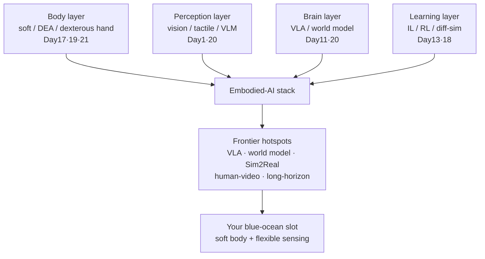
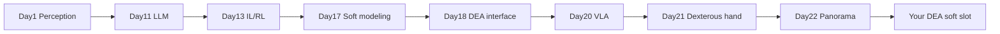

# Lecture 22 — Embodied-AI Frontier Panorama & Research Hotspots

> **Meta**
> - Date: 2026-09-04 (Thursday)
> - Lecture / Day: Lecture 22 — Day 22 of the study plan
> - Plan anchor: `study-plan-60d.md` → **P8 前沿 / 全景收口 (Frontier panorama wrap-up)**
> - Goal of today: connect the 60 days into one "embodied-AI map", see the frontier hotspots, and locate "your DEA / soft direction" in the map. **General embodied-AI content (not a military专题); military special-ops applications stay in Day 16 / Day 19 and are not expanded here.**

---

## 0. One-line summary

> 60 days in, **embodied AI = body (hardware / soft) + brain (LLM / VLA) + learning (IL / RL / world model) + perception (vision / tactile) stacked together**; the frontier hotspots are all about making these four pieces mesh tighter and land at lower cost. And your **DEA soft body + flexible sensing** is exactly the blue-ocean slot in the "body" layer that few people occupy.

---

## 1. Core knowledge

### 1.1 The four-layer map of embodied AI

| Layer | Where you studied it | What the frontier is attacking |
|---|---|---|
| Body | Day 17 soft modeling, Day 19 deployment, Day 21 dexterous hands | soft / DEA actuators, flexible sensing, new embodiments (tactile skin, variable stiffness) |
| Perception | Day 1 perception station, Day 20 multimodal / VLM | vision-language alignment, tactile-vision fusion, active perception (move to see better) |
| Brain | Day 11 LLM, Day 20 VLA | VLA large models, embodied world models, long-horizon planning |
| Learning | Day 13 IL/RL, Day 18 DEA interface | world model + MBRL, sim2real, human-video imitation, differentiable-sim co-design |

### 1.2 Hottest research hotspots (2025–2026)

- **VLA (Vision-Language-Action)**: squeeze "see + say + do" into one model (RT-2, OpenVLA, Octo, π0). The VLM you learned in Day 20 is its "eyes + mouth"; the action head is its "hands".
- **World Model**: let the agent "rehearse" the next step in its head (the differentiable sim from Day 18 is a white-box world model). Rehearse → fewer real trials → safer.
- **Sim2Real & differentiable simulation**: DiffTaichi / PyElastica / ChainQueen (Day 17/18) make "simulation = training ground", shrinking the reality gap.
- **Human-video imitation**: learn by watching human videos — the lowest-data-cost learning paradigm.
- **Long-horizon & open-vocabulary manipulation**: from "grasp one cup" to "clear a messy table", needing planning + memory + language conditioning.
- **Soft / new embodiments + flexible sensing**: **this is exactly your entry** (see §1.4).

### 1.3 One diagram: embodied-AI panorama

### 1.4 Where your DEA / soft direction sits in the map

- **Body layer = your main battlefield**: others pile into "brain" (VLA / world model red ocean); you take "body" (soft actuator + flexible sensing blue ocean).
- **Decoupled from the brain**: as Day 18 stated — VLA is brain, DEA is body; the brain-body interface is "voltage/field action space + flexible-sensing feedback". You can skip building the big model and just build "a compliant body the big model can drive".
- **One-line differentiation**: rigid robots are collision-shy, hard, expensive; your soft body is inherently safe, shock-resistant, can envelop unknown objects — filling the need in human-robot collaboration and fragile scenarios.

### 1.5 DEA cross-over focus (wrap-up)

- Day 17 (modeling) → Day 18 (action-space interface) → Day 19 (deployment / military) → Day 21 (soft hand) already string DEA into one line.
- This lecture drops that line **into the 60-day panorama**: DEA is not an isolated direction, but the concrete landing point of the "body layer" on the soft track; brain/learning layers (VLA, world model, IL/RL) are mature capabilities you can "borrow".

---

## 2. Principles to internalize

1. **Embodied AI = body + sense + brain + learn meshing together**; lose one layer and it limps.
2. **The frontier attacks "meshing cost"**: less data, smaller sim gap, fewer trials.
3. **Your best strategy = occupy the body blue ocean, borrow the mature brain**: don't rebuild VLA; make DEA a compliant actuator the VLA can call.
4. **Soft / DEA's value is "safety & adaptation", not "precision"** — don't fight rigid hands on their strength.

---

## 3. One diagram: from 60 days to you

---

## 4. Today's operation steps

1. **Read this file once**, flipping to Day 1/11/13/17/18/19/20/21 "one-line summary" and Mermaid, confirm the four-layer map reads smoothly.
2. **Hand-draw the §1.3 panorama**: body → perception → brain → learning → stack → frontier hotspots → your blue-ocean slot.
3. **Explain out loud**: what the four layers are, the 3 hottest hotspots now, why your DEA slot is blue ocean.
4. **(Later)** skim one VLA survey (e.g. RT-2 / OpenVLA / π0) abstract to feel what the "brain" looks like.
5. **Mirror test (3 min):** *"Four layers of embodied AI ___; hottest 2025–2026 hotspots (name 3) ___; why world model matters ___; what is Sim2Real ___; how to say your DEA blue-ocean slot in one line ___."*

> ✅ **Definition of "done today":** explain four-layer map + 3 hotspots + DEA blue-ocean slot + pass the mirror test.

---

## 5. Common misconceptions & easy mistakes

| # | Misconception | Reality |
|---|---|---|
| 1 | "Embodied AI = build a big model." | The big model is only the "brain"; body/perception/learning are equally key and more under-staffed. |
| 2 | "DEA is too niche to have a future." | The body layer is exactly the blue ocean, and can borrow mature brains — not isolated. |
| 3 | "Soft is useless because low precision." | Value is inherent safety & adaptation; scenario is fragile / human-robot, not precision contest. |
| 4 | "Must chase every frontier hotspot." | Occupy one layer; your anchor is the body layer, borrow the rest. |
| 5 | "World model = sci-fi." | Differentiable sim (Day 18) is the deployable white-box world model. |

---

## 6. Next steps / checkpoint

- **Checkpoint passed if:** you can explain four-layer map + 3 hotspots + DEA blue-ocean slot + pass the mirror test.
- **Next stage (Day 23+):** enter P9 **job-hunt / project-ization wrap-up** — package the DEA soft direction into interview-reproducible mini-projects (ties to Day 19 §1.7 resume project-ization map), and close gaps against KB 04 job-family matching.

---

## 7. First-person reflection (where the bootcamp sits in the panorama)

1. **SO-101 (Dagu S600 + LeRobot + ACT)** already let you run the minimal "perception → learning → body" loop: camera sees, ACT learns, arm moves.
2. **This panorama = zoom that minimal loop into the industry map**: your bootcamp ran the "learning + body" entry tier; the frontier stacks "brain (VLA/world model)" and "perception (tactile)" on top.
3. **Your DEA soft slot = swap the bootcamp's rigid arm for a compliant body the same framework can drive** — reuse the framework, change the embodiment.

> If I were to redo it: **the bootcamp gave you the "embodied loop" base, this lecture the "industry map", and DEA is the plot you circled on the map.**

---

### References (for later, not required today)
- RT-2 / OpenVLA / Octo / π0: representative VLA works.
- Day 1/11/13/17/18/19/20/21 one-line summaries and Mermaid.
- KB 02 humanoid stack, KB 03 flexible sensing / e-skin, KB 04 job-family matching.
- (Later) Day 23+ job-hunt / project-ization wrap-up.
