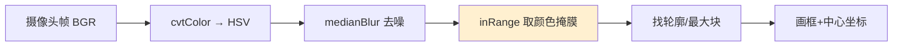

# 第二十二讲 · ROI 与颜色分拣：HSV 提取 + 均值滤波（ROI & Color Sorting）

> **计划定位**：Day 22（P7）｜087 opencv的roi操作 / 088 颜色分拣器的需求分析 / 089 颜色分拣器的代码开发 / 090 做一个灰色hsv范围的提取器 / 091 添加一个均值滤波提升检测的稳定性
> **系列**：黑马程序员《具身智能》223 节学习笔记 · 第 22 天

## 1. 本讲位置
P7 第二个动手案例：用颜色把物体分拣出来。核心工具 ROI、HSV 色彩空间、均值滤波。

## 2. 核心知识点

### 2.1 ROI（087）
- Region of Interest：只截取/处理图像里**关心的一块矩形区域**，省算力、排干扰。
- `roi = img[y1:y2, x1:x2]`。

### 2.2 颜色分拣需求（088）
- 目标：在画面里找出“某种颜色的块”，输出它的位置/外接框，供机械臂去抓或分类。

### 2.3 HSV 提取颜色（089–090）
- **HSV**（色相 H / 饱和度 S / 明度 V）比 RGB 更适合按颜色分割：H 直接代表“什么颜色”，对光照强弱不敏感。
- 做法：`cvtColor(BGR→HSV)` → `inRange` 用 `[Hmin,Smin,Vmin]`~`[Hmax,Smax,Vmax]` 二值掩膜 → 找轮廓。
- “灰色 HSV 范围提取器” = 一个小工具，拖动滑块现场定阈值（避免写死）。

### 2.4 均值滤波（091）
- `blur` / `medianBlur`：用邻域平均/中值平滑图像，**去噪点**，让检测框不抖。
- 均值滤波简单；中值滤波对“椒盐噪点”更好。

## 3. 动手操作
写颜色分拣器：开摄像头 → 转 HSV → inRange 取某色掩膜 → 找最大轮廓 → 画框显示中心；加 medianBlur 稳一下；用滑块工具现场定 HSV 范围。

## 4. 易错点（重点！）
- **光照一变，写死的 HSV 阈值就失效** → 必须现场标定/自适应，别硬编码。
- 没滤波 → 检测框抖、误检。
- OpenCV 里 H 是 0–179（不是 0–360），S/V 是 0–255，别弄错量程。
- inRange 高低顺序反 → 掩膜全黑/全白。

## 5. 阶段检查点
能独立做一个“识别某种颜色块并定位”的小程序；理解为何用 HSV 而非 RGB。

## 6. DEA 交叉链接（轻量，非主线）
- 颜色/视觉分拣对软体抓取很有用：软体手抓易变形物体时，靠视觉定位于“物体的颜色块”比靠固定夹具更稳。
- 软体本体颜色/标记也可作为 proprioception 线索（看薄膜形变估状态）。
- 衔接：Day 24 之后把“看到的颜色块物理坐标”经 IK 让臂去抓，闭环就成型了——无论刚性还是软体臂。

---
*本讲严格对应《60 天计划》Day 22（P7）：087–091。全程零军事内容。注：HSV 阈值要现场标定，别写死。*
