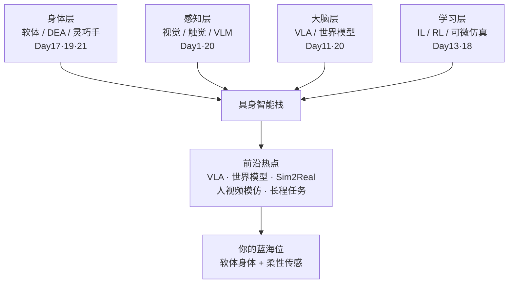

# 第二十二讲 · 具身智能前沿全景与研究热点（Frontier Panorama & Research Hotspots）

> **本讲信息**
> - 日期：2026-09-04（周四）
> - 第几讲：第二十二讲（学习计划 Day 22）
> - 对应计划：`study-plan-60d.md` 里 **P8 前沿 / 全景收口** 阶段
> - 今日目标：把 60 天串成一张「具身智能版图」，看清前沿热点，并定位「你的 DEA / 软体方向」在版图里的位置。**通用具身智能内容（不是军事专题）；军事特种作业应用留在 Day 16 / Day 19，本讲不展开。**

---

## 0. 一句话总结

> 60 天走到这里，**具身智能 = 身体（硬件/软体）+ 大脑（大模型/VLA）+ 学习（IL/RL/世界模型）+ 感知（视觉/触觉）四件叠在一起**；前沿热点都在「让这四件更紧地咬合、更低成本地落地」。而你的 **DEA 软体身体 + 柔性传感**，正是「身体」这一层里少有人占的蓝海位。

---

## 1. 核心知识点

### 1.1 具身智能的四层版图

| 层 | 在学过的哪里 | 前沿在攻什么 |
|---|---|---|
| 身体层 | Day 17 软体建模、Day 19 工程化、Day 21 灵巧手 | 软体/DEA 驱动器、柔性传感、新型本体（触觉皮肤、可变刚度） |
| 感知层 | Day 1 感知站、Day 20 多模态/VLM | 视觉-语言对齐、触觉-视觉融合、主动感知（看不清就动一下） |
| 大脑层 | Day 11 大模型、Day 20 VLA | VLA 大模型、具身世界模型、长程任务规划 |
| 学习层 | Day 13 IL/RL、Day 18 DEA 接口 | 世界模型 + MBRL、sim2real、人类视频模仿、可微分仿真 co-design |

### 1.2 当前最热的研究热点（2025–2026）

- **VLA 大模型（Vision-Language-Action）**：把「看 + 说 + 做」压进一个模型（RT-2、OpenVLA、Octo、π0）。你 Day 20 学的 VLM 是它的「眼睛+嘴巴」，动作头是它的「手」。
- **世界模型（World Model）**：让智能体在脑子里「预演」下一步（Day 18 提的可微分仿真就是白盒世界模型）。能预演就能少试错、更安全。
- **Sim2Real & 可微分仿真**：Day 17/18 的 DiffTaichi / PyElastica / ChainQueen 让「仿真即训练场」，把现实差距压到最小。
- **人类视频模仿（Human Video Imitation）**：看人做视频就学会做——数据成本最低的学习范式。
- **长程任务与开放词汇操作**：从「抓一个杯子」到「收拾一桌乱外卖」，需要规划 + 记忆 + 语言条件。
- **软体 / 新型本体 + 柔性传感**：**这正是你的切口**（见 §1.4）。

### 1.3 一张图：具身智能全景

### 1.4 你的 DEA / 软体方向在版图里的位置

- **身体层 = 你的主战场**：别人卷「大脑」（VLA/世界模型红海），你占「身体」（软体驱动器+柔性传感蓝海）。
- **与大脑解耦**：Day 18 已讲——VLA 是脑，DEA 是体，脑体接口就是「电压/电场动作空间 + 柔性传感反馈」。你可以不做大模型，只做「能被大模型驱动的柔顺身体」。
- **差异化一句话**：刚性机器人怕撞、硬、贵；你的软体体本质安全、抗冲击、能包络未知物体——补的是人-机协作与脆弱场景的刚需。

### 1.5 DEA 交叉重点（收口）

- Day 17（建模）→ Day 18（动作空间接口）→ Day 19（工程化/军事）→ Day 21（软体手）已把 DEA 串成一条线。
- 本讲把这条线**放进 60 天全景**：DEA 不是孤立方向，而是「身体层」在软体赛道的具体落点；大脑/学习层（VLA、世界模型、IL/RL）都是你可以「借用」的成熟能力。

---

## 2. 原理（先抓这几条）

1. **具身智能 = 身 + 感 + 脑 + 学 四层咬合**，少一层就瘸腿。
2. **前沿在攻「咬合成本」**：更低数据、更低仿真差距、更少试错。
3. **你的最优策略 = 占身体蓝海、借大脑成熟**：不重造 VLA，把 DEA 做成可被 VLA 调用的柔顺执行器。
4. **软体/DEA 的价值在「安全与适应」**，不是「精度」——别拿自己短板去拼刚性手的长板。

---

## 3. 一张图：从 60 天到你

---

## 4. 今天的操作步骤

1. **读一遍本文件**，回看 Day 1/11/13/17/18/19/20/21 的「一句话总结」与 Mermaid，确认四层版图能讲顺。
2. **徒手画 §1.3 全景图**：身体 → 感知 → 大脑 → 学习 → 叠成栈 → 前沿热点 → 你的蓝海位。
3. **口头讲清**：四层各是什么、当前最热的 3 个热点、你的 DEA 位为什么是蓝海。
4. **（以后）** 挑 1 篇 VLA 综述（如 RT-2 / OpenVLA / π0）扫一遍摘要，感受「大脑」长什么样。
5. **镜子测试（3 分钟）：** *「具身智能四层___；2025–2026 最热热点（举 3 个）___；世界模型为什么重要___；Sim2Real 是什么___；你的 DEA 蓝海位怎么一句话讲___。」*

> ✅ **今天「做完」的标准：** 讲清四层版图 + 3 个热点 + DEA 蓝海位 + 过镜子测试。

---

## 5. 常见误区 & 容易踩的坑

| # | 误区 | 真相 |
|---|---|---|
| 1 | "具身智能 = 做大模型。" | 大模型只是「脑」；身体/感知/学习三层同样关键，且更缺人。 |
| 2 | "DEA 太小众没前途。" | 身体层正是蓝海，且可借成熟大脑，不孤立。 |
| 3 | "软体精度低就没用。" | 价值在本质安全与自适应，场景是脆弱/人机协作，不是拼精度。 |
| 4 | "前沿热点都要追。" | 选一层占住即可；你的锚点是身体层，其余借力。 |
| 5 | "世界模型=科幻。" | 可微分仿真（Day 18）就是可落地的白盒世界模型。 |

---

## 6. 下一步 / 检查点

- **过了检查点 =** 讲清四层版图 + 3 个热点 + DEA 蓝海位 + 过镜子测试。
- **下一阶段（Day 23 起）：** 进入 P9 **求职/项目化收口**——把 DEA 软体方向打包成可面试复现的小项目（接 Day 19 §1.7 的简历项目化地图），并对照 KB 04 岗位匹配做差距补齐。

---

## 7. 训练营实操回顾（全景里的位置）

1. **SO-101（地瓜 S600 + LeRobot + ACT）** 已经让你跑通「感知→学习→身体」的最小闭环：相机看、ACT 学、机械臂动。
2. **本讲全景 = 把这个最小闭环放大成行业版图**：你训练营跑的是「学习层+身体层」的入门款，前沿在往上叠「大脑层（VLA/世界模型）」和「感知层（触觉）」。
3. **你的 DEA 软体位 = 把训练营的刚性机械臂，换成可被同样框架驱动的柔顺身体**——框架复用，本体换道。

> 让我重来一次：**训练营给你「具身闭环」的地基，本讲给你「行业版图」的地图，DEA 是你在地图上圈下的自留地。**

---

### 参考资料（先放着，今天不要求）
- RT-2 / OpenVLA / Octo / π0：VLA 大模型代表工作.
- Day 1/11/13/17/18/19/20/21 各讲「一句话总结」与 Mermaid.
- KB 02 人形机器人栈、KB 03 柔性传感/电子皮肤、KB 04 岗位匹配.
- （后续）Day 23 起 求职/项目化收口.
