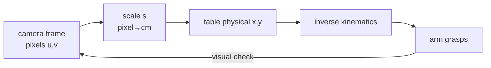

# Lecture 23 · Hand-Eye Calibration & Pixel↔Physical Mapping

> **Lecture info**
> - Date: 2026-09-05 (Fri)
> - Lecture #: 23 (Study Plan Day 23, P7 Computer Vision / OpenCV)
> - Plan ref: `study-plan-60d.md` → **P7 Computer Vision / OpenCV**, episodes **092–095**
> - Goal: Understand why *hand-eye calibration* is the foundation of visual grasping — map pixel coordinates seen by the camera to real-world physical coordinates on the table; and collect the joint-angle information needed for arm grasping. This is the first time the “eye” (camera) and the “hand” (arm) are truly aligned.

---

## 0. One-line summary

> **Hand-eye calibration = building a “pixel ↔ cm” conversion table for the camera**; without it, “the object is at pixel 200” means nothing in the real world and the arm has no idea where to grasp. Calibration is essentially solving for the **extrinsic transform (R|t)** from camera frame to robot base frame.

---

## 1. Core concepts (eps 092–095)

### 1.1 092 Why hand-eye calibration is needed
- The camera only outputs **pixel coordinates (u, v)**; the arm lives in **real-world coordinates (x, y, z)**. The two frames don’t match — vision and motion are disconnected, you can see but not grasp.
- Calibration = solving for the camera-to-base transform (rotation + translation, the **extrinsic R|t**) so an image point can be projected back to a real point on the table.

### 1.2 093 Scale between pixel space and physical space
- **Scale s** = physical length ÷ pixel length (e.g. 0.5 mm/pixel, or “how many pixels per cm”).
- With the camera fixed looking down at the table, perspective approximates parallel projection, so 1 pixel ≈ a fixed number of cm (stable as long as height is constant).

### 1.3 094 Compute object size from pixel/physical scale
- Use a reference of known size (e.g. a 1-yuan coin, 25 mm diameter) — count how many pixels it spans in the image → back out s.
- Real object width = pixel width × s; same for height and position.

### 1.4 095 Collect arm grasping angle information
- After calibration: detect object center in pixels → multiply by scale → get table physical coordinate → use as the **inverse-kinematics (IK) target pose**.
- Also record “joint angles during grasping” to accumulate demonstration data for **behavior cloning / teleoperation** (Day 51+).

---

## 2. Principles (grab these)

1. **Without calibration, pixel coords are gibberish to the arm** — even the units don’t match; feeding them directly is off by a mile.
2. **Scale depends on camera height and lens**; re-calibrate if height changes.
3. **Calibration is essentially solving one transform matrix (extrinsic R|t)** that projects image points back to world points.

---

## 3. One diagram: pixel → physical → grasp loop

---

## 4. Today’s steps

1. **Watch 092–095** (1.0–1.5×), focus on 092 (why calibration is mandatory) and 094 (measure scale with a reference).
2. **Measure scale s with a reference**: place a known-size object → count its pixel width → s = real width / pixel width.
3. **Write a “pixel center → physical coord” function**: input (u,v), output (x,y).
4. **Mirror test (3 min):** *“Hand-eye calibration is ___; scale is ___; why re-calibrate when camera height changes ___; can pixel coords be used directly as IK target ___.”*

> ✅ **Done today when:** you can explain calibration + measure scale + pass the mirror test.

---

## 5. Common pitfalls

| # | Myth | Truth |
|---|---|---|
| 1 | Feed pixel coords straight to the arm | Units don’t even match — off by a mile |
| 2 | Calibrate once, use forever | Camera height / focal length change → scale breaks |
| 3 | Scale is uniform everywhere | Perspective distorts edges; only top-down approximation holds; tilted views are worse |
| 4 | Guess object size by eye | Must calibrate with a reference on-site, don’t hardcode a constant |

---

## 6. DEA cross-link (light, not main thread)

- Soft grippers also need “where is the thing” — visual localization is especially useful for soft hands grasping **deformable objects** (no rigid fixture needed).
- But a soft arm’s end pose is driven by **voltage / electric field**, with no clean joint angles; the IK-target → drive-voltage mapping is “softer” (has hysteresis). Even after calibration you need **closed-loop visual feedback** to keep correcting, not a one-shot forward solution.
- Link: Day 24 feeds “seen physical coord” through IK to move the arm — same “see → locate → move” logic for rigid or soft arms.

---

## 7. Next / checkpoint

- **Checkpoint passed =** explain calibration + measure scale + pass mirror test.
- **Next (Day 24):** FK/IK example code + control arm motion + get world coord via FK formula (096–099).

---

### References (not required today)
- Episodes 092–095 (B 站《黑马程序员 · 具身智能》).
- (Later) Day 24 visual localization → IK → arm control; Day 51+ behavior cloning builds on this “demonstration data”.

*This lecture strictly follows 《60-Day Plan》 Day 23 (P7): 092–095. Zero military content.*
