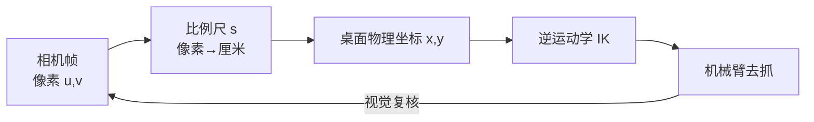

# 第二十三讲 · 手眼标定与像素↔物理映射（Hand-Eye Calibration）

> **本讲信息**
> - 日期：2026-09-05（周五）
> - 第几讲：第二十三讲（学习计划 Day 23，P7 计算机视觉 OpenCV）
> - 对应计划：`study-plan-60d.md` → **P7 计算机视觉 OpenCV**，课程集号 **092–095**
> - 今日目标：搞懂“手眼标定”为什么是视觉抓取的地基——把相机看到的像素坐标，换算成真实桌面上物体的物理坐标；并采集机械臂抓取所需的角度信息。这是把“眼睛”（相机）和“手”（机械臂）第一次真正对到一起。

---

## 0. 一句话总结

> **手眼标定 = 给相机建一张“像素 ↔ 厘米”的换算表**；没有它，你看到的“物体在第 200 像素”在真实世界里毫无意义，机械臂根本不知道去哪抓。标定本质就是求出“相机坐标系 → 机器人基坐标系”的**外参变换矩阵**。

---

## 1. 核心知识点（对照 092–095）

### 1.1 092 为什么需要手眼标定
- 相机只输出**像素坐标 (u, v)**；机械臂活在**真实世界坐标 (x, y, z)** 里。两套坐标系对不上，vision 和 motion 就是两张皮，看到也抓不到。
- 标定 = 求出相机到机器人基座的变换（旋转 + 平移，即**外参 R|t**），让“图像里的点”能投影回“桌面上真实的点”。

### 1.2 093 像素空间和物理空间的比例尺
- **比例尺 s** = 物理长度 ÷ 像素长度（例如 0.5 mm/像素，或反过来“每厘米多少像素”）。
- 相机**固定俯视桌面**时，透视近似成平行投影，1 像素 ≈ 固定的厘米数（高度不变就稳定）。

### 1.3 094 基于像素和物理空间的比例计算物体大小
- 用已知尺寸的参照物（如 1 元硬币直径 25 mm）在图里占多少像素 → 反推出 s。
- 物体真实宽 = 像素宽 × s；同理得真实高、真实位置。

### 1.4 095 采集机械臂抓取的角度信息
- 标定好后：识别物体中心像素 → 乘比例尺 → 得到桌面物理坐标 → 作为**逆运动学 IK 的目标位姿**。
- 同时记录“抓取时各关节角”，为后续**行为克隆 / 遥操作**（Day 51+）积累示范数据。

---

## 2. 原理（先抓这几条）

1. **没有标定，像素坐标对机械臂是“天书”**——单位都不一致，直接喂过去差十万八千里。
2. **比例尺依赖相机高度与镜头**；高度变了要重标。
3. **标定本质是求一个坐标变换矩阵（外参 R|t）**，把图像点投影回世界点。

---

## 3. 一张图：像素 → 物理 → 抓取 的闭环

---

## 4. 今天的操作步骤

1. **看 092–095**（1.0–1.5 倍速），重点看 092 为什么必须标定、094 怎么用参照物测比例尺。
2. **用参照物测比例尺 s**：放一个已知尺寸物体 → 数它在图里的像素宽 → s = 真实宽 / 像素宽。
3. **写“像素中心 → 物理坐标”的函数**：输入 (u,v)，输出 (x,y)。
4. **镜子测试（3 分钟）：** *“手眼标定是___；比例尺是___；为什么相机高度变了要重标___；像素坐标能直接当 IK 目标吗___。”*

> ✅ **今天“做完”的标准：** 讲清手眼标定 + 会测比例尺 + 过镜子测试。

---

## 5. 常见误区 & 容易踩的坑

| # | 误区 | 真相 |
|---|---|---|
| 1 | 像素坐标直接当目标给机械臂 | 单位都不一致，差十万八千里 |
| 2 | 标一次永久用 | 相机高度 / 焦距一动，比例尺就失真 |
| 3 | 比例尺对所有位置都一样 | 透视下边缘有畸变，只有俯视近似才成立；斜着拍更不准 |
| 4 | 物体大小靠“目测” | 必须用参照物现场标定，别写死常量 |

---

## 6. DEA 交叉链接（轻量，非主线）

- 软体抓取同样需要“看到东西在哪”：视觉定位对软体手抓**易变形物体**尤其有用（不靠固定夹具硬夹）。
- 但软体臂末端位姿靠“**电压 / 电场**”驱动，没有干净关节角，IK 目标 → 驱动电压这层映射更“软”（有迟滞），标定后仍需**闭环视觉反馈**不断纠偏，不能只靠一次正解。
- 衔接：Day 24 会把“看到的物理坐标”经 IK 让臂去抓，刚性与软体臂都是同一套“看到→算位→动臂”逻辑。

---

## 7. 下一步 / 检查点

- **过了检查点 =** 讲清手眼标定 + 会测比例尺 + 过镜子测试。
- **下一阶段（Day 24）：** 正 / 反解示例代码 + 控制机械臂运动 + 通过正解公式得到物理世界坐标（096–099）。

---

### 参考资料（先放着，今天不要求）
- 课程集号 092–095（B 站《黑马程序员 · 具身智能》）。
- （后续）Day 24 视觉定位 → IK → 控制机械臂，Day 51+ 行为克隆建立在此“示教数据”之上。

*本讲严格对应《60 天计划》Day 23（P7）：092–095。全程零军事内容。*
