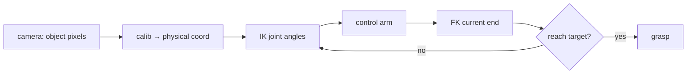

# Lecture 24 · FK/IK Example Code & Arm Control Landing

> **Lecture info**
> - Date: 2026-09-06 (Sat)
> - Lecture #: 24 (Study Plan Day 24, P7 Computer Vision / OpenCV)
> - Plan ref: `study-plan-60d.md` → **P7 Computer Vision / OpenCV**, episodes **096–099**
> - Goal: Connect Day 23’s “seen physical coord” to Day 12–16’s FK/IK; build a chained demo “visual localization → IK → joint angles → control arm to target”. FK recomputes current end pose from joint angles for closed-loop checking. This is the first time “eye + brain + hand” runs end to end.

---

## 0. One-line summary

> **Transform visual coord into the arm base frame → IK for joint angles → control arm to target; FK recomputes current world pose for closed-loop check.** This welds Day 21–23’s “seeing” with Day 12–16’s “computing” into actual “moving”.

---

## 1. Core concepts (eps 096–099)

### 1.1 096 FK/IK example code
- Turn **FK (joint angles → end pose)** and **IK (end pose → joint angles)** into callable functions — the formulas derived in Day 12–16 become code here.

### 1.2 097 Code to control arm motion
- Send “target joint angles / target pose” to the lower controller (linking Day 19–20 motor ID, student-side control, teleoperation) so the arm moves to the spot.

### 1.3 098 Get world coord via FK formula
- Use **FK to compute “current end world coord” from current joint angles**, compare with the visual target; the gap is the remaining displacement — that is closed-loop feedback.

### 1.4 099 IK solving flow
- Standard IK flow: **target pose → pick method (geometric / numerical) → solve angles → limit & singularity check → output executable angles**.

---

## 2. Principles (grab these)

1. **Visual coord must be transformed into the arm base frame before IK** — mismatched frames → grasping offset.
2. **FK tells “where the arm is now”, IK tells “where to go”**: one feedback, one decision.
3. **Control = send target + closed-loop feedback** (encoder reports angles, linking Day 17 closed-loop idea).

---

## 3. One diagram: see → locate → move loop

---

## 4. Today’s steps

1. **Watch 096–099** (1.0–1.5×), focus on 098 (FK → world coord) and 099 (full IK flow).
2. **Write FK + IK functions** (reuse Day 12–16), unit-test first.
3. **Chain “visual → IK → control” demo**: detect → calibrate → IK → command the arm over.
4. **Mirror test (3 min):** *“Why not feed visual coord straight to IK ___; what FK does in this loop ___; how to pick among IK multi-solutions ___.”*

> ✅ **Done today when:** the “see → locate → move” chained demo runs + mirror test passed.

---

## 5. Common pitfalls

| # | Myth | Truth |
|---|---|---|
| 1 | Feed visual coord straight to IK | Frame mismatch → huge offset |
| 2 | Send target once and done | No closed-loop check → error accumulates |
| 3 | Pick any IK solution | Wrong pick among multi-solutions → weird pose / hits table |
| 4 | Ignore joint limits | Out-of-range angle → illegal command / arm stuck |

---

## 6. DEA cross-link (light, not main thread)

- A soft arm has **no clean FK/IK** (continuous deformable body, not discrete joint chain); “physical coord → drive voltage” uses a lookup / learned map; but the same **visual closed loop** can correct end pose.
- Link: this is the “vision + kinematics” loop; soft grasping follows “see → locate → drive” too, just the drive layer is **electric field** not joint angles. Day 26’s eye-in-hand adds one more coordinate transform.

---

## 7. Next / checkpoint

- **Checkpoint passed =** chained visual→IK→control demo runs + explain FK/IK roles + mirror test.
- **Next (Day 25):** shape detection / difference-based new-object detection / color-block tracking (100–103).

---

### References (not required today)
- Episodes 096–099 (B 站《黑马程序员 · 具身智能》).
- Reuse: Day 12–16 (FK/IK), Day 19–20 (motor / teleop control), Day 23 (hand-eye calibration).

*This lecture strictly follows 《60-Day Plan》 Day 24 (P7): 096–099. Zero military content.*
