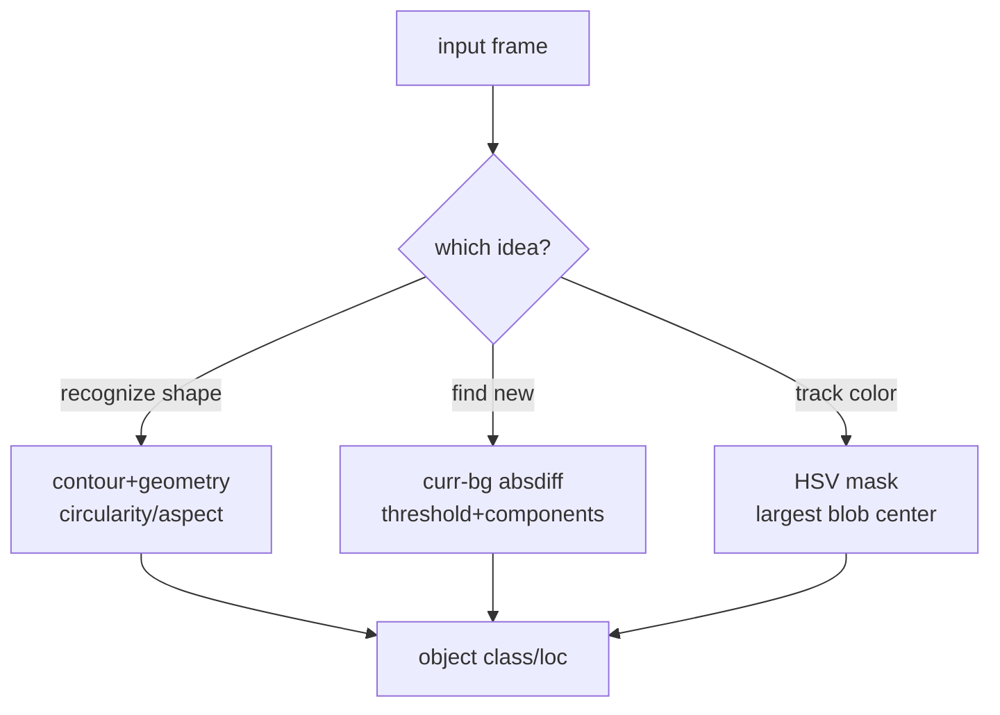

# Lecture 25 · Shape Detection / Difference / Color Tracking

> **Lecture info**
> - Date: 2026-09-07 (Sun)
> - Lecture #: 25 (Study Plan Day 25, P7 Computer Vision / OpenCV)
> - Plan ref: `study-plan-60d.md` → **P7 Computer Vision / OpenCV**, episodes **100–103**
> - Goal: Three ways to “find objects in the frame” — **shape detection** (contour geometry), **difference method** (subtract frames to find “what just appeared”), **color-block tracking** (HSV mask that follows a moving target and gets optimized). Day 22’s color sorting was static; today it levels up to “keep tracking even while moving”.

---

## 0. One-line summary

> **Shape detection relies on geometry, difference relies on “change”, color tracking relies on stable color**: three complementary ways to find things. Difference is extremely light-sensitive; tracking must be de-noised (morphology + smoothing) or it jitters and loses the target.

---

## 1. Core concepts (eps 100–103)

### 1.1 100 Shape detection logic
- `findContours` → compute area / perimeter / moments → use **circularity, aspect ratio** to tell “square vs circle vs triangle”.
- e.g. circularity ≈ 4π·area / perimeter²; closer to 1 = rounder; aspect ratio ≈ 1 → likely square.

### 1.2 101 Difference algorithm for new objects
- **current frame − background frame (absdiff) → threshold → connected components**: whatever “just appeared” leaves a strong difference.
- Good for “an apple was just placed on the table”; background must be relatively stable.

### 1.3 102 Track a color block’s movement
- Reuse Day 22’s **HSV mask**, find the largest color blob center each frame → get its trajectory (center moves across frames).

### 1.4 103 Red cap tracking optimization
- Add **morphological open/close** to remove noise; apply **smoothing** (moving average / Kalman) so the box doesn’t jitter or drop.
- Tune HSV range on-site (link Day 22 slider tool).

---

## 2. Principles (grab these)

1. **Shape = geometry, difference = change, color = stable color** — pick by scenario.
2. **Difference is extremely light-sensitive**: a lighting change reads as “new object” → false detect.
3. **Tracking must de-noise**: no morphology/smoothing → jitter, box jump, lost target.

---

## 3. One diagram: three “find object” ideas

---

## 4. Today’s steps

1. **Watch 100–103** (1.0–1.5×), focus on 100 (contour geometry) and 103 (tracking optimization).
2. **Write shape detection**: contours → circularity/aspect to separate square vs circle.
3. **Write difference method**: fixed background frame, detect “new” components.
4. **Optimize red-cap tracking**: morphology open/close + smoothing for a stable box.
5. **Mirror test (3 min):** *“What do the three methods rely on ___; why difference fears lighting change ___; why tracking needs de-noise ___.”*

> ✅ **Done today when:** all three find-object demos run + mirror test passed.

---

## 5. Common pitfalls

| # | Myth | Truth |
|---|---|---|
| 1 | Difference as a general detector | Lighting change → false “new object”; only for stable background |
| 2 | Tracking without de-noise | Jitter / box jump / lost target |
| 3 | Shape by area only | Similar-area square/circle confuse; need circularity + aspect |
| 4 | Hardcode HSV range | Fails under new light/object; calibrate on-site (Day 22) |

---

## 6. DEA cross-link (light, not main thread)

- Soft hands grasp **deformable objects**; color/shape tracking helps “lock on target”; **difference can even detect the soft tip’s own deformation** — a “new contour” often means the membrane bulged.
- Link: Day 26 eye-in-hand mounts the camera on the arm tip; tracking’s coordinate frame gains one more transform, same idea, just convert coords.

---

## 7. Next / checkpoint

- **Checkpoint passed =** three find-object demos run + explain each scenario & pitfall + mirror test.
- **Next (Day 26):** eye-in-hand camera / follow control / vision+kinematics integration (104–108).

---

### References (not required today)
- Episodes 100–103 (B 站《黑马程序员 · 具身智能》).
- Reuse: Day 22 (HSV / mask / mean filter).

*This lecture strictly follows 《60-Day Plan》 Day 25 (P7): 100–103. Zero military content.*
