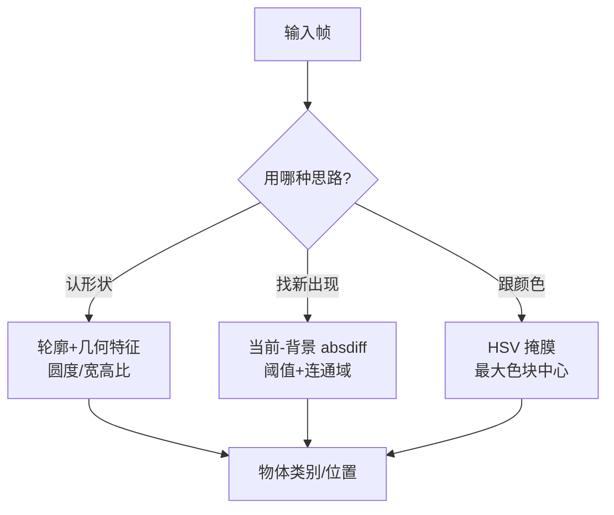

# 第二十五讲 · 形状侦测 / 差值识别 / 颜色追踪（Shape Detection & Tracking）

> **本讲信息**
> - 日期：2026-09-07（周日）
> - 第几讲：第二十五讲（学习计划 Day 25，P7 计算机视觉 OpenCV）
> - 对应计划：`study-plan-60d.md` → **P7 计算机视觉 OpenCV**，课程集号 **100–103**
> - 今日目标：学三种“在画面里找物体”的套路——**形状侦测**（轮廓几何特征）、**差值法**（前后帧相减找“刚冒出来的东西”）、**颜色块追踪**（HSV 掩膜跟住移动目标并优化）。Day 22 的颜色分拣是静态版，今天升级成“动起来也跟得住”。

---

## 0. 一句话总结

> **形状侦测靠几何特征、差值法靠“变化”、颜色追踪靠颜色稳定**：三种找物思路互补。差值法对光照极敏感，追踪必须去噪（形态学 + 平滑）才不抖、不丢。

---

## 1. 核心知识点（对照 100–103）

### 1.1 100 形状侦测逻辑的实现
- `findContours` 找轮廓 → 算面积 / 周长 / 矩 → 用**圆度、宽高比**等几何特征判断“这是方块还是圆还是三角”。
- 例：圆度 ≈ 4π·面积 / 周长²，越接近 1 越圆；宽高比接近 1 多为方。

### 1.2 101 利用差值算法识别新增的物体
- **当前帧 − 背景帧（absdiff）→ 阈值化 → 找连通域**：画面里“刚多出来的东西”会留下明显差值。
- 适合“桌上突然放了个苹果”这类场景；背景要相对稳定。

### 1.3 102 OpenCV 追踪一个颜色块的移动
- 沿用 Day 22 的 **HSV 掩膜**，逐帧找最大色块中心 → 得到它的运动轨迹（中心坐标随帧变化）。

### 1.4 103 红色瓶盖追踪算法的优化
- 加**形态学开/闭运算**去噪点；做**平滑**（滑动平均 / 卡尔曼滤波）让跟踪框不抖、不丢。
- 现场微调 HSV 范围（接 Day 22 的滑块工具）。

---

## 2. 原理（先抓这几条）

1. **形状侦测靠几何特征、差值法靠“变化”、颜色追踪靠颜色稳定**——三种互补，按场景选。
2. **差值法对光照极敏感**：光照一变就被当成“新物体”，误检。
3. **追踪必须去噪**：没形态学/平滑 → 框抖、框跳、丢目标。

---

## 3. 一张图：三种“找物体”的思路

---

## 4. 今天的操作步骤

1. **看 100–103**（1.0–1.5 倍速），重点看 100 轮廓几何特征、103 怎么优化追踪。
2. **写形状侦测**：找轮廓 → 用圆度/宽高比区分方块与圆。
3. **写差值法**：固定背景帧，检测“新出现”的连通域。
4. **优化红色瓶盖追踪**：加形态学开/闭 + 平滑，让框稳。
5. **镜子测试（3 分钟）：** *“三种找物思路分别靠啥___；差值法为啥怕光照变___；追踪为啥要去噪___。”*

> ✅ **今天“做完”的标准：** 三种找物各写一个能跑的 demo + 过镜子测试。

---

## 5. 常见误区 & 容易踩的坑

| # | 误区 | 真相 |
|---|---|---|
| 1 | 差值法当通用检测器 | 光照一变就误检“新物体”；它只适合稳定背景 |
| 2 | 追踪不做去噪 | 框抖 / 框跳 / 丢目标 |
| 3 | 形状只靠面积判断 | 面积相近的方/圆分不清，要圆度 + 宽高比 |
| 4 | HSV 范围写死 | 换光照/换物体就失效，要现场标定（Day 22 强调过） |

---

## 6. DEA 交叉链接（轻量，非主线）

- 软体手抓**易变形物体**时，颜色 / 形状追踪帮它“盯住目标”；**差值法还能检测软体末端自身的形变**——画面里“新出现的轮廓”往往就是薄膜鼓起来了。
- 衔接：Day 26“眼在手上”会把相机装到臂末端，追踪的坐标系会再多一层变换，思路不变、只是要转坐标。

---

## 7. 下一步 / 检查点

- **过了检查点 =** 三种找物 demo 能跑 + 讲清各自适用场景与坑 + 过镜子测试。
- **下一阶段（Day 26）：** 眼在手上摄像头 / 跟随控制 / 视觉+运动学联调（104–108）。

---

### 参考资料（先放着，今天不要求）
- 课程集号 100–103（B 站《黑马程序员 · 具身智能》）。
- 复用：Day 22（HSV / 掩膜 / 均值滤波）。

*本讲严格对应《60 天计划》Day 25（P7）：100–103。全程零军事内容。*
