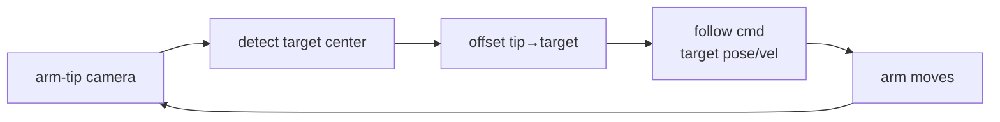

# Lecture 26 · Eye-in-Hand / Follow Control / Vision-Kinematics Integration

> **Lecture info**
> - Date: 2026-09-08 (Mon)
> - Lecture #: 26 (Study Plan Day 26, P7 Computer Vision / OpenCV)
> - Plan ref: `study-plan-60d.md` → **P7 Computer Vision / OpenCV**, episodes **104–108**
> - Goal: Mount the camera on the arm tip (eye-in-hand), achieve **follow control** (“target moves, arm follows in real time”), and **integrate** vision + kinematics + control into one running loop. This chains everything from P7 into a “hand+eye that chases the object”.

---

## 0. One-line summary

> **Eye-in-hand = camera moves with the arm, one more “tip→camera” transform (must calibrate the hand-eye matrix); follow control = target moves, arm follows in a real-time loop; integration = vision + kinematics + control run together, frequencies must match to stay in sync.**

---

## 1. Core concepts (eps 104–108)

### 1.1 104 Eye-in-hand camera intro
- **eye-in-hand**: camera fixed on the arm tip; its view angle changes with arm pose. Compared to Day 23’s fixed top-down, here we add one more “tip frame → camera frame” transform.

### 1.2 105 Eye-in-hand orientation correction
- At calibration, align the “tip frame” and “camera frame” (the **hand-eye matrix**); otherwise the seen object coord is wrong and grasping offsets.

### 1.3 106 Adjust red cap HSV
- Tune HSV on-site (reuse Day 22/25 slider); keep the cap stably detected **while the arm moves** (light/angle shift as it moves).

### 1.4 107 Arm follow-control core logic
- Each frame: detect target center → compute offset from arm tip → generate “move tip toward target” velocity / target pose → control arm to follow.

### 1.5 108 Motion-control integration
- Vision thread + IK thread + control thread run together; **frequencies / latency must match** or they desync (box and arm misalign).

---

## 2. Principles (grab these)

1. **Eye-in-hand adds one coordinate transform (tip→camera), easy to get wrong** — must calibrate the hand-eye matrix, don’t treat as fixed camera.
2. **Follow = real-time loop**: target moves → recompute offset → arm moves; open-loop can’t keep up.
3. **Mismatched module frequencies → desync**: vision 30fps vs control 100Hz unaligned → “box and arm misalign”.

---

## 3. One diagram: eye-in-hand follow loop

---

## 4. Today’s steps

1. **Watch 104–108** (1.0–1.5×), focus on 105 (hand-eye matrix) and 108 (frequency alignment).
2. **Understand the hand-eye matrix**: how tip→camera transform is calibrated and why it can’t be skipped.
3. **Tune HSV**: keep the red cap stable while the arm moves.
4. **Build “eye-in-hand follows the cap” + integrate**: box and arm must align.
5. **Mirror test (3 min):** *“What extra transform does eye-in-hand add ___; why follow must be a loop ___; why integration needs matched frequencies ___.”*

> ✅ **Done today when:** eye-in-hand follow demo runs (box & arm synced) + explain hand-eye matrix + mirror test.

---

## 5. Common pitfalls

| # | Myth | Truth |
|---|---|---|
| 1 | Treat eye-in-hand as fixed camera | Extra tip→camera transform; no calibration → offset |
| 2 | Follow with open loop | Target moves → can’t keep up; needs real-time loop |
| 3 | Modules run independently | Frequency mismatch → desync, box & arm misalign |
| 4 | Reuse old HSV values | Arm moves → light/angle change; re-tune on-site |

---

## 6. DEA cross-link (light, not main thread)

- A soft arm with a tip camera also adds one transform; **soft deformation makes “tip pose” itself fuzzy**, so visual closed-loop correction is even more needed (echoes Day 23/24 “see → locate → move”).
- Link: eye-in-hand lets the camera “look right at the object”, friendlier for soft grasping of deformable targets — but the drive layer is still electric field, follow commands must translate to voltage.

---

## 7. Next / checkpoint

- **Checkpoint passed =** eye-in-hand follow demo runs (synced) + explain hand-eye matrix + mirror test.
- **Next (Day 27):** bird’s-eye affine transform / object pose angle / QR-code recognition (109–111).

---

### References (not required today)
- Episodes 104–108 (B 站《黑马程序员 · 具身智能》).
- Reuse: Day 22/25 (HSV), Day 23 (hand-eye calibration), Day 24 (IK→control loop).

*This lecture strictly follows 《60-Day Plan》 Day 26 (P7): 104–108. Zero military content.*
