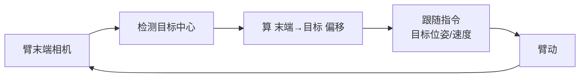

# 第二十六讲 · 眼在手上 / 跟随控制 / 视觉运动学联调（Eye-in-Hand & Integration）

> **本讲信息**
> - 日期：2026-09-08（周一）
> - 第几讲：第二十六讲（学习计划 Day 26，P7 计算机视觉 OpenCV）
> - 对应计划：`study-plan-60d.md` → **P7 计算机视觉 OpenCV**，课程集号 **104–108**
> - 今日目标：把相机装到机械臂末端（眼在手上），实现“目标动、臂就跟着动”的**跟随控制**，并把视觉 + 运动学 + 控制**联调**跑通。这一步把 P7 前面学的全串成“会追着物体跑的眼 + 手”。

---

## 0. 一句话总结

> **眼在手上 = 相机随臂动、多一层“末端→相机”变换（必须标手眼矩阵）；跟随控制 = 目标动、臂实时闭环跟着动；联调 = 视觉+运动学+控制一起跑，频率要匹配才同步。**

---

## 1. 核心知识点（对照 104–108）

### 1.1 104 眼在手上摄像头的介绍
- **eye-in-hand**：相机固定在臂末端，看世界的角度随臂姿态变；相对 Day 23 的固定俯视，这里多了一层“末端坐标系 → 相机坐标系”的变换。

### 1.2 105 眼在手上摄像头方向的修正
- 标定时必须把“末端坐标系”和“相机坐标系”对齐（**手眼矩阵**），否则看到的物体坐标会算错、抓偏。

### 1.3 106 调整红色瓶盖的 HSV 值
- 现场微调 HSV（沿用 Day 22/25 的滑块工具），让瓶盖在**臂移动时**仍被稳定识别（臂一动光照/角度都变）。

### 1.4 107 机械臂跟随控制的核心逻辑
- 每帧：检测目标中心 → 算它相对臂末端的偏移 → 生成“让末端靠近目标”的速度 / 目标位姿 → 控制臂跟随。

### 1.5 108 机械臂运动控制的联调
- 视觉线程 + IK 线程 + 控制线程一起跑；**频率 / 延迟要匹配**，否则不同步（框和臂对不上）。

---

## 2. 原理（先抓这几条）

1. **眼在手上多一层坐标变换（末端→相机），极易算错**——必须标手眼矩阵，不能当固定相机用。
2. **跟随 = 实时闭环**：目标一动 → 重算偏移 → 臂动，开环跟不上。
3. **联调各模块频率不一致 → 不同步**：视觉 30fps、控制 100Hz 不约好就会“框和臂错位”。

---

## 3. 一张图：眼在手上跟随闭环

---

## 4. 今天的操作步骤

1. **看 104–108**（1.0–1.5 倍速），重点看 105 手眼矩阵、108 联调怎么对齐频率。
2. **理解手眼矩阵**：末端→相机的变换怎么标、为什么不能省。
3. **调 HSV**：让红色瓶盖在臂移动时仍稳定识别。
4. **实现“眼在手上跟随瓶盖移动”并联调**：框和臂要对得上。
5. **镜子测试（3 分钟）：** *“眼在手上多了哪层变换___；跟随为什么必须闭环___；联调为啥要频率匹配___。”*

> ✅ **今天“做完”的标准：** 跑通眼在手上跟随 demo（框臂同步）+ 讲清手眼矩阵 + 过镜子测试。

---

## 5. 常见误区 & 容易踩的坑

| # | 误区 | 真相 |
|---|---|---|
| 1 | 眼在手上当固定相机 | 多末端→相机变换，不标就抓偏 |
| 2 | 跟随用开环 | 目标一动就跟不上，要实时闭环 |
| 3 | 各模块各跑各的 | 频率不一致 → 不同步，框臂对不上 |
| 4 | HSV 用之前的定值 | 臂一动光照/角度变，要现场重调 |

---

## 6. DEA 交叉链接（轻量，非主线）

- 软体臂末端装相机同样多一层变换；**软体形变让“末端位姿”本身模糊**，更需视觉闭环实时纠偏（呼应 Day 23/24 的“看到→算位→动臂”）。
- 衔接：眼在手上让相机“贴着物体看”，对软体抓易变形目标更友好——但驱动层仍是电场，跟随指令要翻译成电压。

---

## 7. 下一步 / 检查点

- **过了检查点 =** 眼在手上跟随 demo 跑通（框臂同步）+ 讲清手眼矩阵 + 过镜子测试。
- **下一阶段（Day 27）：** 鸟瞰图仿射变换 / 物体姿态角度 / 二维码识别（109–111）。

---

### 参考资料（先放着，今天不要求）
- 课程集号 104–108（B 站《黑马程序员 · 具身智能》）。
- 复用：Day 22/25（HSV 调参）、Day 23（手眼标定）、Day 24（IK→控制闭环）。

*本讲严格对应《60 天计划》Day 26（P7）：104–108。全程零军事内容。*
