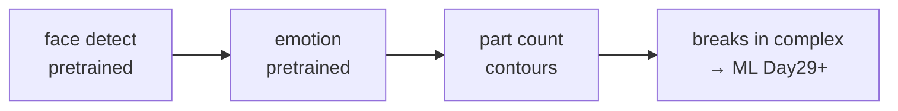

# Lecture 28 · Face / Emotion / Part Counting & Traditional CV Limits

> **Lecture info**
> - Date: 2026-09-10 (Wed)
> - Lecture #: 28 (Study Plan Day 28, P7 Computer Vision / OpenCV · **wrap-up**)
> - Plan ref: `study-plan-60d.md` → **P7 Computer Vision / OpenCV**, episodes **112–115**
> - Goal: Use **pretrained models** for face / emotion detection, **contour counting** for part counting — the “sweet spot” of traditional CV; but **hand-written rules / thresholds break in complex scenes**, which is exactly why “machine learning” from Day 29 steps in. P7 wraps up: links past (vision tricks) to future (ML).

---

## 0. One-line summary

> **Face/emotion = pretrained-model inference; part counting = contour statistics — the sweet spot of traditional CV. But hand-written rules/thresholds collapse under lighting change, object variety, cluttered backgrounds; that is the very reason “machine learning” arrives at Day 29.** P7 ends: you have the vision tricks, next let the machine learn features itself.

---

## 1. Core concepts (eps 112–115)

### 1.1 112 Face detection logic
- Use a **pretrained detector** (Haar cascade / DNN face model) for forward inference, box the faces. Essentially “model exists, just call it”, not writing rules from scratch.

### 1.2 113 Emotion recognition
- On top of the face, attach an **emotion classifier** (happy / angry / surprised…), also pretrained inference.
- Note: this is an “**approximate label**”; the model doesn’t truly understand emotion, don’t read it as psychology.

### 1.3 114 Part counting
- **Binarize → find contours → count connected components = part count**. Extremely stable when background is simple and rules are clear — traditional CV’s strength.

### 1.4 115 Limits of traditional machine vision
- Hand-written rules / thresholds (fixed HSV, fixed template) collapse under **lighting change, object variety, cluttered background**.
- Leads to **machine learning** (Day 29+) — shift from “human writes rules” to “data trains model”.

---

## 2. Principles (grab these)

1. **Face/emotion = pretrained inference** (not rules from scratch); emotion is only approximate.
2. **Counting = contour statistics**; stable in simple scenes; hardcoded thresholds break.
3. **Traditional CV’s ceiling = hardcoded rules**; breaks in complex scenes → needs ML.

---

## 3. One diagram: traditional CV sweet spot & ceiling

---

## 4. Today’s steps

1. **Watch 112–115** (1.0–1.5×), focus on 115 (limits of traditional CV and how it motivates ML).
2. **Run face detection**: pretrained model boxes faces.
3. **Run emotion recognition**: understand output is approximate label.
4. **Write part counting**: binarize + contour + count components.
5. **Pin down “where traditional CV breaks”**: list 2–3 failing scenarios (the motive for ML).
6. **Mirror test (3 min):** *“What do face/emotion rely on ___; why count by contour ___; traditional CV’s ceiling & how ML fixes it ___.”*

> ✅ **Done today when:** face/emotion/count demos run + explain CV limits & ML motive + mirror test.

---

## 5. Common pitfalls

| # | Myth | Truth |
|---|---|---|
| 1 | Emotion = true understanding | Only approximate label; not psychology |
| 2 | Count by hardcoded threshold/eye | Use contour stats; hardcoded breaks |
| 3 | Traditional CV is almighty | Breaks in complex scenes; needs ML |
| 4 | Pretrained = zero config | Still tune input size/confidence; env mismatch → load fail |

---

## 6. DEA cross-link (light, not main thread)

- Soft production-line **part counting** also uses contour stats; but soft parts **vary in shape, deform easily**, so traditional CV thresholds break sooner → ML / visual closed-loop fits better (echoes your “soft + AI” direction).
- Link: traditional CV’s failure on soft objects is exactly why your research angle (soft actuator + learning-based control) matters — rigid rules can’t handle flexible bodies.

---

## 7. Next / checkpoint (P7 wrap)

- **P7 checkpoint (end of Day 28):** OpenCV image processing + hand-eye calibration + YOLO annotate-to-train (YOLO is Day 37–41, P8, note it). Can independently “detect a color block & locate / count / detect faces”.
- **Next (Day 29+, P8):** ML intro / deep learning / YOLO (116–160) — from “human writes rules” to “data trains model”.

---

### References (not required today)
- Episodes 112–115 (B 站《黑马程序员 · 具身智能》).
- Reuse: Day 22/25 (HSV / contour / threshold).

*This lecture strictly follows 《60-Day Plan》 Day 28 (P7 wrap): 112–115. Zero military content. P7 (081–115, 35 episodes) all complete.*
