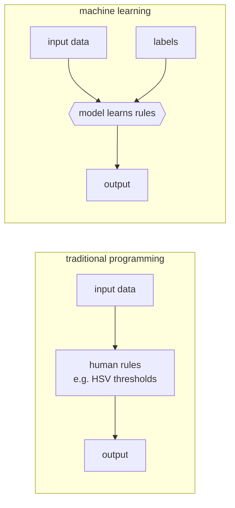

# Lecture 29 · ML Basics: End-to-End, Three Elements, Features & Labels

> **Lecture info**
> - Date: 2026-09-11 (Fri)
> - Lecture #: 29 (Study Plan Day 29, P8 ML / Deep Learning / YOLO)
> - Plan ref: `study-plan-60d.md` → **P8**, episodes **116–120**
> - Goal: Cross from “humans write the rules” (P7 traditional CV) to “let the machine learn the rules”. Nail four terms: **end-to-end, feature, label, three elements (data / model / algorithm)**. This is the foundation of all of P8.

---

## 0. One-line summary

> **Machine learning = don’t write the rules; give the machine a pile of “questions + answers” (data + labels) and let it infer the rule itself.** You feed in **features** (input, e.g. camera frames) and ask it to predict the **label** (output, e.g. “grasp at this angle”); the machine learns the mapping using **data + model + algorithm**.

---

## 1. Core concepts (eps 116–120)

### 1.1 116 ML concept intro
- Traditional programming: **human writes rules → input → output** (tuning HSV thresholds by hand is writing rules).
- Machine learning: **input + answers → machine learns the rule**. Rules are no longer hardcoded; they “grow” out of data.

### 1.2 117 ML / DL concepts
- **ML (machine learning)**: a broad family of “learn patterns from data” methods — linear regression, decision trees, SVM, etc.
- **DL (deep learning)**: a branch of ML that uses **multi-layer neural networks**.
- ⚠️ **DL ⊂ ML**, not equal (stressed back on Day 28).

### 1.3 118 The goal of ML
- The goal is not “memorize the training set”; it is **generalization** — answer correctly on unseen data.
- Memorizing the training set is **overfitting**, ML’s number one enemy.

### 1.4 119 Common ML terms
- **Sample**: one data item (one image).
- **Feature**: input variables describing the sample.
- **Label**: the correct answer for that sample.
- **Train / test set**: used to learn / used to exam (splitting details on Day 30).

### 1.5 120 Features and labels
- Robot-arm example:
  - feature = camera frame + current joint angles
  - label = the expert’s joystick action right now / target joint angles
- This is exactly the recipe for **behavior cloning (BC)** later (Day 51+).

---

## 2. Principles (grab these)

1. **ML learns an input→output mapping**, it does not memorize answers.
2. **The goal is generalization**, not 100% training accuracy.
3. **Features set the ceiling; the model only approaches it** — garbage features beat even the best model.

---

## 3. One diagram: traditional programming vs ML

---

## 4. Today’s steps

1. **Watch 116–120** (1.0–1.5×), focus on 118 (goal = generalization) and 120 (features/labels).
2. **Give one robot-arm feature/label pair in plain words** (e.g. “input = camera image, output = which way the gripper should move”).
3. **List 2 everyday ML examples** (spam filter, recommender) and name their feature and label.
4. **Mirror test (3 min):** *“ML vs traditional programming ___; the goal of ML is ___; feature vs label ___; DL vs ML ___.”*

> ✅ **Done today when:** you can give a robot-arm feature/label example + explain “learns mapping, not memorization” + mirror test passed.

---

## 5. Common pitfalls

| # | Myth | Truth |
|---|---|---|
| 1 | Deep learning = machine learning | DL is only the neural-net branch of ML |
| 2 | 100% training accuracy = good model | Likely overfit; collapses on new data |
| 3 | More data always better, quality irrelevant | Dirty labels / narrow distribution bias the model directly |
| 4 | More complex model = stronger | Complex model + little data = overfitting hotspot |

---

## 6. DEA cross-link (light, not main thread)

- Your DEA’s **hysteresis / nonlinearity / slow drift** is exactly a case where no analytic rule can be written — which is why a **data-driven (ML) “voltage→deformation” map** is more realistic than deriving physics by hand.
- Feature could be “drive-voltage history + previous displacement”, label “current actual displacement” — that is the **proprioception** modeling idea for soft actuators.
- Link: after Day 30 covers data splitting, Days 32–34 train a small net — soft-hysteresis fitting is a great practice problem.

---

## 7. Next / checkpoint

- **Checkpoint passed =** explain ML vs traditional programming + give feature/label examples + mirror test.
- **Next (Day 30):** dataset splitting (train/val/test), ML taxonomy, modeling flow, feature engineering (121–124).

---

### References (not required today)
- Episodes 116–120 (B站《黑马程序员 · 具身智能》).
- Links: Day 28 (limits of traditional CV → why ML), Day 51+ (behavior-cloning feature/label recipe).

*This lecture strictly follows 《60-Day Plan》 Day 29 (P8): 116–120. Zero military content.*
