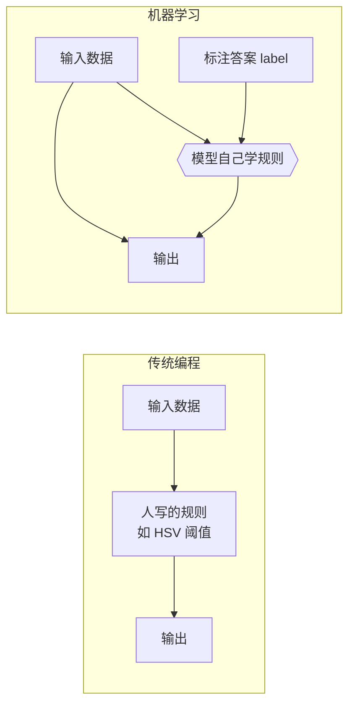

# 第二十九讲 · 机器学习入门：端到端、三要素、特征与标签

> **本讲信息**
> - 日期：2026-09-11（周五）
> - 第几讲：第二十九讲（学习计划 Day 29，P8 机器学习 / 深度学习 / YOLO）
> - 对应计划：`study-plan-60d.md` → **P8**，课程集号 **116–120**
> - 今日目标：从“人写规则”（P7 传统 CV）跨到“让机器自己学规则”。搞懂四个词：**端到端、特征 feature、标签 label、三要素（数据/模型/算法）**。这是整个 P8 的地基。

---

## 0. 一句话总结

> **机器学习 = 不写规则，而是给机器一堆“题目+答案”（数据+标签），让它自己总结出规则。** 你喂进去的是**特征**（输入，如相机画面），要它预测的是**标签**（输出，如“该抓这个角度”）；机器靠**数据 + 模型 + 算法**三件套把中间的映射学出来。

---

## 1. 核心知识点（对照 116–120）

### 1.1 116 机器学习概念入门
- 传统编程：**人写规则 → 输入 → 输出**（你手调 HSV 阈值就是写规则）。
- 机器学习：**输入 + 答案 → 机器自己学出规则**。规则不再由人写死，而是从数据里“长”出来。

### 1.2 117 机器学习 / 深度学习的概念
- **ML（机器学习）**：一大类“从数据学规律”的方法，包含线性回归、决策树、SVM 等。
- **DL（深度学习）**：ML 的一个分支，**用多层神经网络**来学。
- ⚠️ **DL ⊂ ML**，不是等号（计划 Day 28 已强调）。

### 1.3 118 机器学习的目标
- 目标不是“背下训练题”，而是**泛化**：遇到没见过的数据也能答对。
- 背下训练集叫**过拟合**（overfitting），是 ML 头号敌人。

### 1.4 119 机器学习常见术语
- **样本 sample**：一条数据（一张图）。
- **特征 feature**：描述样本的输入变量。
- **标签 label**：这条样本对应的正确答案。
- **训练集 / 测试集**：用来学的 / 用来考的（明天 Day 30 详讲划分）。

### 1.5 120 feature 和 label
- 机械臂例子：
  - feature = 相机画面 + 当前关节角
  - label = 专家此刻的手柄动作 / 目标关节角
- 这就是后面 **行为克隆 BC**（Day 51+）的标准配方。

---

## 2. 原理（先抓这几条）

1. **ML 学的是“输入→输出”的映射**，不是背答案。
2. **目标是泛化**（没见过的也会做），不是训练准确率 100%。
3. **特征决定上限，模型只是逼近这个上限**——垃圾特征喂给再好的模型也白搭。

---

## 3. 一张图：传统编程 vs 机器学习

---

## 4. 今天的操作步骤

1. **看 116–120**（1.0–1.5 倍速），重点看 118“目标是泛化”和 120 特征/标签。
2. **用大白话给机械臂举一组 feature/label**：写成一句话（如“输入=相机图，输出=夹爪该移动的方向”）。
3. **举 2 个身边 ML 的例子**（垃圾邮件过滤、推荐系统），各自说出 feature 和 label 是什么。
4. **镜子测试（3 分钟）：** *“ML 和传统编程区别___；ML 的目标是___；feature 和 label 分别是___；DL 和 ML 什么关系___。”*

> ✅ **今天“做完”的标准：** 能举出 feature/label 的机械臂例子 + 讲清“学的是映射不是背答案” + 过镜子测试。

---

## 5. 常见误区 & 容易踩的坑

| # | 误区 | 真相 |
|---|---|---|
| 1 | 深度学习 = 机器学习 | DL 只是 ML 中用神经网络的一支 |
| 2 | 训练准确率 100% 就是好模型 | 大概率过拟合，遇到新数据就崩 |
| 3 | 数据越多越好，质量无所谓 | 脏标签 / 分布单一会直接带偏模型 |
| 4 | 模型越复杂越强 | 复杂模型 + 少数据 = 过拟合重灾区 |

---

## 6. DEA 交叉链接（轻量，非主线）

- 你的 DEA（介电弹性体）**迟滞 / 非线性 / 慢漂移**，恰恰是“写不出解析规则”的典型场景——正因如此，用 **数据驱动（ML）去学“电压→形变”映射** 才比手推物理模型更现实。
- feature 可以是“驱动电压历史序列 + 上一位移”，label 是“当前实际位移”——这就是**软体执行器的本体感知（proprioception）**建模思路。
- 衔接：Day 30 讲完数据划分后，Day 32–34 会亲手训一个小网络，届时可把这套“软体迟滞拟合”当练手题。

---

## 7. 下一阶段 / 检查点

- **过了检查点 =** 讲清 ML 与传统编程的区别 + 举出 feature/label 例子 + 过镜子测试。
- **下一阶段（Day 30）：** 数据集划分（训练/验证/测试）、ML 分类、建模流程、特征工程（121–124）。

---

### 参考资料（先放着，今天不要求）
- 课程集号 116–120（B 站《黑马程序员 · 具身智能》）。
- 衔接：Day 28（传统 CV 的缺陷 → 为什么需要 ML）、Day 51+（行为克隆的 feature/label 配方）。

*本讲严格对应《60 天计划》Day 29（P8）：116–120。全程零军事内容。*
