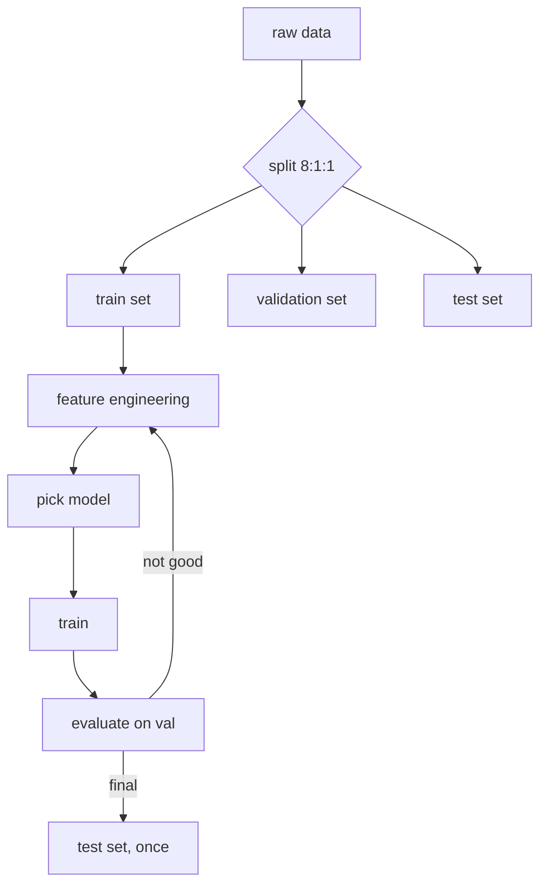

# Lecture 30 · Dataset Splitting / Modeling Flow / Feature Engineering

> **Lecture info**
> - Date: 2026-09-12 (Sat)
> - Lecture #: 30 (Study Plan Day 30, P8)
> - Plan ref: `study-plan-60d.md` → **P8**, episodes **121–124**
> - Goal: Understand “how to split data” (train/val/test), “what kinds of ML exist”, “what steps an ML project goes through”, and “what feature engineering really is”. These four decide whether your model’s **evaluation can be trusted**.

---

## 0. One-line summary

> **Train / validation / test = homework / monthly exam / final exam** — the exam paper must never have been practiced beforehand, otherwise the score is fake. An ML project’s five steps are **data → features → model → train → evaluate**, and **feature engineering** (reshaping raw data into something learnable) often gains more than swapping in a fancier model.

---

## 1. Core concepts (eps 121–124)

### 1.1 121 Train/test split
- Common ratio **8:1:1 (train : val : test)**.
- **Train set**: the model learns parameters from it.
- **Validation set**: tune hyperparameters, pick models (the monthly exam).
- **Test set**: used once at the very end for the true score (the final exam).
- ⚠️ **Never tune against the test set** — if you keep changing the model based on it, it gets contaminated.

### 1.2 122 Taxonomy of ML
- **Supervised learning**: has labels (classification, regression) — BC and YOLO later belong here.
- **Unsupervised learning**: no labels (clustering, dimensionality reduction).
- **Reinforcement learning**: no correct answers, only rewards (**Day 57–60**).

### 1.3 123 Modeling flow
- **Data → features → model → train → evaluate**; if evaluation disappoints, go back and fix features / change model. It’s a **loop**, not a line.

### 1.4 124 Feature engineering
- Turn raw data into a representation the model can learn: normalization / standardization, encoding categories, dimensionality reduction, cross features.
- **Good features > complex model**: a plain linear model with great features often beats a stacked network with poor ones.

---

## 2. Principles (grab these)

1. **The test set is the final exam — use it once.** Tuning on it leaks the questions.
2. **Split first, preprocess second**: standardizing over all data leaks test statistics into training.
3. **Features set the ceiling**; the model only approaches it.

---

## 3. One diagram: the ML modeling loop

---

## 4. Today’s steps

1. **Watch 121–124** (1.0–1.5×), focus on 121 (splitting rules) and 124 (feature engineering).
2. **Do an 8:1:1 split** on a dataset (two calls to sklearn `train_test_split`).
3. **Normalize correctly**: `fit` on train only, then `transform` val/test.
4. **Write out the five modeling steps** and mark which one you think gets skipped most. 
5. **Mirror test (3 min):** *“What do train/val/test map to ___; why split before normalizing ___; why feature engineering matters ___.”*

> ✅ **Done today when:** split done correctly + explain “test set is one-shot” + mirror test passed.

---

## 5. Common pitfalls

| # | Myth | Truth |
|---|---|---|
| 1 | Normalize globally, then split | Test statistics leak → evaluation is distorted (the classic trap) |
| 2 | Keep tuning on the test set | Test set contaminated; you wrote your own exam |
| 3 | Skip the validation set | No place to tune hyperparams; you end up using test → contamination |
| 4 | Ignore class imbalance | Model guesses the majority class; high accuracy but useless |
| 5 | Feature engineering is optional | Often the fastest way to gain points |

---

## 6. DEA cross-link (light, not main thread)

- DEA data is a **time series** (voltage history, displacement history) — you must **not shuffle randomly**; split by **whole trajectories**, otherwise neighbouring points from the same run land in both train and test, i.e. the exam contains practiced questions.
- Feature-engineering counterpart: feed the net a **window of the past N steps** of voltage/displacement — far better than instantaneous voltage alone (hysteresis has memory).

---

## 7. Next / checkpoint

- **Checkpoint passed =** split correctly + explain leakage risk + mirror test.
- **Next (Day 31):** MSE loss / gradient descent & learning rate / classification / cross-entropy (125–128).

---

### References (not required today)
- Episodes 121–124 (B站《黑马程序员 · 具身智能》).
- Reuse: Day 29 (feature / label concepts).

*This lecture strictly follows 《60-Day Plan》 Day 30 (P8): 121–124. Zero military content.*
