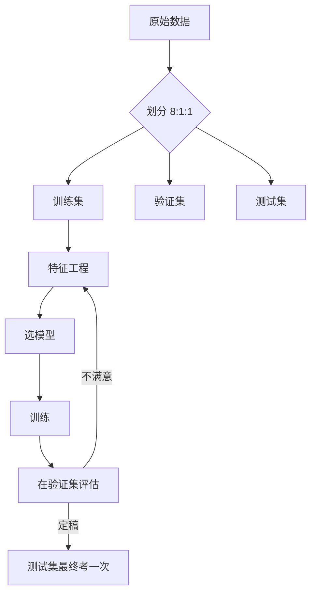

# 第三十讲 · 数据集划分 / 建模流程 / 特征工程

> **本讲信息**
> - 日期：2026-09-12（周六）
> - 第几讲：第三十讲（学习计划 Day 30，P8）
> - 对应计划：`study-plan-60d.md` → **P8**，课程集号 **121–124**
> - 今日目标：搞懂“数据怎么分”（训练/验证/测试）、“ML 有哪些门类”、“一个 ML 项目走哪几步”、以及“特征工程到底是什么”。这四件事决定了你后面训的模型**评估结果可不可信**。

---

## 0. 一句话总结

> **训练/验证/测试 = 平时作业 / 月考 / 高考**——考试卷绝对不能提前做过，否则分数全是假的。ML 项目的五步是**数据 → 特征 → 模型 → 训练 → 评估**，其中**特征工程**（把原始数据变好学的样子）往往比换模型更能涨点。

---

## 1. 核心知识点（对照 121–124）

### 1.1 121 训练集和测试集的划分
- 常见比例 **8:1:1（train : val : test）**。
- **训练集**：让模型学参数。
- **验证集**：调超参、选模型（相当于月考）。
- **测试集**：最后只考一次，看真实水平（高考）。
- ⚠️ **测试集只能看、不能用它调参**，一旦反复根据测试集改模型，它就被“污染”了。

### 1.2 122 机器学习的分类
- **监督学习**：有标签（分类、回归）——后面 BC、YOLO 都属于这类。
- **无监督学习**：没标签（聚类、降维）——让机器自己找结构。
- **强化学习**：没有标准答案，只有奖励（**Day 57–60 才学**）。

### 1.3 123 建模流程
- **数据 → 特征 → 模型 → 训练 → 评估**，评估不满意就回头改特征 / 换模型，是个**循环**不是直线。

### 1.4 124 特征工程
- 把原始数据加工成模型好学的表示：归一化 / 标准化、编码类别、降维、构造交叉特征等。
- **好特征 > 复杂模型**：同样的线性模型，特征工程做足了往往比堆网络更管用。

---

## 2. 原理（先抓这几条）

1. **测试集是“高考卷”，只能用一次**——用它调参 = 泄题，分数虚高。
2. **先划分、再预处理**：先在全量数据上做标准化，等于让测试集的统计信息泄漏进训练。
3. **特征工程决定上限**，模型只是逼近它。

---

## 3. 一张图：ML 建模循环

---

## 4. 今天的操作步骤

1. **看 121–124**（1.0–1.5 倍速），重点看 121 划分原则和 124 特征工程。
2. **拿一份数据做 8:1:1 划分**（sklearn `train_test_split` 分两次即可）。
3. **做一个归一化**：注意**只在训练集上 fit，再 transform 到验证/测试集**。
4. **写一遍建模五步流程**，标出哪一步你觉得最容易被跳过。
5. **镜子测试（3 分钟）：** *“训练/验证/测试分别像什么___；为什么先划分再归一化___；特征工程为什么重要___。”*

> ✅ **今天“做完”的标准：** 正确完成划分 + 讲清“测试集只能考一次” + 过镜子测试。

---

## 5. 常见误区 & 容易踩的坑

| # | 误区 | 真相 |
|---|---|---|
| 1 | 先全局归一化再划分 | 测试集统计泄漏 → 评估失真（最经典的坑） |
| 2 | 反复用测试集调参 | 测试集被污染，等于自己给自己出题 |
| 3 | 只划分训练/测试，不要验证集 | 超参没法调，只能拿测试集凑 → 又污染 |
| 4 | 类别不平衡不处理 | 模型全猜多数类，accuracy 虚高但没用 |
| 5 | 特征工程可有可无 | 往往是涨点最快的一步 |

---

## 6. DEA 交叉链接（轻量，非主线）

- DEA 数据是**时间序列**（电压历史、位移历史），划分时**不能随机打散**——必须按**整段轨迹**切分，否则同一段数据的相邻点被分到训练/测试两边，等于“考试考了做过的原题”。
- 特征工程上的对应项：给网络喂“过去 N 步的电压/位移窗口”，这比只喂瞬时电压有效得多（迟滞是有记忆的）。

---

## 7. 下一阶段 / 检查点

- **过了检查点 =** 会做正确划分 + 讲清泄漏风险 + 过镜子测试。
- **下一阶段（Day 31）：** MSE 损失函数 / 梯度下降与学习率 / 分类原理 / 交叉熵（125–128）。

---

### 参考资料（先放着，今天不要求）
- 课程集号 121–124（B 站《黑马程序员 · 具身智能》）。
- 复用：Day 29（feature / label 概念）。

*本讲严格对应《60 天计划》Day 30（P8）：121–124。全程零军事内容。*
