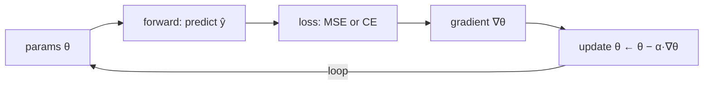

# Lecture 31 · MSE / Gradient Descent & Learning Rate / Classification & Cross-Entropy

> **Lecture info**
> - Date: 2026-09-13 (Sun)
> - Lecture #: 31 (Study Plan Day 31, P8)
> - Plan ref: `study-plan-60d.md` → **P8**, episodes **125–128**
> - Goal: Understand *how a model actually learns* — the **loss function** (how far off) and **gradient descent** (how to fix it). Regression uses **MSE**, classification uses **cross-entropy**; together they form the skeleton of every training run later (YOLO, BC included).

---

## 0. One-line summary

> **Training = repeating two things: ① use a loss to measure “how wrong”; ② use gradient descent to nudge parameters along the steepest downhill direction.** The step size is the **learning rate** — too big and it explodes, too small and it crawls. Regression is measured with MSE; classification with cross-entropy, which asks “were the probabilities assigned correctly?”

---

## 1. Core concepts (eps 125–128)

### 1.1 125 MSE for regression
- **MSE = mean of squared errors**: `MSE = (1/n)·Σ(ŷ − y)²`.
- Squaring does two things: errors of opposite sign no longer cancel; large errors are amplified and punished harder.
- Used for **regression** (predicting continuous values, e.g. joint angles).

### 1.2 126 Learning rate in gradient descent
- Update rule: `θ ← θ − α·∇θ(Loss)`.
- **Learning rate α**: the step size.
  - Too large → overshoot the valley, oscillate, or loss explodes to NaN.
  - Too small → extremely slow convergence, stalls halfway.
- Intuition: how big a stride you take walking downhill.

### 1.3 127 How classification works
- Classification doesn’t output a class id directly; it outputs a **score/probability per class** and takes the largest (argmax).
- **Softmax** squashes scores into probabilities (all positive, sum to 1).

### 1.4 128 Cross-entropy
- **Cross-entropy = −Σ y_true·log(y_pred)**: it only cares how much probability was given to the *correct* class.
  - Correct and confident → loss near 0.
  - Wrong → loss spikes.
- Used for **classification** (e.g. “this is a 7”, “this is a mask”).

---

## 2. Principles (grab these)

1. **Loss = the ruler** (how far off), **gradient descent = the walking style** (how to correct).
2. **Learning rate is the first hyperparameter to check** when loss won’t drop.
3. **Regression → MSE, classification → cross-entropy.** Don’t mix them up.

---

## 3. One diagram: the minimal training loop

---

## 4. Today’s steps

1. **Watch 125–128** (1.0–1.5×), focus on 126 (comparing learning-rate sizes) and 128 (the CE formula).
2. **Hand-compute a tiny gradient descent**: with `y = 2x`, start at `w=0`, MSE + α=0.1, do two update steps and see w move toward 2.
3. **Compare three learning rates** (0.001 / 0.1 / 1.0) in code or simulator; record the loss-curve shapes.
4. **Explain one classification case**: 10-class probabilities, take argmax; if the true class is 7 but got 0.1, how does CE change?
5. **Mirror test (3 min):** *“MSE is ___ used for ___; cross-entropy used for ___; learning rate too big/small causes ___; gradient descent is ___.”*

> ✅ **Done today when:** you hand-ran two GD steps + explained when to use MSE vs CE + mirror test passed.

---

## 5. Common pitfalls

| # | Myth | Truth |
|---|---|---|
| 1 | Bigger learning rate learns faster | Too big → oscillation / NaN loss |
| 2 | Use MSE for classification too | Use CE; MSE has poor gradient behaviour on probabilities |
| 3 | Loss won’t drop → switch to a bigger model | Check learning rate and data first; that’s where most problems live |
| 4 | Low accuracy must mean underfitting | Could be wrong labels / unnormalized features |
| 5 | One training pass fixes it | Training is iterative; watch the curve |

---

## 6. DEA cross-link (light, not main thread)

- The DEA “voltage → displacement” map is fundamentally **regression** → training a hysteresis model with **MSE** is natural; if you discretize deformation into bins and treat it as classification, switch to **cross-entropy**.
- Learning rate matters here too: soft-actuator data is noisy (sensor jitter), so **a large learning rate gets dragged around by noise**; smoother data windows usually help.

---

## 7. Next / checkpoint

- **Checkpoint passed =** hand-run gradient descent + explain both loss scenarios + mirror test.
- **Next (Day 32):** sklearn linear regression, why linear models can’t solve XOR, parsing the OX*R data (129–131).

---

### References (not required today)
- Episodes 125–128 (B站《黑马程序员 · 具身智能》).
- Reuse: Day 30 (train/test split — always watch train *and* val loss).

*This lecture strictly follows 《60-Day Plan》 Day 31 (P8): 125–128. Zero military content.*
