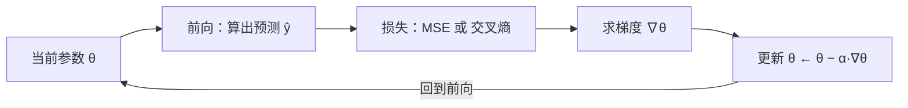

# 第三十一讲 · MSE / 梯度下降与学习率 / 分类与交叉熵

> **本讲信息**
> - 日期：2026-09-13（周日）
> - 第几讲：第三十一讲（学习计划 Day 31，P8）
> - 对应计划：`study-plan-60d.md` → **P8**，课程集号 **125–128**
> - 今日目标：搞懂“模型是怎么学出来的”——**损失函数**（差多少）和**梯度下降**（怎么改）。回归用 **MSE**，分类用**交叉熵**；两者串起来就是后面所有训练（含 YOLO、BC）的共同骨架。

---

## 0. 一句话总结

> **训练 = 反复做两件事：① 用损失函数算出“差多少”；② 用梯度下降沿“最陡的下坡方向”改一点参数。** 改的步子由**学习率**决定——太大直接炸，太小爬一年。回归用 MSE 衡量距离，分类用交叉熵衡量“概率给得对不对”。

---

## 1. 核心知识点（对照 125–128）

### 1.1 125 回归函数的最小均方差 MSE
- **MSE = 预测值与真值之差的平方求平均**：`MSE = (1/n)·Σ(ŷ − y)²`。
- 平方有两大作用：正负误差不抵消；大误差被放大、重点惩罚。
- 用于**回归任务**（预测连续数，如预测关节角）。

### 1.2 126 梯度下降的学习速率
- 参数更新：`θ ← θ − α·∇θ(Loss)`。
- **学习率 α**：步子大小。
  - 太大 → 越过谷底来回震荡甚至 loss 爆炸；
  - 太小 → 收敛极慢、卡在半路。
- 直觉：下山时每一步迈多大。

### 1.3 127 分类任务的原理
- 分类不是直接输出类别号，而是输出**每个类别的分数/概率**，取最大的那个（argmax）。
- 常用 softmax 把分数压成概率（全为正、和为 1）。

### 1.4 128 交叉熵
- **交叉熵 Cross-Entropy = −Σ y_true·log(y_pred)**：只关心“正确类别”被给了多少概率。
  - 给对了且很自信 → 损失接近 0；
  - 给错了 → 损失飙升。
- 用于**分类任务**（如“这是数字 7 / 这是口罩”）。

---

## 2. 原理（先抓这几条）

1. **损失函数 = 尺子**（衡量差多少），**梯度下降 = 走路方式**（怎么改）。
2. **学习率是最先该调的超参**：loss 不降先看它。
3. **回归用 MSE，分类用交叉熵**——别混着用。

---

## 3. 一张图：训练的最小闭环

---

## 4. 今天的操作步骤

1. **看 125–128**（1.0–1.5 倍速），重点看 126 学习率大小的对比、128 交叉熵公式。
2. **手推一个梯度下降小例子**：设 `y = 2x`，从 `w=0` 出发，用 MSE + α=0.1 手算两步更新，看 w 是否朝 2 靠近。
3. **在模拟器 / 代码里对比三种学习率**（0.001 / 0.1 / 1.0），记录 loss 曲线形状。
4. **说清一个分类例子**：输出 10 类概率，取 argmax；若真值是 7 但给了 0.1，交叉熵怎么变。
5. **镜子测试（3 分钟）：** *“MSE 是___、用在___；交叉熵用在___；学习率太大/太小会___；梯度下降是___。”*

> ✅ **今天“做完”的标准：** 手推梯度下降两步 + 讲清 MSE/交叉熵各自场景 + 过镜子测试。

---

## 5. 常见误区 & 容易踩的坑

| # | 误区 | 真相 |
|---|---|---|
| 1 | 学习率越大学得越快 | 太大 → 震荡 / loss 变 NaN 直接炸 |
| 2 | 分类任务也用 MSE | 分类用交叉熵，MSE 在概率上梯度性质差 |
| 3 | loss 不降就换大模型 | 先查学习率和数据，多数问题在这两步 |
| 4 | 准确率低一定是欠拟合 | 也可能是标签错 / 特征没归一化 |
| 5 | 训练一次就定型 | 训练是迭代循环，要盯曲线 |

---

## 6. DEA 交叉链接（轻量，非主线）

- DEA 的“电压→位移”映射本质是**回归**→ 用 **MSE** 训一个迟滞模型很自然；若你把它离散化成“形变档位”做分类，那就改用**交叉熵**。
- 学习率在这里也关键：软体数据噪声大（传感器抖），**学习率太大容易被噪声带跑**，通常要配合更平滑的数据窗口。

---

## 7. 下一阶段 / 检查点

- **过了检查点 =** 手推梯度下降 + 讲清两种损失的场景 + 过镜子测试。
- **下一阶段（Day 32）：** sklearn 线性回归、线性模型解不了异或、oxr 数据解析（129–131）。

---

### 参考资料（先放着，今天不要求）
- 课程集号 125–128（B 站《黑马程序员 · 具身智能》）。
- 复用：Day 30（训练/测试划分——loss 要分开看训练与验证）。

*本讲严格对应《60 天计划》Day 31（P8）：125–128。全程零军事内容。*
