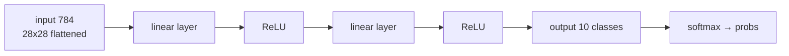

# Lecture 33 · Feature Engineering + Assembling Neural Nets / MNIST

> **Lecture info**
> - Date: 2026-09-15 (Tue)
> - Lecture #: 33 (Study Plan Day 33, P8)
> - Plan ref: `study-plan-60d.md` → **P8**, episodes **132–134**
> - Goal: Combine Day 30’s **feature engineering** with Day 32’s **nonlinearity** — assemble a network layer by layer like building blocks; then meet deep learning’s “Hello World” dataset, **MNIST** (28×28 handwritten digits).

---

## 0. One-line summary

> **A complex net is stacked blocks: linear layers give expression, nonlinear activations give the ability to bend, and alternating them can fit arbitrarily complex relations.** MNIST is 28×28 grayscale digits — **flattened to 784 inputs, 10 output classes** — the standard starting point for classification practice.

---

## 1. Core concepts (eps 132–134)

### 1.1 132 Feature engineering & assembling complex nets
- General recipe: **input → [linear layer → activation] × N → output layer**.
- **Linear (fully-connected) layer** combines features; the **activation** (ReLU / Sigmoid / Tanh) injects nonlinearity.
- Linear layers with no activation → stacking any number equals one layer (recall Day 32).
- Where feature engineering sits: **the first few layers are effectively doing feature engineering automatically** — that’s DL’s edge over classic ML.

### 1.2 133 Handwritten-digit dataset showcase
- MNIST: 70k images of 28×28 grayscale digits (60k train / 10k test), labels 0–9, 10 classes.
- Why it’s classic: **small, clean, yet hard enough** — a fast way to verify your net is wired correctly.

### 1.3 134 Loading and inspecting MNIST
- Common loading: `torchvision.datasets.MNIST(download=True)` or `keras.datasets.mnist.load_data()`.
- What to inspect: image shape `(28, 28)`, pixel range 0–255, whether label distribution is balanced.
- Before feeding: **flatten to 784** and **normalize to 0–1** (divide by 255).

---

## 2. Principles (grab these)

1. **A net is alternating linear + nonlinear layers**; activations are the source of nonlinearity.
2. **Get the input dimension right**: 28×28 = **784** (not 782).
3. **Normalizing to 0–1** stabilizes training (a direct use of Day 30’s feature engineering).

---

## 3. One diagram: how a net is assembled

---

## 4. Today’s steps

1. **Watch 132–134** (1.0–1.5×), focus on 132 (layer-by-layer assembly) and 134 (fixing input shape).
2. **Load MNIST** and print: `X.shape`, the first 10 labels, one image’s pixel range.
3. **Compute the input dim by hand**: confirm 28×28 = 784; reshape one image into a 784-vector.
4. **Normalize**: `X / 255.0`, verify the range becomes 0–1.
5. **Sketch a 3-layer net**, labelling each layer’s in/out dimensions.
6. **Mirror test (3 min):** *“Why must a net have activations ___; MNIST input dim is ___; why divide by 255 ___.”*

> ✅ **Done today when:** MNIST loaded & inspected + you can explain the assembly recipe + mirror test passed.

---

## 5. Common pitfalls

| # | Myth | Truth |
|---|---|---|
| 1 | Wrong input dim (e.g. 782) | 28×28 = **784**; wrong value → shape mismatch error |
| 2 | Skipping normalization | Feeding raw 0–255 → large gradients, unstable training |
| 3 | Stacking linear layers without activation | Equivalent to a single linear model; XOR still unsolvable |
| 4 | Forgetting the batch dimension | Real input is `(N, 784)`, not `(784,)` |
| 5 | Miscounting classes | MNIST is 0–9 → **10 classes** |

---

## 6. DEA cross-link (light, not main thread)

- The same assembly idea applies to soft actuators: **linear layer + activation** fitting the DEA hysteresis curve beats deriving physics by hand; the input can be a **voltage-history window** (which brings memory).
- Replace 784 with “N-step history + current voltage” and the recipe is identical — **only the meaning of the input changes**.

---

## 7. Next / checkpoint

- **Checkpoint passed =** MNIST loaded & inspected + assembly recipe explained + mirror test.
- **Next (Day 34):** training & saving the net, capturing digits with OpenCV, camera-data preprocessing (135–138).

---

### References (not required today)
- Episodes 132–134 (B站《黑马程序员 · 具身智能》).
- Reuse: Day 30 (normalization / feature engineering), Day 32 (why activations are needed).

*This lecture strictly follows 《60-Day Plan》 Day 33 (P8): 132–134. Zero military content.*
