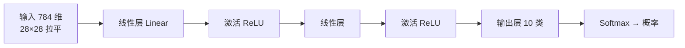

# 第三十三讲 · 特征工程 + 神经网络组拼 / MNIST 数据集

> **本讲信息**
> - 日期：2026-09-15（周二）
> - 第几讲：第三十三讲（学习计划 Day 33，P8）
> - 对应计划：`study-plan-60d.md` → **P8**，课程集号 **132–134**
> - 今日目标：把 Day 30 的**特征工程**和 Day 32 的**非线性**合起来——像搭积木一样把网络“组拼”出来；然后认识深度学习界的“Hello World”数据集 **MNIST**（28×28 手写数字）。

---

## 0. 一句话总结

> **复杂网络 = 一层层积木组拼起来的：线性层提供表达、非线性激活提供“掰弯”的能力，交替堆叠就能拟合任意复杂关系。** MNIST 是 28×28 灰度手写数字图，**拉平后是 784 维输入、10 类输出**，是练手分类任务的标准起点。

---

## 1. 核心知识点（对照 132–134）

### 1.1 132 特征工程与复杂神经网络的组拼
- 搭网络的通用套路：**输入层 → [线性层 → 激活函数] × N → 输出层**。
- **线性层（全连接）**负责组合特征，**激活函数**（ReLU / Sigmoid / Tanh）负责引入非线性。
- 只有线性层、没有激活 → 叠多少层都等于一层（回顾 Day 32）。
- 特征工程在网络里的位置：**网络前面几层其实就是在自动做特征工程**（这是 DL 比传统 ML 强的地方）。

### 1.2 133 手写数字识别数据集展示
- MNIST：7 万张 28×28 灰度手写数字（6 万训练 / 1 万测试），标签 0–9 共 10 类。
- 为什么经典：**小、干净、够难**，能快速验证一个网络写对没有。

### 1.3 134 MNIST 数据集的加载与观察
- 常见加载方式：`torchvision.datasets.MNIST(download=True)` 或 `keras.datasets.mnist.load_data()`。
- 观察要点：图像形状 `(28, 28)`、像素值范围 0–255、标签分布是否均衡。
- 输入前要**拉平成 784 维**并**归一化到 0–1**（除以 255）。

---

## 2. 原理（先抓这几条）

1. **网络 = 线性 + 非线性交替堆叠**；激活函数是“非线性”的来源。
2. **输入维度必须算对**：28×28 = **784**（不是 782）。
3. **归一化到 0–1** 能让训练更稳（Day 30 特征工程的直接应用）。

---

## 3. 一张图：网络的组拼方式

---

## 4. 今天的操作步骤

1. **看 132–134**（1.0–1.5 倍速），重点看 132 怎么一层层组拼、134 输入形状怎么定。
2. **加载 MNIST**，打印：`X.shape`、`y` 的前 10 个标签、一张图的像素范围。
3. **手算输入维度**：确认 28×28 = 784；把一张图 reshape 成 784 维向量。
4. **做归一化**：`X / 255.0`，观察数值范围变成 0–1。
5. **画一个三层小网络的结构草图**：标出每层的输入/输出维度。
6. **镜子测试（3 分钟）：** *“网络为什么必须加激活函数___；MNIST 输入维度是多少___；为什么要除以 255___。”*

> ✅ **今天“做完”的标准：** 成功加载并观察 MNIST + 讲清网络组拼套路 + 过镜子测试。

---

## 5. 常见误区 & 容易踩的坑

| # | 误区 | 真相 |
|---|---|---|
| 1 | 输入维度写错（如 782） | 28×28 = **784**，写错直接报 shape 不匹配 |
| 2 | 忘了归一化 | 像素 0–255 直接喂进去 → 梯度大、训练不稳 |
| 3 | 只堆线性层不加激活 | 等价于单层线性模型，XOR 照样分不开 |
| 4 | 把 batch 维度漏掉 | 实际输入是 `(N, 784)`，不是 `(784,)` |
| 5 | 标签类别数数错 | MNIST 是 0–9 共 **10 类** |

---

## 6. DEA 交叉链接（轻量，非主线）

- “组拼”思路同样适用于软体：用**线性层 + 激活**去拟合 DEA 的迟滞曲线，比手工推物理公式省事；输入可以是“电压历史窗口”（就有记忆了）。
- 这里的 784 维输入换成你的场景就是“N 步历史 + 当前电压”，**套路一模一样，只是输入含义变了**。

---

## 7. 下一阶段 / 检查点

- **过了检查点 =** 加载并观察 MNIST + 讲清网络组拼套路 + 过镜子测试。
- **下一阶段（Day 34）：** 神经网络的训练与模型保存、用 OpenCV 捕获手写数字、摄像头数据预处理（135–138）。

---

### 参考资料（先放着，今天不要求）
- 课程集号 132–134（B 站《黑马程序员 · 具身智能》）。
- 复用：Day 30（归一化 / 特征工程）、Day 32（非线性激活的必要性）。

*本讲严格对应《60 天计划》Day 33（P8）：132–134。全程零军事内容。*
