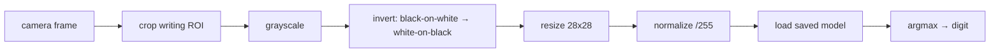

# Lecture 34 · Training & Saving / Capturing Digits with OpenCV / Preprocessing

> **Lecture info**
> - Date: 2026-09-16 (Wed)
> - Lecture #: 34 (Study Plan Day 34, P8)
> - Plan ref: `study-plan-60d.md` → **P8**, episodes **135–138**
> - Goal: Actually **train and save** the net you assembled on Day 33; then use the camera (OpenCV) to **capture your own handwritten digits** as live inference input. **Preprocessing must be identical to training** — otherwise “trains great, useless in practice”.

---

## 0. One-line summary

> **Always save after training (or the run is wasted); camera frames must go through *exactly* the same preprocessing as training (grayscale → crop ROI → resize 28×28 → normalize) before entering the net.** When inference breaks, it’s usually **preprocessing mismatch**, not a weak model.

---

## 1. Core concepts (eps 135–138)

### 1.1 135 Episode-number note
- The plan flags 135 as a likely placeholder / mislabeled number; it does **not** affect the main thread — proceed with 136–138.

### 1.2 136 Training and saving the net
- Training loop, four pieces: **forward → compute loss → backprop → update params**, repeated for several epochs.
- After each epoch, check loss/acc on the **validation set**; if train improves while val degrades → **overfitting**.
- **Always save**: PyTorch `torch.save(model.state_dict(), path)` / Keras `model.save(path)`.

### 1.3 137 Capturing handwritten digits with OpenCV
- Read frames live (reuse Day 21 `VideoCapture`); define a **ROI** in the frame as the “writing area” (Day 22 skill).
- You write a digit in that area; the program crops the ROI and sends it to inference.

### 1.4 138 Preprocessing camera data
- Standard pipeline: **grayscale → (optional) binarize/denoise → crop digit bounding box → resize 28×28 → normalize /255 → add batch dim**.
- ⚠️ **Every step must match training**: if you trained on grayscale, don’t feed RGB at inference; if you divided by 255, don’t forget it.
- Extra: MNIST is **white-on-black**, while camera input is usually **black-on-white** — you must **invert**, or accuracy collapses.

---

## 2. Principles (grab these)

1. **Save right after training** — the weights are the entire output of the run.
2. **Inference input distribution = training input distribution** (grayscale / size / normalization / foreground colour).
3. **Watch two curves** (train loss + val loss); divergence means overfitting.

---

## 3. One diagram: from camera to prediction

---

## 4. Today’s steps

1. **Watch 136–138** (1.0–1.5×), focus on 136 (how to save) and 138 (each preprocessing step).
2. **Train your Day-33 net** on MNIST (1–3 epochs first, just to see it work).
3. **Save the model**, reload it in a fresh process, verify predictions match.
4. **Write the capture script**: a fixed ROI shown live.
5. **Write the preprocessing function**: grayscale → invert → 28×28 → /255, output `(1, 784)` or `(1,1,28,28)`.
6. **Print shapes and pixel ranges** before/after, checking each item against training.
7. **Mirror test (3 min):** *“Why save the model ___; which preprocessing steps ___; why black-on-white breaks recognition and how to fix ___.”*

> ✅ **Done today when:** the model trains, saves and reloads + the preprocessing pipeline runs + mirror test passed.

---

## 5. Common pitfalls

| # | Myth | Truth |
|---|---|---|
| 1 | Don’t bother saving | Kill the process and the weights are gone — run wasted |
| 2 | Preprocess differently at inference | The #1 cause of “trains fine, fails in use” |
| 3 | Ignore colour inversion | MNIST white-on-black vs camera black-on-white; accuracy tanks without inverting |
| 4 | Watch only training loss | Train down + val up = overfitting; watch both curves |
| 5 | Crop ROI but forget to resize to 28×28 | Wrong size → shape error immediately |

---

## 6. DEA cross-link (light, not main thread)

- The “training and deployment preprocessing must match” rule is even more brutal for soft robots: DEA sensors **drift with temperature and ageing**, so normalization constants calibrated at training time go stale on site — you need **periodic recalibration or online adaptation**.
- Same for saving: when you save a soft-actuator control policy, also store the **calibration constants / ambient temperature-humidity at the time**, so results are reproducible and traceable.

---

## 7. Next / checkpoint

- **Checkpoint passed =** model trains, saves, reloads + preprocessing pipeline works + mirror test.
- **Next (Day 35):** digit-recognition inference flow + the integrated case (139–140).

---

### References (not required today)
- Episodes 135–138 (B站《黑马程序员 · 具身智能》).
- Reuse: Day 21–22 (OpenCV frames / ROI), Day 30 (normalization), Day 33 (net structure).

*This lecture strictly follows 《60-Day Plan》 Day 34 (P8): 135–138. Zero military content.*
