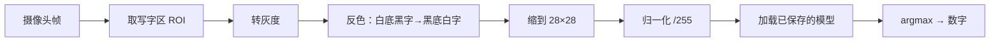

# 第三十四讲 · 训练与模型保存 / OpenCV 捕获手写数字 / 预处理

> **本讲信息**
> - 日期：2026-09-16（周三）
> - 第几讲：第三十四讲（学习计划 Day 34，P8）
> - 对应计划：`study-plan-60d.md` → **P8**，课程集号 **135–138**
> - 今日目标：把 Day 33 搭好的网络**真正训起来并保存**；再用摄像头（OpenCV）**捕获自己写的数字**作为实时推理输入。**预处理必须和训练时一模一样**，否则“训得挺好、一用就废”。

---

## 0. 一句话总结

> **训练完一定要 save（否则白训）；摄像头捕获的画面必须经过与训练时完全一致的预处理（灰度 → 裁 ROI → 缩到 28×28 → 归一化）才能送进网络。** 推理结果崩，八成是**预处理不一致**，而不是模型不行。

---

## 1. 核心知识点（对照 135–138）

### 1.1 135 课程编号说明（占位/编号误标）
- 计划中标注 135 疑似编号占位或误标；**不影响主线**，按 136–138 的内容推进即可。

### 1.2 136 神经网络的训练与模型保存
- 训练循环四件套：**前向 → 算损失 → 反向传播 → 更新参数**，重复若干个 epoch。
- 每轮结束在**验证集**看一次 loss/acc，判断是否过拟合（训练升、验证降 = 过拟合）。
- **务必保存模型**：PyTorch `torch.save(model.state_dict(), path)` / Keras `model.save(path)`。

### 1.3 137 利用 OpenCV 捕获手写数字
- 摄像头实时读帧（复用 Day 21 `VideoCapture`）；在画面里框一块 **ROI**（Day 22 的知识）作为“写字区”。
- 你在这块区域里写数字，程序截下 ROI 送去做推理。

### 1.4 138 摄像头捕获数据的预处理
- 标准流水线：**转灰度 → （可选）二值化/去噪 → 裁剪数字外接矩形 → 缩放到 28×28 → 归一化 /255 → 加 batch 维度**。
- ⚠️ **与训练时的预处理必须逐项对齐**：训练用了灰度就别在推理时喂彩色；训练除以 255 了推理也别忘。
- 补充：MNIST 是**黑底白字**，摄像头往往是**白底黑字**，需要**反色**，否则识别率暴跌。

---

## 2. 原理（先抓这几条）

1. **训完就存**，模型权重是训练的全部产出。
2. **推理的输入分布 = 训练的输入分布**（灰度/尺寸/归一化/前景背景色）。
3. **训练曲线要两条一起看**（训练 loss + 验证 loss），分叉就是过拟合。

---

## 3. 一张图：从摄像头到推理结果

---

## 4. 今天的操作步骤

1. **看 136–138**（1.0–1.5 倍速），重点看 136 如何 save、138 预处理每一步。
2. **训练你 Day 33 搭的小网络**（MNIST，1–3 个 epoch 先看效果）。
3. **保存模型**并在新进程里重新加载，验证预测结果一致。
4. **写摄像头捕获脚本**：固定一块 ROI，实时显示。
5. **写预处理函数**：灰度 → 反色 → 28×28 → /255，输出 `(1, 784)` 或 `(1,1,28,28)`。
6. **打印预处理前后的形状与像素范围**，逐项核对与训练一致。
7. **镜子测试（3 分钟）：** *“为什么要保存模型___；预处理哪几步___；白底黑字为什么容易识别错、怎么办___。”*

> ✅ **今天“做完”的标准：** 模型训完并成功保存重载 + 预处理流水线写通 + 过镜子测试。

---

## 5. 常见误区 & 容易踩的坑

| # | 误区 | 真相 |
|---|---|---|
| 1 | 训练完不保存 | 关掉进程权重全没，白训 |
| 2 | 推理时预处理和训练不一致 | 最常见的“训得好、用就废”的原因 |
| 3 | 忽略黑白反转 | MNIST 黑底白字 vs 摄像头白底黑字，不反色准确率暴跌 |
| 4 | 只盯训练 loss | 训练降、验证升 = 过拟合，要看两条曲线 |
| 5 | 只裁 ROI 不缩放到 28×28 | 尺寸不对直接 shape 报错 |

---

## 6. DEA 交叉链接（轻量，非主线）

- “训练时与部署时预处理必须一致”这条铁律，在软体上更致命：DEA 的传感器**随温度/老化漂移**，训练时标定的归一化参数到了现场就失效，需要**定期重新标定或在线自适应**。
- 模型保存同理：软体控制策略一旦训好，建议连同**当时的标定参数 / 环境温湿度**一起存，方便复现与溯源。

---

## 7. 下一阶段 / 检查点

- **过了检查点 =** 模型能训能存能重载 + 预处理流水线跑通 + 过镜子测试。
- **下一阶段（Day 35）：** 手写数字识别的推理流程 + 综合案例（139–140）。

---

### 参考资料（先放着，今天不要求）
- 课程集号 135–138（B 站《黑马程序员 · 具身智能》）。
- 复用：Day 21–22（OpenCV 读帧 / ROI）、Day 30（归一化）、Day 33（网络结构）。

*本讲严格对应《60 天计划》Day 34（P8）：135–138。全程零军事内容。*
