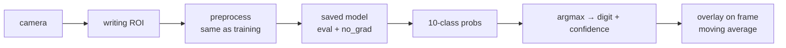

# Lecture 35 · Digit-Recognition Inference Flow + Integrated Case

> **Lecture info**
> - Date: 2026-09-17 (Thu)
> - Lecture #: 35 (Study Plan Day 35, P8)
> - Plan ref: `study-plan-60d.md` → **P8**, episodes **139–140**
> - Goal: Actually **use** the model trained and saved on Day 34 — walk the full **inference flow** (load model → preprocess → forward → argmax) and chain capture/preprocess/inference into one **demoable integrated case**. This is your first end-to-end deep-learning mini-app.

---

## 0. One-line summary

> **Inference is four steps: load model → identical preprocessing → forward pass → take the highest-probability class (argmax).** Disable gradient tracking and switch to eval mode, or it’s slow (and possibly wrong); the integrated case chains “camera capture → preprocess → inference → overlay result” into one pipeline.

---

## 1. Core concepts (eps 139–140)

### 1.1 139 Digit-recognition inference flow
Standard four steps:
1. **Load the model**: `model.load_state_dict(torch.load(path))`, then `model.eval()`.
2. **Preprocess**: identical to training, item by item (grayscale → invert → 28×28 → /255 → add batch dim).
3. **Forward**: wrap in `with torch.no_grad():` (inference needs no gradients — saves memory and time).
4. **Read the result**: `argmax` over the 10-dim probabilities; take `max(prob)` as the confidence.

### 1.2 140 Integrated case design
- Chain everything into an app: **live camera frame → ROI box → preprocess → inference → overlay the result on screen**.
- Engineering details:
  - Use a **moving average to stabilize the display** (single-frame jitter makes digits flicker — echoes Day 25’s tracking de-noising).
  - Add keys: `q` to quit, `s` to save the current sample (useful for growing your dataset later).
  - When confidence is below a threshold, show “unsure” instead of forcing a guess.

---

## 2. Principles (grab these)

1. **Inference needs no gradients** → `no_grad()` / `model.eval()`: faster and lighter.
2. **Consistent preprocessing is the lifeline** (stressed on Day 34).
3. **Output is 10 probabilities; take the max** — and get the `argmax` axis right (the class dimension).

---

## 3. One diagram: the integrated pipeline

---

## 4. Today’s steps

1. **Watch 139–140** (1.0–1.5×), focus on 140 (chaining modules into an app).
2. **Write a `predict(img)` function**: preprocessed tensor in → (digit, confidence) out.
3. **Add eval mode + no_grad**, and compare runtime with/without.
4. **Chain the live demo**: camera view + ROI box + result in the corner.
5. **Add a moving average** (vote over the last 5 frames) and see flicker drop.
6. **Test 10 digits you wrote yourself**, record accuracy, and analyze 2 failures.
7. **Mirror test (3 min):** *“The four inference steps are ___; why no_grad/eval ___; which axis does argmax use ___.”*

> ✅ **Done today when:** the live digit-recognition demo runs + you can state the four inference steps + mirror test passed.

---

## 5. Common pitfalls

| # | Myth | Truth |
|---|---|---|
| 1 | Forget `eval()` at inference | Dropout/BN still behave in training mode → weird results |
| 2 | Leave gradients on | Wastes memory, slower; can even blow up VRAM |
| 3 | argmax on the wrong axis | Taking it over the batch dim → always outputs 0 |
| 4 | Display raw single-frame results | Heavy flicker; vote / moving-average instead |
| 5 | Force an answer at low confidence | Set a threshold and show “unsure” |

---

## 6. DEA cross-link (light, not main thread)

- This “**trained model + consistent preprocessing + real-time inference**” pipeline maps directly onto soft robotics: **train an inverse “voltage→displacement” model offline → feed current voltage plus a history window at runtime → predict deformation live → feed it to the controller for compensation**. Identical structure.
- One difference: for soft bodies you must **wrap a closed loop around the prediction** (model residual + material drift), unlike digit recognition where one decision is final.

---

## 7. Next / checkpoint

- **Checkpoint passed =** live demo runs + four inference steps explained + mirror test.
- **Next (Day 36):** confusion matrix / precision / recall / F1 (141–142).

---

### References (not required today)
- Episodes 139–140 (B站《黑马程序员 · 具身智能》).
- Reuse: Day 34 (saving + preprocessing), Day 25 (moving-average de-jitter).

*This lecture strictly follows 《60-Day Plan》 Day 35 (P8): 139–140. Zero military content.*
