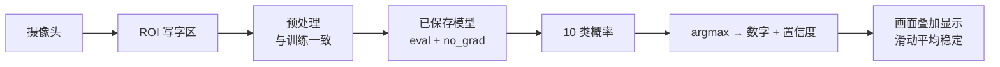

# 第三十五讲 · 手写数字识别推理流程 + 综合案例

> **本讲信息**
> - 日期：2026-09-17（周四）
> - 第几讲：第三十五讲（学习计划 Day 35，P8）
> - 对应计划：`study-plan-60d.md` → **P8**，课程集号 **139–140**
> - 今日目标：把 Day 34 训好存好的模型**用起来**——走通完整的**推理流程**（加载模型 → 预处理 → 前向 → argmax），并把捕获/预处理/推理串成一个**能演示的综合案例**。这是你人生第一个“端到端深度学习小应用”。

---

## 0. 一句话总结

> **推理就四步：加载模型 → 同样的预处理 → 前向传播 → 取概率最大的那一类（argmax）。** 推理时记得关掉梯度追踪并切到评估模式，否则又慢又可能结果异常；综合案例就是把“摄像头捕获 → 预处理 → 推理 → 显示结果”串成一条流水线。

---

## 1. 核心知识点（对照 139–140）

### 1.1 139 手写数字识别的推理流程
标准四步：
1. **加载模型**：`model.load_state_dict(torch.load(path))`，并 `model.eval()`。
2. **预处理**：与训练时逐项一致（灰度 → 反色 → 28×28 → /255 → 加 batch 维度）。
3. **前向传播**：`with torch.no_grad():` 包起来（推理不需要梯度，省显存又提速）。
4. **取结果**：对输出的 10 维概率取 `argmax`，得到数字；想看把握有多大就取 `max(概率)` 作为置信度。

### 1.2 140 手写数字综合案例设计
- 把前面所有零件串成应用：**摄像头实时读帧 → 框出 ROI → 预处理 → 推理 → 在画面上叠加显示识别结果**。
- 工程细节：
  - 用滑动平均**稳定显示结果**（单帧抖动会导致数字跳来跳去，呼应 Day 25 的追踪去噪）。
  - 加个按键：按 `q` 退出、按 `s` 保存当前样本（方便日后扩充数据集）。
  - 置信度低于阈值时显示“不确定”，别硬猜。

---

## 2. 原理（先抓这几条）

1. **推理不需要梯度** → `no_grad()` / `model.eval()`，又快又省。
2. **预处理一致是生命线**（Day 34 已强调）。
3. **输出是 10 个概率，取最大**；`argmax` 的轴要指定对（对类别那一维）。

---

## 3. 一张图：综合案例的流水线

---

## 4. 今天的操作步骤

1. **看 139–140**（1.0–1.5 倍速），重点看 140 怎么把各模块串成应用。
2. **写一个 `predict(img)` 函数**：输入预处理好的张量，输出（数字, 置信度）。
3. **确认 eval 模式 + no_grad 都已加上**，对比加与不加的耗时。
4. **串成实时 demo**：摄像头画面 + ROI 框 + 左上角显示识别结果。
5. **加滑动平均**（最近 5 帧投票），观察数字跳动是否明显减少。
6. **测 10 个自己写的数字**，记录准确率，挑 2 个识别错的样本分析原因。
7. **镜子测试（3 分钟）：** *“推理四步是___；为什么要用 no_grad/eval___；argmax 取的是哪一维___。”*

> ✅ **今天“做完”的标准：** 实时手写数字识别 demo 跑通 + 讲清推理四步 + 过镜子测试。

---

## 5. 常见误区 & 容易踩的坑

| # | 误区 | 真相 |
|---|---|---|
| 1 | 推理时忘了 `eval()` | Dropout/BN 仍按训练模式跑 → 结果异常 |
| 2 | 没关梯度 | 白白占显存、变慢，极端情况下爆显存 |
| 3 | argmax 轴取错 | 对 batch 维取 → 永远输出 0 |
| 4 | 单帧结果直接显示 | 抖动严重，要投票/滑动平均 |
| 5 | 低置信度也硬输出 | 应设阈值提示“不确定” |

---

## 6. DEA 交叉链接（轻量，非主线）

- 这套“**训好的模型 + 一致预处理 + 实时推理**”流水线，换成软体场景就是：**离线训好“电压→位移”逆模型 → 部署时喂当前电压与历史窗口 → 实时输出预测形变 → 送给控制器补偿**。结构完全一样。
- 唯一差别：软体要在**推理结果上再加闭环反馈**（因为模型有残差、材料会漂移），不能像数字识别那样“一次判定就完事”。

---

## 7. 下一阶段 / 检查点

- **过了检查点 =** 实时识别 demo 跑通 + 讲清推理四步 + 过镜子测试。
- **下一阶段（Day 36）：** 混淆矩阵 / 查准率 / 查全率 / F1 分数（141–142）。

---

### 参考资料（先放着，今天不要求）
- 课程集号 139–140（B 站《黑马程序员 · 具身智能》）。
- 复用：Day 34（模型保存 + 预处理流水线）、Day 25（滑动平均去抖）。

*本讲严格对应《60 天计划》Day 35（P8）：139–140。全程零军事内容。*
