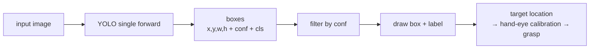

# Lecture 37 · YOLO Installation / Inference Demo / Usage Notes

> **Lecture info**
> - Date: 2026-09-19 (Sat)
> - Lecture #: 37 (Study Plan Day 37, P8)
> - Plan ref: `study-plan-60d.md` → **P8**, episodes **143–145**
> - Goal: Meet **YOLO**, the workhorse of **object detection** — unlike classification, it answers not only “what is this” but **“where is it” (a box)**. Today: install it, run inference, and learn to read its output format.

---

## 0. One-line summary

> **YOLO = You Only Look Once: a single forward pass outputs “which objects + where each one is + how confident”** all at once. Remember the four output pieces: **box (x, y, w, h) + confidence + class id**. It’s the de-facto standard for real-time detection and what lets a robot arm “see and locate a target”.

---

## 1. Core concepts (eps 143–145)

### 1.1 143 Installing YOLO
- Standard route: `pip install ultralytics` (Ultralytics maintains YOLOv5/v8/v11).
- Verify: `yolo version`, or in Python `from ultralytics import YOLO` without error.
- ⚠️ **Version differences**: v5 / v8 / v11 APIs and config formats are not fully interchangeable — stick to the version used in the course.

### 1.2 144 Inference demo
- Minimal three lines:
  ```python
  from ultralytics import YOLO
  model = YOLO('yolov8n.pt')      # pretrained weights (n = nano: smallest, fastest)
  results = model('bus.jpg')      # inference
  results[0].show()               # draw boxes
  ```
- `yolov8n.pt` is pretrained on COCO’s 80 classes — out of the box it detects people, cars, cups, etc.

### 1.3 145 Usage notes
- **Output format** (per image): multiple boxes, each = `(x_center, y_center, w, h, conf, cls)`.
  - Coordinates may be absolute pixels **or normalized to 0–1** (training labels must be normalized).
- **Confidence threshold**: too high → misses; too low → false alarms everywhere. YOLO defaults around 0.25; tune per scenario (ties to Day 36’s P/R trade-off).
- **Model size tiers**: n / s / m / l / x — further right means more accurate and slower. Edge devices (e.g. Jetson) usually pick n or s.

---

## 2. Principles (grab these)

1. **Classification vs detection**: classification says “what”; detection says “what + where”.
2. **YOLO is a one-stage detector**: one look, one result — that’s why it’s real-time.
3. **Output = box + confidence + class**; always check whether box coords are absolute or normalized.

---

## 3. One diagram: what YOLO does



---

## 4. Today’s steps

1. **Watch 143–145** (1.0–1.5×), focus on 145 (how to read the output).
2. **Install ultralytics**; confirm both the CLI and the Python API work.
3. **Run inference on the sample image** (e.g. `bus.jpg`) and save a screenshot of the boxes.
4. **Print every box’s full fields** and cross-check against the image: where’s the center, what are w/h, conf, cls.
5. **Sweep the conf threshold** (0.1 / 0.25 / 0.6) and watch misses vs false alarms.
6. **Run it live on the camera** (`model(source=0, stream=True)`) and feel the FPS.
7. **Mirror test (3 min):** *“YOLO vs classification ___; the four output pieces ___; raising/lowering conf causes ___.”*

> ✅ **Done today when:** YOLO inference runs (image + camera) + you can explain the output fields + mirror test passed.

---

## 5. Common pitfalls

| # | Myth | Truth |
|---|---|---|
| 1 | Mix v5/v8/v11 configs and APIs | Not interchangeable; follow the course version |
| 2 | Never tune conf | Default 0.25 may not fit your scene; weigh misses vs false alarms on-site |
| 3 | Treat normalized coords as pixels | Training labels must be normalized (divide by w/h); don’t mix |
| 4 | Assume box center = grasp point | Still needs **hand-eye calibration** to physical coords, plus object pose angle (Day 23/27) |
| 5 | Start training immediately | Run pretrained inference first to verify the environment |

---

## 6. DEA cross-link (light, not main thread)

- When using YOLO to localize **deformable targets** for soft grasping (fruit, fabric, soft-tissue phantoms), box boundaries are inherently fuzzy — **annotation consistency** matters even more than for rigid parts, or the model learns noise.
- For edge deployment (soft systems often run on portable HV supplies and small controllers), pick **n/s-tier small models** for real-time performance; only scale up if accuracy is short.

---

## 7. Next / checkpoint

- **Checkpoint passed =** YOLO inference runs + output fields explained + mirror test.
- **Next (Day 38):** annotation requirements / annotation practice / label conversion / dataset prep / training config (146–150).

---

### References (not required today)
- Episodes 143–145 (B站《黑马程序员 · 具身智能》).
- Reuse: Day 23 (hand-eye calibration — box → physical coords), Day 36 (P/R vs conf threshold).

*This lecture strictly follows 《60-Day Plan》 Day 37 (P8): 143–145. Zero military content.*
