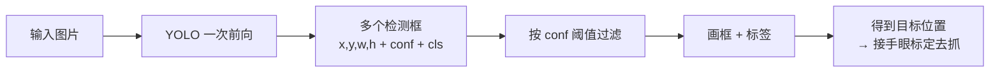

# 第三十七讲 · YOLO 安装 / 推理演示 / 使用说明

> **本讲信息**
> - 日期：2026-09-19（周六）
> - 第几讲：第三十七讲（学习计划 Day 37，P8）
> - 对应计划：`study-plan-60d.md` → **P8**，课程集号 **143–145**
> - 今日目标：认识**目标检测**的主力框架 **YOLO**——它和前面分类任务的区别是：**不只说“这是什么”，还要说“在哪”（给出框）**。今天先装好、跑通推理、看懂输出格式。

---

## 0. 一句话总结

> **YOLO = You Only Look Once：一次前向就同时输出“有哪些物体 + 每个在哪 + 置信度多少”。** 输出格式记住四件套：**框（x, y, w, h）+ 置信度 conf + 类别 cls**。它是实时检测的事实标准，机械臂“看见并定位目标”靠它。

---

## 1. 核心知识点（对照 143–145）

### 1.1 143 YOLO 框架的安装
- 主流做法：`pip install ultralytics`（Ultralytics 维护 YOLOv5/v8/v11 等）。
- 装完验证：`yolo version` 或在 Python 里 `from ultralytics import YOLO` 不报错。
- ⚠️ **版本差异**：v5 / v8 / v11 的 API 与配置文件格式不完全通用，跟着课程版本走，别混用。

### 1.2 144 YOLO 框架的推理演示
- 最小推理三行：
  ```python
  from ultralytics import YOLO
  model = YOLO('yolov8n.pt')      # 加载预训练权重（n=nano，最快最小）
  results = model('bus.jpg')      # 推理
  results[0].show()               # 显示带框结果
  ```
- `yolov8n.pt` 在 COCO 80 类上预训练，开箱就能检测人、车、杯子等常见物体。

### 1.3 145 YOLO 模型的使用说明
- **输出格式**（每张图）：多个检测框，每个框 = `(x_center, y_center, w, h, conf, cls)`。
  - 坐标可以是像素绝对值，也可以是**归一化到 0–1** 的值（训练标签必须用归一化）。
- **置信度阈值 conf**：调太高 → 漏检；调太低 → 误检一堆。YOLO 默认约 0.25，可按场景微调（呼应 Day 36 的 P/R 取舍）。
- **模型尺寸档位**：n / s / m / l / x，越往右越准越慢。边端设备（如 Jetson）通常选 n 或 s。

---

## 2. 原理（先抓这几条）

1. **分类 vs 检测**：分类给“是什么”，检测给“是什么 + 在哪”。
2. **YOLO 是单阶段（one-stage）检测器**：只看一次就出结果，所以快、能实时。
3. **输出是框 + 置信度 + 类别**；框的表示方式要先看清是绝对像素还是归一化。

---

## 3. 一张图：YOLO 在做什么



---

## 4. 今天的操作步骤

1. **看 143–145**（1.0–1.5 倍速），重点看 145 输出格式怎么读。
2. **装 ultralytics**，确认 CLI 与 Python 两种方式都能用。
3. **跑官方示例图推理**（如 `bus.jpg`），把带框结果截图保存。
4. **打印出每个框的完整字段**，对照画面数一数：框中心在哪、宽高多少、conf 多少、cls 是几。
5. **试着调 conf 阈值**（0.1 / 0.25 / 0.6），观察漏检与误检的变化。
6. **用摄像头实时跑一次**（`model(source=0, stream=True)`），感受帧率。
7. **镜子测试（3 分钟）：** *“YOLO 和分类任务的区别___；输出四件套是___；conf 调高/调低分别会___。”*

> ✅ **今天“做完”的标准：** YOLO 推理跑通（图片 + 摄像头）+ 能解释输出字段 + 过镜子测试。

---

## 5. 常见误区 & 容易踩的坑

| # | 误区 | 真相 |
|---|---|---|
| 1 | 混用 v5/v8/v11 的配置与 API | 各版本不通用，跟着课程版本走 |
| 2 | conf 阈值不调 | 默认 0.25 未必适合你的场景，漏检/误检要现场权衡 |
| 3 | 把归一化坐标当像素用 | 训练标签必须归一化（除以宽高），别混 |
| 4 | 以为检测框中心 = 抓取点 | 还要经**手眼标定**转物理坐标，并考虑物体姿态角度（Day 23/27） |
| 5 | 一上来就训 | 先用预训练权重跑通推理，确认环境没问题再训 |

---

## 6. DEA 交叉链接（轻量，非主线）

- 软体抓取用 YOLO 定位**易变形目标**（水果、织物、软组织模型）时，框的边界本来就模糊——**标注一致性**比刚性件更重要，否则模型学到的是噪声。
- 边端部署（软体常配便携驱动电源与小型控制器）建议选 **n/s 档小模型**，实时性优先；精度不够再往上换。

---

## 7. 下一阶段 / 检查点

- **过了检查点 =** YOLO 推理跑通 + 会读输出字段 + 过镜子测试。
- **下一阶段（Day 38）：** 数据标注要求 / 标注实操 / 标签转化 / 数据集准备 / 训练配置文件（146–150）。

---

### 参考资料（先放着，今天不要求）
- 课程集号 143–145（B 站《黑马程序员 · 具身智能》）。
- 复用：Day 23（手眼标定 —— 检测框 → 物理坐标）、Day 36（P/R 与 conf 阈值的关系）。

*本讲严格对应《60 天计划》Day 37（P8）：143–145。全程零军事内容。*
