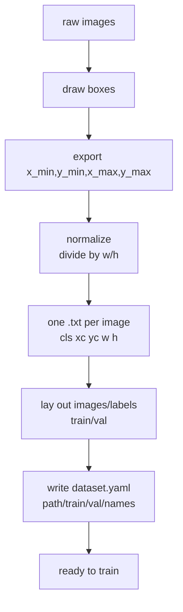

# Lecture 38 · Annotation / Label Conversion / Dataset Prep / Training Config

> **Lecture info**
> - Date: 2026-09-20 (Sun)
> - Lecture #: 38 (Study Plan Day 38, P8)
> - Plan ref: `study-plan-60d.md` → **P8**, episodes **146–150**
> - Goal: Cross from “using someone else’s model” to “training your own”. Today is all **data-side work**: how to draw boxes, how to convert label formats, how to lay out the dataset, how to write the training config. **Get this wrong and tomorrow’s training run dies.**

---

## 0. One-line summary

> **Before YOLO training you need three things: ① images + one matching .txt per image (class x_center y_center w h, all normalized to 0–1); ② a directory laid out as images/labels × train/val; ③ a dataset.yaml pointing the way plus a model yaml defining the architecture.** Wrong normalization, wrong paths, and out-of-bounds boxes are the three most common failures.

---

## 1. Core concepts (eps 146–150)

### 1.1 146 Annotation requirements
- Boxes must **hug the object edge**, not be sloppy, not run outside the image.
- Every class needs **enough and diverse** samples (angle / lighting / background / occlusion all covered).
- Annotation must be **consistent**: hugging tight in one image and loose in another teaches the model noise.

### 1.2 147 Annotating mask / no-mask data
- Course example task: detect “wearing a mask / not wearing a mask” (e.g. `names: ['mask', 'no_mask']`).
- Practice: use an annotation tool (LabelImg / CVAT / Roboflow), box each image, export in YOLO format.

### 1.3 148 Converting labels to YOLO format
- YOLO label format (one line per box in each .txt):
  ```
  <class_id> <x_center> <y_center> <width> <height>
  ```
- **All values are relative**: `x_center = (x_min + x_max) / 2 / img_w`, `w = (x_max − x_min) / img_w`; y/h likewise divided by `img_h`.
- Converting from VOC/COCO (absolute pixels) is exactly this division; multiply back for the reverse.

### 1.4 149 Preparing the training dataset
- Recommended layout:
  ```
  dataset/
    images/train/  images/val/
    labels/train/  labels/val/
  ```
- **Images and labels must correspond by same name and level** (`a.jpg` ↔ `a.txt`); an image with no label is treated as “no object” or raises an error.

### 1.5 150 Training config files
- `dataset.yaml` key fields:
  ```yaml
  path: ./dataset
  train: images/train
  val: images/val
  names:
    0: mask
    1: no_mask
  ```
- The model yaml (e.g. `yolov8n.yaml`) sets `nc: 2` (number of classes) — **a wrong class count is a classic training error**.

---

## 2. Principles (grab these)

1. **Labels must be normalized** — the model learns relative position, decoupled from resolution.
2. **Directory layout is strict** — YOLO looks up “x.jpg in images/train → x.txt in labels/train”.
3. **`nc` must match the length of `names`.**

---

## 3. One diagram: from raw images to a trainable dataset



---

## 4. Today’s steps

1. **Watch 146–150** (1.0–1.5×), focus on 148 (normalization math) and 150 (config writing).
2. **Annotate 30–50 of your own images** (two classes is fine, e.g. “cap / not-cap”), covering different angles and lighting.
3. **Write a conversion script**: absolute pixel boxes → normalized YOLO; print 3 lines and verify by hand.
4. **Lay out the directories** (images/labels × train/val) — **split first**, never let images of the same object straddle train and val.
5. **Write dataset.yaml**; confirm `nc` matches `names` length and paths exist.
6. **Visual spot-check**: draw labels back onto images and eyeball that boxes aren’t skewed or out of bounds.
7. **Mirror test (3 min):** *“What does one YOLO label line look like ___; why normalize ___; what must dataset.yaml contain ___.”*

> ✅ **Done today when:** dataset laid out + dataset.yaml correct + visual check passed + mirror test passed.

---

## 5. Common pitfalls

| # | Myth | Truth |
|---|---|---|
| 1 | Write box coords in pixels | Must **normalize** (÷ w/h) or training is skewed |
| 2 | Shuffle train/val randomly | Split by whole scene/object groups, or val score is inflated (same leakage issue as Day 30) |
| 3 | Wrong paths / absolute paths break on another machine | Prefer relative paths; change only `path` when moving |
| 4 | `nc` doesn’t match `names` length | Training errors out or class mapping is scrambled |
| 5 | Skip the visual spot-check | Skewed or out-of-bounds boxes go unnoticed; training is wasted |
| 6 | Number classes starting from 1 | YOLO class_id **starts at 0** |

---

## 6. DEA cross-link (light, not main thread)

- When annotating soft/deformable targets, **“where does the boundary end” has no single right answer** — write an **annotation guideline** (e.g. “box to the visible outer contour before deformation”) and enforce it across the team, otherwise inter-annotator consistency is poor and the model can’t learn.
- Same lesson for your soft-robotics experiments: **define the measurement protocol before collecting data**, or the data is unusable.

---

## 7. Next / checkpoint

- **Checkpoint passed =** dataset ready + config correct + mirror test.
- **Next (Day 39):** YOLO training demo / inference results / CNN intro / how convolution kernels work (151–154).

---

### References (not required today)
- Episodes 146–150 (B站《黑马程序员 · 具身智能》).
- Reuse: Day 30 (splitting — split first to avoid leakage), Day 37 (YOLO output format).

*This lecture strictly follows 《60-Day Plan》 Day 38 (P8): 146–150. Zero military content.*
