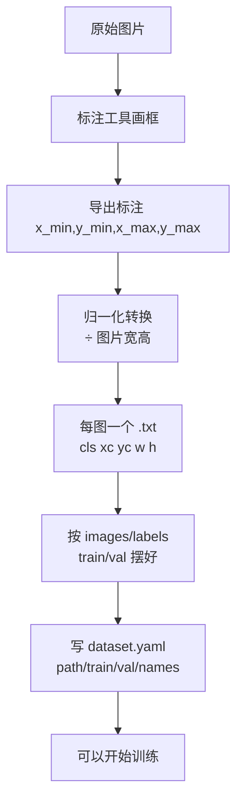

# 第三十八讲 · 数据标注 / 标签转化 / 数据集准备 / 训练配置

> **本讲信息**
> - 日期：2026-09-20（周日）
> - 第几讲：第三十八讲（学习计划 Day 38，P8）
> - 对应计划：`study-plan-60d.md` → **P8**，课程集号 **146–150**
> - 今日目标：从“用别人的模型”跨到“训自己的模型”。今天全是**数据侧**的活：怎么标框、标签格式怎么转、数据集怎么摆、训练配置怎么写。**这一步做错，明天训练直接挂。**

---

## 0. 一句话总结

> **YOLO 训练前要备齐三样：① 图片 + 每图一个同名 .txt 标签（class x_center y_center w h，全部归一化到 0–1）；② 按 images/labels + train/val 摆好的目录；③ 一个 dataset.yaml 指路 + 一个模型 yaml 定结构。** 归一化算错、路径写错、框出界，是三大高发故障。

---

## 1. 核心知识点（对照 146–150）

### 1.1 146 数据标注的要求说明
- 框要**紧贴目标边缘**、不框歪、不框出图片边界。
- 每类目标都要有**足够数量且多样**的样本（角度/光照/背景/遮挡都要覆盖）。
- 标注要**一致**：同一个物体在这张图框紧、那张图框松，模型学到的是噪声。

### 1.2 147 标注口罩和非口罩数据
- 课程示例任务：检测“戴口罩 / 没戴口罩”两类（names: ['mask', 'no_mask'] 之类）。
- 实操：用标注工具（如 LabelImg / CVAT / Roboflow）逐张框，导出 YOLO 格式。

### 1.3 148 YOLO 标签数据的转化
- YOLO 标签格式（每个 .txt 一行一个框）：
  ```
  <class_id> <x_center> <y_center> <width> <height>
  ```
- **全部是相对值**：`x_center = (x_min + x_max) / 2 / img_w`，`w = (x_max − x_min) / img_w`，y/h 同理除以 `img_h`。
- 从 VOC/COCO（绝对像素）转 YOLO 就是这套除法；反过来乘回去。

### 1.4 149 准备 YOLO 训练的数据集
- 推荐目录结构：
  ```
  dataset/
    images/train/  images/val/
    labels/train/  labels/val/
  ```
- **图片与标签必须同名同目录层级对应**（`a.jpg` ↔ `a.txt`），缺标签的图会被当成“无目标”或报错。

### 1.5 150 YOLO 训练的配置文件
- `dataset.yaml` 关键字段：
  ```yaml
  path: ./dataset
  train: images/train
  val: images/val
  names:
    0: mask
    1: no_mask
  ```
- 模型结构 yaml（如 `yolov8n.yaml`）里指定 `nc: 2`（类别数）——**类别数写错是训练报错常客**。

---

## 2. 原理（先抓这几条）

1. **标签必须归一化**：模型学的是相对位置，与图片分辨率解耦。
2. **目录结构要严格**：YOLO 按“把 images/train 里的 x.jpg 替换成 labels/train 里的 x.txt”去找标签。
3. **nc（类别数）必须和 names 长度一致**。

---

## 3. 一张图：从原始图到可训练数据集



---

## 4. 今天的操作步骤

1. **看 146–150**（1.0–1.5 倍速），重点看 148 归一化怎么算、150 配置怎么写。
2. **标 30–50 张自己的数据**（两类即可，如“瓶盖 / 非瓶盖”），覆盖不同角度与光照。
3. **写转换脚本**：把绝对像素框 → 归一化 YOLO 格式，抽 3 条打印核对。
4. **按目录结构摆好** images/labels 与 train/val（**先划分再摆**，别让同一物体的图跨 train/val）。
5. **写 dataset.yaml**，确认 `nc` 与 `names` 数量一致、路径存在。
6. **做一次“标签可视化抽查”**：把标签画回图上，肉眼确认框没歪、没出界。
7. **镜子测试（3 分钟）：** *“YOLO 标签一行长啥样___；为什么要归一化___；dataset.yaml 里必须有哪几项___。”*

> ✅ **今天“做完”的标准：** 数据集摆好 + dataset.yaml 写对 + 可视化抽查通过 + 过镜子测试。

---

## 5. 常见误区 & 容易踩的坑

| # | 误区 | 真相 |
|---|---|---|
| 1 | 框坐标直接写像素 | 必须**归一化**（÷ 宽高），否则训练全歪 |
| 2 | train/val 随机打散 | 同一场景/同一物体的图要整组划分，否则验证集虚高（同 Day 30 泄漏问题） |
| 3 | 路径写错 / 用绝对路径换机器就挂 | 优先用相对路径，换机器只改 `path` |
| 4 | `nc` 与 `names` 数量不一致 | 训练直接报错或类别映射错乱 |
| 5 | 标完不抽查 | 框歪了、出界了看不出来，模型白训 |
| 6 | 类别 id 从 1 开始编号 | YOLO 的 class_id **从 0 开始** |

---

## 6. DEA 交叉链接（轻量，非主线）

- 标注软体 / 易变形目标时，**“框到哪里算边界”没有唯一答案**——建议写成一份**标注规范**（如“框到形变前的外轮廓可见边缘”），全组统一，否则标注者之间一致性差，模型学不会。
- 这条经验对你日后做软体实验数据同样适用：**先定测量口径，再采集数据**，不然数据没法用。

---

## 7. 下一阶段 / 检查点

- **过了检查点 =** 数据集准备完成 + 配置正确 + 过镜子测试。
- **下一阶段（Day 39）：** YOLO 训练演示 / 推理效果展示 / CNN 卷积入门 / 卷积核原理（151–154）。

---

### 参考资料（先放着，今天不要求）
- 课程集号 146–150（B 站《黑马程序员 · 具身智能》）。
- 复用：Day 30（划分原则 —— 先划分，防泄漏）、Day 37（YOLO 输出格式）。

*本讲严格对应《60 天计划》Day 38（P8）：146–150。全程零军事内容。*
