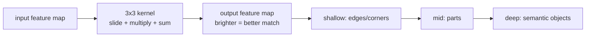

# Lecture 39 · YOLO Training & Results / CNN Intro / How Kernels Work

> **Lecture info**
> - Date: 2026-09-21 (Mon)
> - Lecture #: 39 (Study Plan Day 39, P8)
> - Plan ref: `study-plan-60d.md` → **P8**, episodes **151–154**
> - Goal: Two things — **① actually launch a YOLO training run** and learn to read the loss and mAP curves; **② step back to fundamentals: how a CNN “sees” an image**, and what a convolution kernel really does. The first is engineering, the second is theory — you need both.

---

## 0. One-line summary

> **Watch two curves during training: loss should fall, mAP should rise; if loss falls while mAP stalls, that’s usually overfitting (too little / too uniform data).** And a CNN can “see” because **a convolution kernel is a little template slid across the image** — shallow layers find edges/corners, deeper layers assemble parts like “eye” or “wheel”.

---

## 1. Core concepts (eps 151–154)

### 1.1 151 YOLO training demo
- Launch training (Ultralytics):
  ```python
  from ultralytics import YOLO
  model = YOLO('yolov8n.yaml')   # train from architecture
  # or YOLO('yolov8n.pt')       # fine-tune from pretrained (recommended, converges faster)
  model.train(data='dataset.yaml', epochs=50, imgsz=640, batch=8)
  ```
- **Key hyperparameters**: `epochs`, `batch`, `imgsz`, `lr0` (initial learning rate — links Day 31).
- Outputs land in `runs/detect/train*/`: `weights/best.pt`, `results.png` (curves), confusion matrix, etc.

### 1.2 152 Inference results showcase
- Run the trained `best.pt` on new images and evaluate visually.
- **Quantify with mAP** (mean Average Precision): aggregates P/R behaviour across confidence thresholds (the advanced version of Day 36).
- **Find the weak class → go back and add data**; modeling is a loop (Day 30).

### 1.3 153 CNN intro
- Why not fully-connected layers for images: flattening 28×28 is fine, but **640×640 flattens to 400k dims** — parameter explosion plus loss of spatial structure.
- **CNN uses “local connectivity + weight sharing”**: each kernel looks at a small patch (e.g. 3×3) and shares weights across the image → far fewer parameters and better translation robustness.

### 1.4 154 How convolution kernels work
- **Convolution = slide a small template over the image, multiply element-wise and sum**; a high output means that patch matches the template.
- Different kernels detect different features: vertical edges, horizontal edges, blobs.
- **Shallow → edges/textures; middle → parts; deep → semantic objects** (that’s “automatic feature engineering”, linking Day 33).
- Output size formula (memorize it): `out = (in + 2·padding − kernel) / stride + 1`.

---

## 2. Principles (grab these)

1. **Watch both loss and mAP**; the classic overfit signature is falling loss with flat val/mAP.
2. **Convolution = sliding template matching**; weight sharing keeps parameters manageable.
3. **CNN hierarchy = automatic feature engineering**: edges → parts → objects.

---

## 3. One diagram: what a kernel does



---

## 4. Today’s steps

1. **Watch 151–154** (1.0–1.5×), focus on 151 (training command) and 154 (convolution illustration).
2. **Launch a YOLO training run** (start with 10 epochs just to verify the pipeline runs).
3. **Read `results.png`**: is loss falling, is mAP rising, do they diverge (overfitting)?
4. **Infer with best.pt on new images** — eyeball it *and* check metrics; find the worst-performing class.
5. **Hand-compute one convolution**: a 3×3 kernel over a 5×5 image (padding=0, stride=1); write the output size and a few values.
6. **Verify the size formula**: `out = (in + 2p − k)/s + 1`; plug in padding=1 and check the size is preserved.
7. **Mirror test (3 min):** *“Which two training metrics matter ___; what does a kernel do ___; why does a CNN have fewer params than FC ___.”*

> ✅ **Done today when:** YOLO training runs + you can read the curves + you hand-computed a convolution + mirror test passed.

---

## 5. Common pitfalls

| # | Myth | Truth |
|---|---|---|
| 1 | Falling loss means all good | Watch mAP/val metrics; loss down but val flat = overfitting |
| 2 | Little data → use a bigger model | Little data + big model overfits faster; add data or fine-tune from pretrained |
| 3 | Always train from scratch | Fine-tuning pretrained weights converges faster and better |
| 4 | Guess the convolution output size | Compute it: `(in + 2p − k)/s + 1` |
| 5 | Think kernels are hand-designed | Kernel weights are **learned by training**, not written by hand |

---

## 6. DEA cross-link (light, not main thread)

- Treat a DEA membrane’s **deformation field** as an “image” and a CNN can eat it too: input “voltage distribution / electrode-zone map”, output “predicted strain field”. That’s an off-the-shelf recipe for **soft-body proprioception** via vision/deep learning.
- Caveat: soft-body data is **expensive to collect** (every deformation needs a real experiment), unlike images — so it leans harder on **simulation + synthetic data** (Day 41) and pretrained fine-tuning.

---

## 7. Next / checkpoint

- **Checkpoint passed =** YOLO training runs + can read loss/mAP curves + hand-computed convolution + mirror test.
- **Next (Day 40):** CNN pooling & flattening / data-collection requirements analysis (155–156).

---

### References (not required today)
- Episodes 151–154 (B站《黑马程序员 · 具身智能》).
- Reuse: Day 31 (learning rate), Day 36 (P/R → mAP), Day 33 (automatic feature engineering).

*This lecture strictly follows 《60-Day Plan》 Day 39 (P8): 151–154. Zero military content.*
