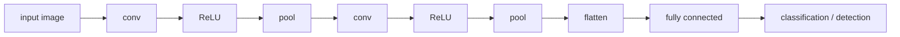

# Lecture 40 · CNN Pooling & Flattening / Data-Collection Requirements

> **Lecture info**
> - Date: 2026-09-22 (Tue)
> - Lecture #: 40 (Study Plan Day 40, P8)
> - Plan ref: `study-plan-60d.md` → **P8**, episodes **155–156**
> - Goal: Finish the last two CNN building blocks — **pooling (downsampling)** and **flattening (feeding fully-connected layers)** — so you can narrate a full CNN forward pass; then shift to the engineering view: **how to write data-collection requirements** (what to collect, how much, how to label), setting up tomorrow’s synthetic data.

---

## 0. One-line summary

> **The full CNN forward pass = convolution (extract features) → activation (nonlinearity) → pooling (downsample, add robustness) → flatten (to 1-D) → fully connected (decide).** On the data side, write down in advance **what to collect, how much, how to label, and which scenarios** — collecting without a plan means discovering mid-training that your data is insufficient.

---

## 1. Core concepts (eps 155–156)

### 1.1 155 Pooling and flattening
- **Pooling**: over a small window (e.g. 2×2), take the max (MaxPool) or the mean (AvgPool).
  - Benefits: **downsampling** (size halves), **less compute**, and a bit of **translation invariance** (the object is recognized even if nudged).
  - Cost: **loss of spatial precision** — that’s why small-object detection is sensitive to pooling (pool too hard and small objects vanish).
- **Flatten**: unroll the multi-dim feature map into one long vector to feed fully-connected layers.
  - e.g. `(16, 7, 7)` → `784` dims.

### 1.2 156 Data-collection requirements analysis
Write down four things before you start:
1. **What**: target classes and the criterion for each (“what counts as a positive”).
2. **How much**: a few hundred per class to start; keep classes **balanced**.
3. **How to label**: annotation rules (box tightness, boundary definition), who labels, how to review.
4. **Which scenarios**: angle, lighting, background, occlusion, distance — **the training set must cover the variation you’ll meet at deploy time**, or it breaks the moment the environment changes.

---

## 2. Principles (grab these)

1. **Pooling trades precision for robustness**; use it carefully for small targets.
2. **Flatten is the bridge** from the “convolution world” to the “fully-connected world”.
3. **Plan data collection**: distribution coverage matters more than raw count.

---

## 3. One diagram: the full CNN forward pass

---

## 4. Today’s steps

1. **Watch 155–156** (1.0–1.5×), focus on 155 (size changes across pooling) and 156 (the four data elements).
2. **Hand-compute the sizes**: input 28×28 → Conv(3×3, padding=1) → MaxPool(2×2) → what are the sizes at each layer?
3. **Verify the flatten dimension**: compute the final flattened size and check it matches the FC input.
4. **Write a data-collection requirement** for your own detection task (2–3 bullets per element).
5. **List a “scenario variation checklist”**: lighting / background / object orientation / distance — confirm each is covered in your data.
6. **Mirror test (3 min):** *“What pooling gives and costs ___; what flatten does ___; the four things a data-collection requirement must state ___.”*

> ✅ **Done today when:** you can narrate all five CNN forward steps + wrote your data-collection requirement + mirror test passed.

---

## 5. Common pitfalls

| # | Myth | Truth |
|---|---|---|
| 1 | More pooling is better | Over-pooling loses spatial info; small-object detection degrades badly |
| 2 | Let the framework infer the flatten dim and forget it | A wrong dim throws a shape error; hand-compute it once |
| 3 | Collect data first, plan later | No plan → poor scenario coverage → rework cost is huge |
| 4 | Only watch the total count | Distribution coverage (lighting/angle/background) matters more |
| 5 | Train on severely imbalanced classes | Model favours the majority; minority-class Recall collapses |

---

## 6. DEA cross-link (light, not main thread)

- **Pooling’s precision loss hurts more on soft bodies**: soft deformation is often **small, continuous and subtle** (e.g. a membrane bulging 1 mm), and a few pooling layers wipe that difference out. For soft-body deformation estimation, **avoid heavy pooling or use resolution-preserving architectures** (e.g. U-Net style).
- Data-collection planning matters even more for soft robots: **each sample requires actually actuating the device**, far costlier than taking a photo — so design the **condition matrix first** (voltage level × frequency × load × temperature), then collect.

---

## 7. Next / checkpoint

- **Checkpoint passed =** narrate the five CNN forward steps + wrote data-collection requirements + mirror test.
- **Next (Day 41, P8 wrap-up):** build a transparent recognition image / image synthesis & auto-labeling / launch YOLO training (157–160).

---

### References (not required today)
- Episodes 155–156 (B站《黑马程序员 · 具身智能》).
- Reuse: Day 33 (assembling nets), Day 38 (annotation rules), Day 39 (convolution).

*This lecture strictly follows 《60-Day Plan》 Day 40 (P8): 155–156. Zero military content.*
