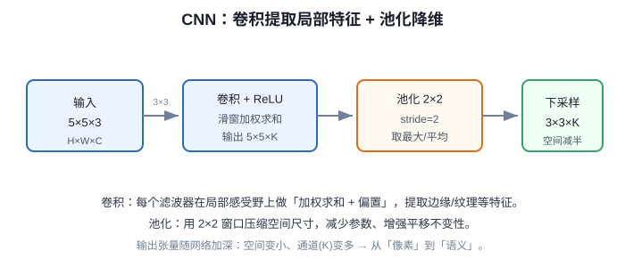

# 第四十讲 · CNN 的池化与打平 / 数据收集需求分析

> **本讲信息**
> - 日期：2026-09-22（周二）
> - 第几讲：第四十讲（学习计划 Day 40，P8）
> - 对应计划：`study-plan-60d.md` → **P8**，课程集号 **155–156**
> - 今日目标：补完 CNN 的最后两块积木——**池化（降维）**与**打平（接全连接）**，至此你能完整说出一个 CNN 的前向过程；然后转向工程视角：**数据收集需求怎么写**（要收什么、收多少、怎么标），为明天的合成数据做铺垫。

---

## 0. 一句话总结

> 我自己的理解：**CNN 完整前向 = 卷积（提特征）→ 激活（加非线性）→ 池化（降维、增鲁棒）→ 打平（拉成一维）→ 全连接（做决策）。** 数据侧则要提前写清**收什么、收多少、怎么标、什么场景**——没计划地采集，等于边训边发现数据不够。

---

## 1. 核心知识点（对照 155–156）

### 1.1 155 池化和打平操作
- **池化 Pooling**：在一个小窗口（如 2×2）里取最大值（MaxPool）或平均值（AvgPool）。
  - 作用：**降维**（尺寸减半）、**减少计算**、**带来一点平移不变性**（物体挪一点也能认出）。
  - 代价：**丢空间精度**——所以小目标检测对池化很敏感（池太狠，小物体直接没了）。
- **打平 Flatten**：把多维特征图拉成一维长向量，好接全连接层。
  - 例：`(16, 7, 7)` → `784` 维。

### 1.2 156 数据收集需求分析
开工采集前写清四件事：
1. **收什么**：目标类别、每类的判定标准（写清楚“什么算正例”）。
2. **收多少**：每类至少几百张起步；类别要**均衡**。
3. **怎么标**：标注规范（框的松紧、边界如何定）、谁来标、怎么复核。
4. **覆盖什么场景**：角度、光照、背景、遮挡、距离——**训练集要覆盖部署时会遇到的变化**，否则一换环境就崩。

---

## 2. 原理（先抓这几条）

1. **池化换鲁棒、丢精度**；小目标任务要慎用。
2. **打平是“卷积世界”通向“全连接世界”的桥**。
3. **数据采集要有计划**：分布覆盖比数量堆砌更重要。

---

## 2.5 补充细节：池化与打平

- 池化(Pooling)：常用 2×2 max pooling，取窗口内最大值 → 空间尺寸减半、参数再减少、保留最显著特征、增强平移不变。
- stride 一般等于窗口大小（不重叠）。
- 打平(Flatten)：把多维特征图拉成一维向量，才能接全连接层(FC)做分类/检测头。
- 数据收集需求：自己训模型 = 要足量标注数据；课程里的省力思路是「图像合成 / 自动标注」先起步，再人工校正。

---

## 3. 一张图：CNN 的完整前向

---

## 4. 今天的操作步骤

1. **看 155–156**（1.0–1.5 倍速），重点看 155 池化前后尺寸变化、156 数据需求四要素。
2. **手算一遍尺寸**：输入 28×28 → Conv(3×3, padding=1) → MaxPool(2×2) → 各层尺寸变成多少？
3. **验证打平维度**：算出最后特征图拉平后是多少维，和全连接输入对上。
4. **给你自己的检测任务写一份“数据收集需求”**（四要素各写 2–3 条）。
5. **列一张“场景变化清单”**：部署时可能变的因素（光照/背景/物体朝向/距离），逐条确认数据里有没有覆盖。
6. **镜子测试（3 分钟）：** *“池化有什么用、有什么代价___；打平是干啥___；数据收集需求要写清哪四件事___。”*

> ✅ **今天“做完”的标准：** 能完整讲出 CNN 前向五步 + 写出自己任务的数据收集需求 + 过镜子测试。

---

## 5. 常见误区 & 容易踩的坑

| # | 误区 | 真相 |
|---|---|---|
| 1 | 池化越多越好 | 池太狠 → 空间信息丢失，小目标检测掉点严重 |
| 2 | 打平后维度靠框架自动算就不管 | 算错就直接 shape 报错；手算一遍最稳 |
| 3 | 数据先采再说 | 没计划 → 场景覆盖不全，训完才发现缺数据，返工成本极高 |
| 4 | 只看总数量 | 分布覆盖（光照/角度/背景）比数量更关键 |
| 5 | 类别严重不平衡照训 | 模型偏袒多数类，少数类 Recall 极低 |

---

## 6. DEA 交叉链接（轻量，非主线）

- **池化的“丢精度”代价，在软体上更明显**：软体形变往往是**小幅、连续、细微**的变化（如薄膜鼓起 1 mm），几层池化下来这点差异就被抹平了——所以做软体形变估计时，**要慎用大池化，或改用保留分辨率的架构**（如 U-Net 类）。
- 数据收集需求对软体尤其重要：软体实验**每次采集都要真做一次驱动**，成本远高于拍照，更要**先规划工况矩阵**（电压档位 × 频率 × 负载 × 温度）再动手。

---

## 7. 下一阶段 / 检查点

- **过了检查点 =** 完整讲出 CNN 前向五步 + 写出数据收集需求 + 过镜子测试。
- **下一阶段（Day 41，P8 收口）：** 构造透明识别图 / 图像合成与标注自动生成 / 启动 YOLO 训练（157–160）。

---

### 参考资料（先放着，今天不要求）
- 课程集号 155–156（B 站《黑马程序员 · 具身智能》）。
- 复用：Day 33（网络组拼）、Day 38（标注规范）、Day 39（卷积原理）。

*本讲严格对应《60 天计划》Day 40（P8）：155–156。全程零军事内容。*