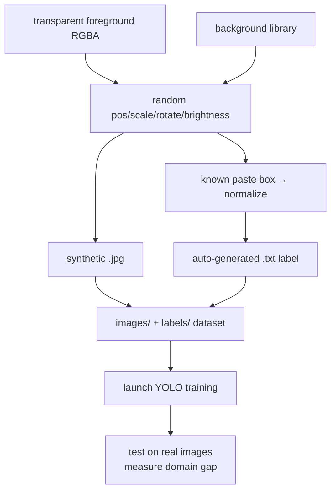

# Lecture 41 · Image Synthesis + Auto-Labeling + Launching YOLO Training (P8 wrap)

> **Lecture info**
> - Date: 2026-09-23 (Wed)
> - Lecture #: 41 (Study Plan Day 41, P8 ML / Deep Learning / YOLO · **wrap-up**)
> - Plan ref: `study-plan-60d.md` → **P8**, episodes **157–160**
> - Goal: Learn a **cheap way to manufacture data** — paste a transparent foreground onto random backgrounds, and **generate the labels automatically** (you already know where and how big you pasted it). Then launch a YOLO training round on that synthetic set. P8 wraps up here.

---

## 0. One-line summary

> **Synthetic data = paste a known object onto random backgrounds; since you chose the paste position and size, labels come free and exact.** Its nemesis is the **domain gap**: synthetic and real distributions differ, so a model that scores great on synthetic data can still collapse in the real world — mitigate with **background diversity + noise/blur/lighting perturbation + mixing in real data**.

---

## 1. Core concepts (eps 157–160)

### 1.1 157 Build a transparent recognition image
- Prepare a **foreground with an alpha channel (RGBA / PNG with transparency)**: object kept, background transparent.
- Tools: Photoshop / remove.bg / OpenCV alpha handling.

### 1.2 158 Synthesis and label-generation principle
- Synthesis = **overlay the transparent foreground onto a background**, randomly choosing:
  - paste position `(x, y)`, scale, rotation, brightness/contrast jitter.
- Because *you* define the paste box, the **bounding box (x_min, y_min, x_max, y_max) is known by construction** → convert straight into normalized YOLO labels.

### 1.3 159 Generate labels and labeled images
- One script outputs:
  - `images/train/0001.jpg` (synthetic image)
  - `labels/train/0001.txt` (matching YOLO label: `cls x_center y_center w h`)
- Afterwards, **sample and draw labels back onto images for a visual check** (the Day 38 habit).

### 1.4 160 Launch YOLO training
- Train on the synthetic dataset, watch loss/mAP (Day 39 skills).
- **Key judgement**: a model trained on synthetic data must be tested on **real photos** — the drop you observe *is* the domain gap.

---

## 2. Principles (grab these)

1. **Synthetic data’s biggest edge = free, exact labels.**
2. **Biggest risk = domain gap**: synthetic distribution ≠ real distribution.
3. **Mitigation**: diversify background/lighting/angle/noise, and **mix in real data for fine-tuning**.

---

## 3. One diagram: the synthetic-data pipeline

---

## 4. Today’s steps

1. **Watch 157–160** (1.0–1.5×), focus on 158 (synthesis principle) and 159 (auto-labeling).
2. **Prepare 1–3 transparent foreground PNGs** (clean cut-outs, no white halo at the edges).
3. **Prepare 5–10 background images** (desk, cloth, different lighting).
4. **Write the synthesis script**: random position/scale/rotation → image + auto YOLO label.
5. **Generate 200–500 synthetic samples** and lay them out per the Day 38 structure.
6. **Spot-check 10 samples**: draw labels back on and confirm boxes are tight and in-bounds.
7. **Launch YOLO training** (fine-tune from pretrained weights, 10–30 epochs).
8. **Test on real photos**; record the metric gap vs the synthetic test set.
9. **Mirror test (3 min):** *“The biggest benefit of synthetic data ___; the biggest risk ___; how to mitigate the domain gap ___.”*

> ✅ **Done today when:** the synthesis pipeline runs + YOLO trains on synthetic data + you measured the domain gap + mirror test passed.

---

## 5. Common pitfalls

| # | Myth | Truth |
|---|---|---|
| 1 | Synthetic data fully replaces real data | The domain gap is real; synthetic scores ≠ real-world usefulness |
| 2 | Use only one or two backgrounds | A single background teaches a “background shortcut”; change the desk and it collapses |
| 3 | Cut-outs with white halos / residue | Unclean foreground → the model learns spurious features |
| 4 | No perturbation during synthesis | Without lighting/blur/noise variation, real-world robustness is poor |
| 5 | Skip the visual spot-check | You won’t notice wrong boxes, and mislabeled data keeps misleading training |

---

## 6. DEA cross-link (light, not main thread)

- **The synthetic-data idea is especially valuable for soft robotics**: soft experiments are expensive to collect (every deformation frame needs a real actuation), so **rendering in simulation (SOFA / Isaac / your own FE renderer) to mass-produce “deformation image + known strain label”** is the standard “simulation fills the data” approach.
- But soft bodies have a **bigger Sim-to-Real gap than rigid ones** (material-parameter scatter, ageing, friction hard to model) — that’s exactly where **Sim2Real / domain randomization** earns its keep in soft robotics, and a genuine research opening for you.

---

## 7. Next / checkpoint (P8 wrap)

- **P8 checkpoint (end of Day 41):** can explain the “data → features → model → train → evaluate” loop; can run MNIST classification and YOLO annotation/training; can narrate the five CNN forward steps; can use synthetic data to supplement data and identify the domain gap.
- **Next (Day 42+, P9):** speech / LLMs / Ollama / MCP (161–187) — giving the robot **ears, understanding, and tool access**.

---

### References (not required today)
- Episodes 157–160 (B站《黑马程序员 · 具身智能》).
- Reuse: Day 38 (layout & dataset.yaml), Day 39 (training & curves), Day 40 (data-collection planning).

*This lecture strictly follows 《60-Day Plan》 Day 41 (P8 wrap): 157–160. Zero military content. P8 (116–160, 45 episodes) all complete.*
