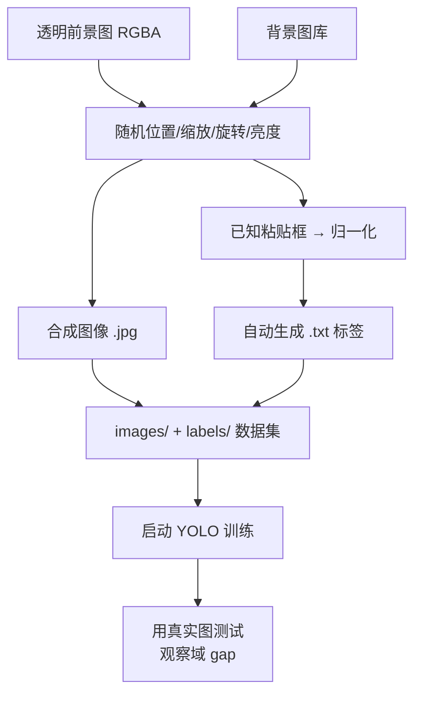

# 第四十一讲 · 图像合成 + 自动标注 + YOLO 训练启动（P8 收口）

> **本讲信息**
> - 日期：2026-09-23（周三）
> - 第几讲：第四十一讲（学习计划 Day 41，P8 机器学习 / 深度学习 / YOLO · **收口**）
> - 对应计划：`study-plan-60d.md` → **P8**，课程集号 **157–160**
> - 今日目标：学一个**低成本造数据的绝招**——把透明前景图贴到随机背景上合成图像，同时**自动生成标注**（因为你本来就知道贴在哪、多大）。然后用这批合成数据启动一轮 YOLO 训练。P8 收口。

---

## 0. 一句话总结

> **合成数据 = 把已知目标“贴”到随机背景上，因为贴的位置/尺寸是你自己定的，标注可以一并自动生成，几乎零标注成本。** 但它的天敌是**域 gap（domain gap）**：合成图和真实图分布不一致，模型在合成数据上刷得再高，到了真实场景也可能崩——必须靠**背景多样化 + 加噪声/模糊/光照扰动 + 混一部分真实数据**来缓解。

---

## 1. 核心知识点（对照 157–160）

### 1.1 157 构造一个识别的透明图片
- 准备**带透明通道（RGBA / PNG with alpha）**的目标前景图：物体保留，背景透明。
- 抠图工具：Photoshop / remove.bg / OpenCV 的 alpha 通道处理。

### 1.2 158 图像素材和标注信息生成原理
- 合成 = **前景（透明图）叠加到背景图上**，随机决定：
  - 粘贴位置 `(x, y)`、缩放比例、旋转角度、亮度/对比度扰动。
- 因为粘贴框是你自己定的，**边界框（x_min, y_min, x_max, y_max）天然已知** → 直接换算成 YOLO 归一化标签。

### 1.3 159 生成标注信息和标注的图像
- 一条龙脚本输出：
  - `images/train/0001.jpg`（合成图）
  - `labels/train/0001.txt`（对应 YOLO 标签：`cls x_center y_center w h`）
- 生成后务必**抽样把标签画回图上肉眼检查**（Day 38 的抽查习惯）。

### 1.4 160 YOLO 训练的启动
- 用合成数据集启动训练，观察 loss/mAP（Day 39 的技能）。
- **关键判断**：合成数据训出来的模型，一定要拿**真实场景图**去测，看掉多少点——这个落差就是域 gap。

---

## 2. 原理（先抓这几条）

1. **合成数据的最大优势 = 标注免费且精确**。
2. **最大风险 = 域 gap**：合成分布 ≠ 真实分布。
3. **缓解手段**：背景/光照/角度/噪声多样化，**并混入真实数据做微调**。

---

## 3. 一张图：合成数据流水线

---

## 4. 今天的操作步骤

1. **看 157–160**（1.0–1.5 倍速），重点看 158 合成原理、159 标注自动生成。
2. **准备 1–3 张透明前景 PNG**（抠图要干净，边缘别带白边）。
3. **准备 5–10 张背景图**（桌面、桌布、不同光照）。
4. **写合成脚本**：随机位置/缩放/旋转 → 合成图 + 自动生成 YOLO 标签。
5. **生成 200–500 张合成数据**，按 Day 38 的目录结构摆好。
6. **抽查 10 张**：把标签画回图上，确认框准、没出界。
7. **启动 YOLO 训练**（先用预训练权重微调，10–30 epoch）。
8. **用真实照片测试**，记录与合成测试集的指标差距（域 gap 有多大）。
9. **镜子测试（3 分钟）：** *“合成数据最大好处___；最大风险___；怎么缓解域 gap___。”*

> ✅ **今天“做完”的标准：** 合成数据流水线跑通 + YOLO 用合成数据训起来 + 测出域 gap + 过镜子测试。

---

## 5. 常见误区 & 容易踩的坑

| # | 误区 | 真相 |
|---|---|---|
| 1 | 合成数据能完全替代真实数据 | 域 gap 客观存在，合成刷分 ≠ 真实好用 |
| 2 | 背景只用一两张 | 背景单一 → 模型学到“背景捷径”，换个桌面就崩 |
| 3 | 抠图边缘带白边/残影 | 前景不干净 → 模型学到伪特征 |
| 4 | 合成时不加扰动 | 没有光照/模糊/噪声变化 → 真实场景鲁棒性差 |
| 5 | 合成完不抽查 | 框错了都不知道，标错的数据会持续误导训练 |

---

## 6. DEA 交叉链接（轻量，非主线）

- **合成数据思路对软体尤其有价值**：软体实验采集贵（每帧形变都要真做驱动），用**仿真渲染（如 SOFA / Isaac / 自写有限元渲染）批量造“形变图 + 已知应变标签”**，正是“仿真补数据”的标准做法。
- 但软体的 **Sim-to-Real gap 比刚性更大**（材料参数分散、老化、摩擦难建准）→ 这就是 **Sim2Real / 域随机化（domain randomization）** 在软体方向的用武之地，也正好是你可以切入的研究口子。

---

## 7. 下一步 / 检查点（P8 收官）

- **P8 阶段检查点（Day 41 末）：** 能讲清“数据 → 特征 → 模型 → 训练 → 评估”闭环；会跑 MNIST 分类与 YOLO 标注/训练；能解释 CNN 前向五步；会用合成数据补数据并识别域 gap。
- **下一阶段（Day 42 起，P9）：** 语音 / 大模型 / Ollama / MCP（161–187）——让机器人**能听、能懂、能接工具**。

---

### 参考资料（先放着，今天不要求）
- 课程集号 157–160（B 站《黑马程序员 · 具身智能》）。
- 复用：Day 38（目录结构与 dataset.yaml）、Day 39（训练与曲线）、Day 40（数据收集需求分析）。

*本讲严格对应《60 天计划》Day 41（P8 收口）：157–160。全程零军事内容。P8（116–160，共 45 集）全部完成。*
